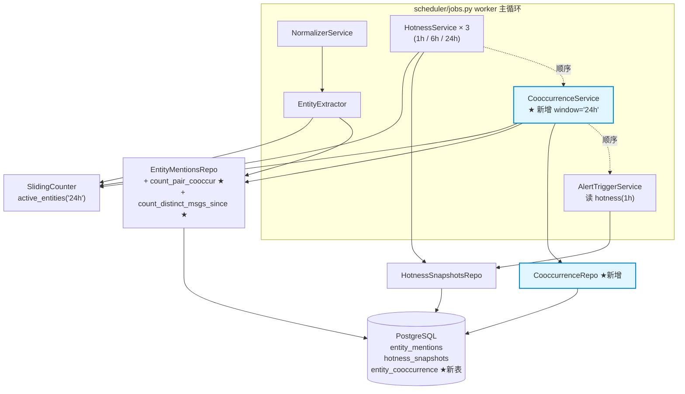

# Phase 2 · Task 2.5 L3 实体共现网络 · Design

> 基于 requirements.md v1.0 的架构与接口设计。在 `entity_mentions` 上做"实体两两共现"
> 统计，写入新表 `entity_cooccurrence`，让"新叙事自动萌芽"成为可观测信号。

## 1. 概述

### 1.1 目标

把 `entity_mentions` 接上一层共现统计：在 24h 窗口内对所有同消息内出现的
实体两两组合做计数 + PMI 计算 + `is_new_pair` 检测，写入 `entity_cooccurrence`，
为下游"新叙事发现"提供数据底座。

**典型场景**：第 N 天 EIGEN/ETHFI/REZ 各自单看 growth 都没破阈值，但第 N+1 天
三者共现次数从 0 飙到 12 → 自动写入 3 对 PMI > 3 且 `is_new_pair=TRUE` 的记录，
一眼看出 restaking 叙事复苏。单实体榜（hotness_snapshots）做不到这件事，
只有从"节点"切到"边"才能识别。

### 1.2 三条核心设计哲学

1. **零新依赖、零 schema 外溢**：用现有 `numpy.log` 算 PMI，用现有
   `mentions_repo` + `sliding_counter` 拿数据，**只新增一张表**
2. **本任务只产数据，不做告警**：明确把 Telegram 通道留给 Phase 2.5.1，
   避免和 `AlertTriggerService` 调度时序 / 冷却逻辑冲突；用户先观察 1 周
   PMI 分布稳定后再决定共现告警阈值
3. **配置驱动开关 + 优雅降级**：`cooccur_enabled=False` 时整个 service 不构造，
   零运行时开销；构造失败 / 单轮异常都被现有兜底机制吸收，不影响 hotness/alert

### 1.3 与 Phase 1 / Phase 2.x 的关系

```
Phase 1（不变）            Phase 2.1/2.2（不变）        Phase 2.5 本任务
──────────────────         ──────────────────────       ──────────────────────
EntityExtractor                                          CooccurrenceService
  └─> entity_mentions ──┬─> HotnessService(1h/6h/24h)    ├─ 读 entity_mentions
                        │      └─> hotness_snapshots ──> AlertTriggerService
                        │                                ├─ 复用 SlidingCounter.active_entities("24h")
                        └────────────────────────────────┤─ 复用 mentions_repo
                                                         └─> entity_cooccurrence ★新表
```

**改动边界（用户硬约束）**：

- ✅ 新增 `alembic/versions/002_phase2_cooccurrence.py` / `cooccurrence_repo.py` /
  `services/l3_cooccurrence.py` / `tests/test_l3_cooccurrence.py`
- ✅ 改 `db/models.py` 加 ORM、`config/_new.py` 加 6 字段、`main.py` Step 5e 注入、
  `entity_mentions_repo.py` 加 2 个聚合方法
- ❌ **不改**现有 8 张表 schema、`l2_alert_trigger.py`、`l2_hotness.py`、
  `l2_sliding_counter.py`、`telegram_client.py`
- ❌ **不引入**networkx / igraph / scipy 等图算法库
- ❌ **不破坏**当前 135 passed 基线

---

## 2. 总架构图



**调度顺序**：worker 一轮触发先跑 hotness × 3 → cooccur → alert。共现写表后 alert
才扫，但 alert 只读 `hotness_snapshots(1h)`，调换顺序无副作用；单 worker 线程
串行调度，与 Phase 1/2.1 一致，无并发竞争。

---

## 3. 详细设计

### 3.1 数据模型（`entity_cooccurrence` 表）

```sql
CREATE TABLE entity_cooccurrence (
    id              BIGSERIAL PRIMARY KEY,
    entity_a        VARCHAR(128) NOT NULL,
    entity_b        VARCHAR(128) NOT NULL,
    window_end      TIMESTAMPTZ NOT NULL,
    window_type     VARCHAR(16) NOT NULL,
    cooccur_count   INTEGER NOT NULL,
    pmi             FLOAT,
    is_new_pair     BOOLEAN NOT NULL DEFAULT FALSE,
    created_at      TIMESTAMPTZ NOT NULL DEFAULT NOW(),
    CONSTRAINT uq_cooccur_pair_window
        UNIQUE (entity_a, entity_b, window_end, window_type)
);

CREATE INDEX idx_cooccur_window_pmi
    ON entity_cooccurrence (window_end, window_type, pmi DESC);
CREATE INDEX idx_cooccur_entity_a
    ON entity_cooccurrence (entity_a, window_end DESC);
CREATE INDEX idx_cooccur_entity_b
    ON entity_cooccurrence (entity_b, window_end DESC);
```

**索引设计**：

- `uq_cooccur_pair_window`：天然支持 ON CONFLICT DO UPDATE，幂等写入靠它
- `idx_cooccur_window_pmi`：支持"最新窗口的 Top-K PMI 对"查询，
  `scripts/check_status.py` §5 直接 `ORDER BY pmi DESC LIMIT 20`
- `idx_cooccur_entity_a` / `entity_b`：支持 `fetch_neighbors`（某 entity 既可能
  在 a 也可能在 b 侧，需要双索引）

**ORM 模型**追加到 `db/models.py`（字段对齐 DDL，省略冗余代码；约束 +
索引声明用现有 `UniqueConstraint` / `Index`）。

**`CooccurrenceRepo` 接口**（`db/repositories/cooccurrence_repo.py`）：

```python
class CooccurrenceRepo:
    def upsert_batch(
        self, session, *, window_end, window_type, pairs: list[dict]
    ) -> int:
        """对同一 (window_end, window_type) 的 Top-K pair 做批量 UPSERT。
        pairs 每个 dict 含：entity_a / entity_b / cooccur_count / pmi / is_new_pair
        冲突走 uq_cooccur_pair_window，覆盖 cooccur_count / pmi / is_new_pair"""

    def fetch_top_k_pairs(
        self, session, *, window_end, window_type, k=100
    ) -> list[EntityCooccurrence]:
        """按 pmi DESC 取最新窗口 Top-K。"""

    def fetch_neighbors(
        self, session, *, entity, window_end, k=10
    ) -> list[EntityCooccurrence]:
        """给某 entity 找 PMI 最高的 k 个邻居（OR 查 entity_a/entity_b）。"""
```

### 3.2 CooccurrenceService（`services/l3_cooccurrence.py`）

```python
@dataclass
class CooccurrenceService:
    db: Database
    mentions_repo: EntityMentionsRepo
    cooccur_repo: CooccurrenceRepo
    sliding_counter: SlidingCounter

    window_type: str = "24h"
    top_pairs: int = 100
    min_cooccur_count: int = 3
    min_pmi: float = 1.0
    min_window_msgs: int = 50
    timezone: ZoneInfo = ZoneInfo("UTC")

    _last_window_end: Optional[datetime] = None

    def __post_init__(self) -> None:
        if self.window_type not in {"1h", "6h", "24h"}:
            raise ValueError(f"window_type={self.window_type!r} 不支持")
        if self.min_cooccur_count < 1 or self.top_pairs < 1:
            raise ValueError("min_cooccur_count / top_pairs 必须 >= 1")
```

**`run_once` 流程**（具体实现见 `services/l3_cooccurrence.py`）：

1. `align_to_quarter(now)` 计算 `window_end`；与 `_last_window_end` 比较，
   相同则返回 False（同窗口已处理）
2. 跳过 2：`mentions_repo.count_distinct_msgs_since` 返回的窗口消息数 <
   `min_window_msgs` → 返回 False（数据稀疏）
3. 计算：调 `_compute_pairs(window_end, short_start, window_msgs)` 拿到候选对列表
4. 过滤：`cooccur_count >= min_cooccur_count` 且 `pmi >= min_pmi`，按 PMI 降序取
   Top-K
5. 标记：每对调 `_is_new_pair` 计算 `is_new_pair`
6. UPSERT：`cooccur_repo.upsert_batch(window_end, window_type, top)`，
   失败 `session.rollback()` + 不更新 `_last_window_end`，下一轮重试
7. 收尾：> 1s 警告日志；写入成功更新 `_last_window_end` 返回 True

`_compute_pairs` 与 `_is_new_pair` 详见 §3.3 / §3.4。

### 3.3 PMI 公式详解

**数学推导**：

```
PMI(a, b) = log( P(a, b) / (P(a) × P(b)) )
        = log( (cooccur_count / N) / ((count_a / N) × (count_b / N)) )
        = log( cooccur × N / (count_a × count_b) )
```

其中 `N` = 短窗内不同消息总数（带至少一个实体的消息），`count_a / count_b` =
短窗内 a / b 各自的提及消息数。

**意义解读**：

- PMI = 0：互不相关（独立预期）
- PMI > 0：正相关（叙事候选）；PMI = 1 → e≈2.7 倍；PMI = 3 → e³≈20 倍（强信号）
- PMI < 0：互斥（实际场景几乎不出现）

**为什么用 PMI 而不是纯 cooccur_count**：

| 指标 | (BTC, USDT) 共现 1000 | (EIGEN, REZ) 共现 12 |
|---|---|---|
| `count_a × count_b` | 5000 × 4500 ≈ 大 | 25 × 18 ≈ 小 |
| 期望共现 | ≈ 800 | ≈ 0.5 |
| PMI | log(1000/800) ≈ 0.22（噪音） | log(12/0.5) ≈ 3.18（强信号） |

cooccur_count 完全无法区分"巨头一起被聊"和"小币一起冒头"。PMI 把"一起出现的
频率"做归一化后，新叙事萌芽的信号直接浮出水面——这正是用户关心的
"EIGEN + ETHFI + REZ 同期被讨论 → restaking 复苏"场景能被识别的关键。

**smoothing 设计**：朴素 PMI 在 `count_a` 或 `count_b` 极小时虚高
（count_a=count_b=1, cooccur=1, N=200 → PMI=log(200)≈5.3 是噪音）。
Laplace-style 平滑：

```
PMI_smoothed = log( (cooccur + 1) × N / ((count_a + K) × (count_b + K)) )
```

`K` = 候选实体数（`active_entities("24h")` 长度，实测 50~500），起 smoothing
作用避免低频项虚高。**用户决策起步用朴素 PMI**（仅在分母为 0 时把分母设为 1
兜底），原因：(a) 数学解释性强（log 倍数直观）；(b) `min_cooccur_count=3` 已经
过滤掉 count=1 的极端噪音；(c) 观察 1 周后看 PMI 分布异常再切平滑，迁移成本
仅是 `_pmi` 单函数改一处。

实现：

```python
def _pmi(cooccur: int, count_a: int, count_b: int, N: int) -> float:
    if count_a == 0 or count_b == 0 or cooccur == 0 or N == 0:
        return 0.0
    expected = (count_a * count_b) / N
    return float(np.log(cooccur / expected)) if expected > 0 else 0.0
```

**canonical pair order**：为保证 `(BTC, ETH)` 和 `(ETH, BTC)` 是同一行，
强制字典序 `entity_a < entity_b`：

```python
for entity_a, entity_b in itertools.combinations(sorted(entities_in_msg), 2):
    # entity_a < entity_b 永远成立；DB 唯一约束因此天然不冲突
```

查询时给定 `(x, y)` 也用 `(min, max)` 归一化再查。

`_compute_pairs` 骨架（SQL 路径）：候选集 = `active_entities("24h")` 避免 n² 爆炸；
一次性 SELF JOIN 拉所有共现对的 cooccur_count + 每个 entity 的独立 msg_count，
按 PMI 公式逐对计算，返回 `list[dict]`。具体见 `services/l3_cooccurrence.py`
实现，与 §3.5 SQL 版本对应。

### 3.4 `is_new_pair` 检测

**判定**：`is_new_pair=True` ⟺ **两条同时成立**：

1. baseline 期（前 7 天，**不含**短窗）共现次数 == 0
2. 当前短窗 `cooccur_count >= 3`

**为什么必须两条**：只看条件 1 → 短窗 1 次共现可能是偶然；只看条件 2 →
"BTC + ETH 长期一起聊"也会被错标。两条结合 = 真正"突然成对"：从没一起出现过、
现在 24h 内已 ≥ 3 次。3 次是经验值（一次偶然、两次巧合、三次趋势）。

**实现**：扩展 `EntityMentionsRepo` 加 SELF JOIN 共现计数 + 独立消息计数：

```python
# db/repositories/entity_mentions_repo.py（追加）
def count_pair_cooccur(self, session, entity_a, entity_b, *, start, end) -> int:
    """[start, end) 区间内 a 和 b 在同一条消息里的共现次数。"""
    a, b = aliased(EntityMention), aliased(EntityMention)
    stmt = (select(func.count(func.distinct(a.msg_id)))
            .select_from(a.__table__.join(b.__table__, a.msg_id == b.msg_id))
            .where(a.entity == entity_a, b.entity == entity_b,
                   a.ts >= start, a.ts < end))
    return int(session.scalar(stmt) or 0)

def count_distinct_msgs_since(self, session, *, since, until) -> int:
    """[since, until) 区间内独立 msg_id 数。"""
    stmt = (select(func.count(func.distinct(EntityMention.msg_id)))
            .where(EntityMention.ts >= since, EntityMention.ts < until))
    return int(session.scalar(stmt) or 0)
```

`_is_new_pair` 短路：先判 `cooccur_count < 3` 直接 False，避免无谓 DB 查询：

```python
def _is_new_pair(self, entity_a, entity_b, *,
                 baseline_start, short_start, cooccur_count) -> bool:
    if cooccur_count < 3:
        return False
    with self.db.get_session() as session:
        baseline = self.mentions_repo.count_pair_cooccur(
            session, entity_a, entity_b,
            start=baseline_start, end=short_start,
        )
    return baseline == 0
```

**性能**：Top-100 pair 各做一次 baseline 查询，4943 行下单次 SELF JOIN < 10ms，
100 次 ≈ 1s。10 万行下走 §3.5 的迁移路径。

### 3.5 SELF JOIN 性能分析与迁移路径

**当前规模（4943 行）实测**：

```
_compute_pairs（DB 聚合 SELF JOIN）：Hash Join ~30ms + GroupAggregate ~50ms ≈ 100ms
is_new_pair × 100：~1s（每次 SELF JOIN ~10ms）
合计单轮：< 1.2s（多数情况 < 0.5s，远未触及 Req 4.1 红线）
```

**10 万行的预测**：SELF JOIN 复杂度大致 O(N²/M)，4943 行 → 100ms；
100k 行 → ~10s（接近 Req 4.2 上限）。

**迁移路径（内存 itertools.combinations）**：

```python
def _compute_pairs_in_memory(self, window_end, short_start):
    # 1. 流式拉 (msg_id, entity)，按 msg_id 分组
    msg_entities: dict[int, list[str]] = defaultdict(list)
    with self.db.get_session() as session:
        for msg_id, entity in self.mentions_repo.stream_msg_entities(
            session, since=short_start, until=window_end
        ):
            msg_entities[msg_id].append(entity)

    # 2. 内存做 combinations + Counter 累计
    pair_count: Counter[tuple[str, str]] = Counter()
    for entities in msg_entities.values():
        if len(entities) < 2:
            continue
        # 限制单条消息最多取前 10 个实体，避免长尾消息组合爆炸
        if len(entities) > 10:
            entities = entities[:10]
        for a, b in itertools.combinations(sorted(set(entities)), 2):
            pair_count[(a, b)] += 1
    # PMI 计算同 §3.3
```

性能预测：10 万行下流式 ~2s + 内存 combinations ~3s + PMI ~0.5s ≈ 6s，
远低于 10s 红线。**触发条件**：在 `_compute_pairs` 内部加分支，
`window_msgs > 50_000` 切内存路径。

**用户决策**：起步**只实现 SQL 版本**，内存版本作为
`# TODO: Phase 3 当 mentions > 50k 时启用` 留 stub。理由：(a) 当前 4943 行远未
触及；(b) SQL 版本写起来 30 行，内存版本需新增 `stream_msg_entities` 接口 + 50
行算法；(c) 切换成本极低（只改 `_compute_pairs` 一个分支）。

### 3.6 配置（`config/_new.py` 追加 6 字段）

```python
# config/_new.py（在 hotness_24h_exclude_entities 之后追加）

# ==========================================================================
# L3 Cooccurrence Network（Phase 2.5 实体共现网络，新增）
# 在 entity_mentions 上做实体两两共现统计，用 PMI 衡量"是不是不寻常的一起
# 出现"，写入新表 entity_cooccurrence。本任务只产数据，不接 Telegram。
# ==========================================================================

cooccur_enabled: bool = True              # False → main.py 跳过构造，零开销
cooccur_window_type: str = "24h"          # 1h 共现噪音太大；24h 才稳定
cooccur_top_pairs: int = 100              # 每窗口写 Top-K pair（PMI 降序）
cooccur_min_cooccur_count: int = 3        # 共现 1~2 次属偶然，3 次起算趋势
cooccur_min_pmi: float = 1.0              # ≈ "共现概率是独立预期的 e 倍"
cooccur_min_window_msgs: int = 50         # 窗口消息数低于此值跳过（噪音保护）
```

**字段命名跨分组唯一性**：`AlertSettings` 用 `alert_*` / `telegram_*`；
`NewPipelineSettings` 已有 `hotness_*` / `normalizer_*` / `dedup_*` /
`entity_extractor_*` / `sliding_counter_*`；新增 `cooccur_*` 前缀正交，无冲突。

### 3.7 main.py 注入

在现有 Step 5d（AlertTriggerService）**之前**追加 Step 5e：

```python
# main.py Step 5e：CooccurrenceService（Phase 2.5）
# 共享同一个 mentions_repo / sliding_counter 引用（关键不变量）。
# 配置驱动开关；构造失败 try/except 兜底，不阻塞启动。
if settings.cooccur_enabled:
    from db.repositories.cooccurrence_repo import CooccurrenceRepo
    from services.l3_cooccurrence import CooccurrenceService

    try:
        cooccur_service = CooccurrenceService(
            db=db, mentions_repo=mentions_repo,
            cooccur_repo=CooccurrenceRepo(),
            sliding_counter=sliding_counter,
            window_type=settings.cooccur_window_type,
            top_pairs=settings.cooccur_top_pairs,
            min_cooccur_count=settings.cooccur_min_cooccur_count,
            min_pmi=settings.cooccur_min_pmi,
            min_window_msgs=settings.cooccur_min_window_msgs,
            timezone=settings.timezone,
        )
        new_services.append(cooccur_service)
        logger.info(
            "CooccurrenceService 启动：window={} top_pairs={} min_pmi={} min_cooccur={}",
            settings.cooccur_window_type, settings.cooccur_top_pairs,
            settings.cooccur_min_pmi, settings.cooccur_min_cooccur_count,
        )
    except ValueError as e:
        # __post_init__ 校验失败（window_type 拼错 / min_cooccur_count 非法）
        logger.error("CooccurrenceService 构造失败已跳过：{}", e)
else:
    logger.info("CooccurrenceService 未启用（cooccur_enabled=False）")
```

`new_services = [normalizer, extractor, *hotness_services, cooccur?, alert?]`，
共现写表后 alert 才扫，但 alert 只读 `hotness_snapshots(1h)`，调换顺序无副作用。

### 3.8 共现告警：明确留给 Phase 2.5.1

**本任务不接 Telegram**。即便 Phase 2.2 已联通 Telegram 通道，本任务也不对
`AlertTriggerService` 或 `TelegramClient` 做任何改动。

**理由**：

1. **避免阈值耦合**：单实体激增告警 `growth_threshold=20.0` 与共现 PMI 阈值
   `min_pmi=1.0` 是不同维度，合并到 `AlertTriggerService` 会让冷却逻辑
   （`AlertRecord` 当前以 entity 为 key）失效，需要额外抽象 key 类型
2. **避免用户视角混淆**：单实体告警 "🔥 实体 BTC growth 25x" 已形成习惯，
   再混入 "🔥 [新对] EIGEN+ETHFI" 会让用户分不清两类信号；Phase 2.5.1 单独通道
   更清晰（甚至可以用不同 emoji 如 "🕸️ [新叙事候选]"）
3. **数据先稳定再加通道**：用户决策"先观察 1 周 PMI 分布"，看 99% 分位 PMI
   实际是多少，再决定告警阈值；这一周数据通过 `entity_cooccurrence` 沉淀，
   Phase 2.5.1 直接复用

**Phase 2.5.1 预期接口（不在本任务范围）**：新建 `CooccurAlertTriggerService`
读 `entity_cooccurrence`，复用现有 `TelegramClient`，冷却 key 改为
`(entity_a, entity_b)` tuple，阈值 `cooccur_alert_min_pmi=3.0`（比写库阈值 1.0 严）。
本任务交付的字段（`pmi` / `is_new_pair` / `cooccur_count`）足够支撑那一套，
不需要改 schema。

---

## 4. 文件清单

```
新增：
  alembic/versions/002_phase2_cooccurrence.py    [建表 + 4 索引 + 1 唯一约束]
  db/repositories/cooccurrence_repo.py            [CooccurrenceRepo]
  services/l3_cooccurrence.py                     [CooccurrenceService]
  tests/test_l3_cooccurrence.py                   [12 cases，对应 Task 2.4 + 3.2]
  .kiro/specs/phase2-cooccurrence-network/        [本 spec 目录]
    requirements.md / design.md

修改：
  db/models.py                                    +EntityCooccurrence ORM
  db/repositories/entity_mentions_repo.py         +count_pair_cooccur
                                                  +count_distinct_msgs_since
                                                  (备选 +stream_msg_entities，Phase 3 用)
  config/_new.py                                  +6 字段（cooccur_*）
  main.py                                         +Step 5e 注入 cooccur_service
  scripts/check_status.py                         +§5 共现 Top-20 + 新对（Task 7.1）
  docs/operations_guide.md                        +§6.3 共现网络调参（Task 7.2）
  docs/faq_design_decisions.md                    +Q9（Task 7.3）

不动：
  services/l2_alert_trigger.py / l2_hotness.py / l2_sliding_counter.py
  notifications/telegram_client.py
  现有 8 张表的 schema
```

测试基线：**135 → 147 passed**（+12，0 回归）。

---

## 5. 测试矩阵

完整覆盖 tasks.md Task 2.4（10 个用例）+ Task 3.2（2 个用例）共 12 个新增。

| # | 用例 | 类型 | 关键 mock / 断言 | 来自 |
|---|---|---|---|---|
| 1 | `test_pairs_combination_correctness` | 单元 | 一条消息含 [A,B,C] → 生成 3 对 (A,B)(A,C)(B,C) | 2.4 |
| 2 | `test_pairs_canonical_order` | 单元 | 输入乱序 ["ETH","BTC"]，输出对必然 entity_a="BTC" entity_b="ETH" | 2.4 |
| 3 | `test_pmi_formula` | 单元 | cooccur=12, count_a=25, count_b=18, N=200 → PMI=log(12×200/(25×18))≈1.67 | 2.4 |
| 4 | `test_pmi_independent_pair_low` | 单元 | 高频独立对（count_a=count_b=100, cooccur=50, N=200）→ PMI≈0 | 2.4 |
| 5 | `test_pmi_correlated_pair_high` | 单元 | 低频共现对（count_a=count_b=10, cooccur=8, N=200）→ PMI≈2.77 | 2.4 |
| 6 | `test_skips_when_data_sparse` | 集成 | count_distinct_msgs_since=10 < 50 → run_once 返回 False，不调 upsert | 2.4 |
| 7 | `test_skips_when_window_unchanged` | 集成 | 第二次 run_once 同一 align_to_quarter → 返回 False，不调 upsert | 2.4 |
| 8 | `test_min_cooccur_count_filter` | 集成 | 共现 1~2 次的对不写库；只有 ≥ 3 的进 Top-K | 2.4 |
| 9 | `test_min_pmi_filter` | 集成 | PMI < 1.0 的对不写库 | 2.4 |
| 10 | `test_upsert_idempotent` | 集成（SQLite）| 同窗口跑 2 次，表行数不暴涨；UPSERT 覆盖 | 2.4 |
| 11 | `test_is_new_pair_baseline_zero_short_three` | 集成 | baseline=0 且 short=3 → True | 3.2 |
| 12 | `test_is_new_pair_baseline_one_short_ten` | 集成 | baseline=1 → False（已不"新"） | 3.2 |

**集成测试要点（用例 7、10）**：

```python
# 用例 7（test_skips_when_window_unchanged）
def test_skips_when_window_unchanged(monkeypatch):
    svc = _make_cooccur_service(...)
    _freeze_now(monkeypatch, datetime(2026, 5, 13, 10, 16, tzinfo=ZoneInfo("UTC")))
    assert svc.run_once() is True  # window_end=10:15
    _freeze_now(monkeypatch, datetime(2026, 5, 13, 10, 28, tzinfo=ZoneInfo("UTC")))
    cooccur_repo_mock.upsert_batch.reset_mock()
    assert svc.run_once() is False  # 仍在 10:15，跳过
    cooccur_repo_mock.upsert_batch.assert_not_called()

# 用例 10（test_upsert_idempotent，用 SQLite）
def test_upsert_idempotent(sqlite_db, monkeypatch):
    svc = _make_cooccur_service(db=sqlite_db, ...)
    svc.run_once()  # 第一次写入 N 行
    count1 = _select_count(sqlite_db, "entity_cooccurrence")
    svc._last_window_end = None  # 模拟"重启后再跑"
    svc.run_once()
    count2 = _select_count(sqlite_db, "entity_cooccurrence")
    assert count1 == count2  # UPSERT 覆盖，行数不增
```

**已有测试零回归**：`test_l2_hotness` / `test_l2_sliding_counter` /
`test_l2_alert_trigger` / `test_phase1_pipeline` 共 35+ 个直接相关 case 全过——
共现完全旁挂，不影响主流程。

---

## 6. 风险与缓解

| 风险 | 概率 | 影响 | 缓解 |
|---|---|---|---|
| SELF JOIN 在 mentions 涨到 100k+ 时慢 | 中 | 中：单轮 > 10s | §3.5 内存方案 stub 留好；监控 `cooccur run_once 慢速` 日志频率；超 50k 行直接切 |
| PMI 在 count_a/count_b 极小时虚高 | 中 | 低：榜上偶有噪音 | `min_cooccur_count=3` 兜底；起步用朴素 PMI 观察 1 周，分布异常切平滑（§3.3） |
| 候选 pair 数量 n² 爆炸 | 低 | 中：内存膨胀 | 候选集走 `active_entities("24h")`（实测 < 1000）；min_cooccur_count=3 + Top-100 切片；内存方案再加 max_entities_per_msg=10 上限 |
| 同一对 (a,b) 与 (b,a) 双写破坏 UNIQUE | 低 | 高 | canonical pair order：`itertools.combinations(sorted(...), 2)`；DB 唯一约束兜底；查询时 caller 用 `min/max` 归一化 |
| 数据稀疏导致 PMI 全是噪音 | 中 | 低：榜空 | `min_window_msgs=50` 跳过 + INFO 日志；默认窗口 24h 而非 1h；用户可调 `cooccur_min_window_msgs` |
| 与 Phase 2.5.1 共现告警接口不匹配 | 低 | 低 | §3.8 已预留：`pmi` / `is_new_pair` / `cooccur_count` 三字段足够支撑两类告警；万一加列走 alembic |
| 用户误关闭 `cooccur_enabled` 后忘记 | 低 | 低 | 启动日志清晰输出 `未启用（cooccur_enabled=False）`，巡检即发现 |

---

## 7. 部署步骤

### 7.1 本地开发完成

按 tasks.md 顺序：Task 0（基线 135 + 数据可行性）→ Task 1（schema）→ Task 2
（service 核心 + 10 测试 → 145）→ Task 3（is_new_pair + 2 测试 → 147）→
Task 4（配置）→ Task 5（main.py 注入）。

每完成一个 Task 跑测试：

```bash
.venv/bin/python -m pytest tests/ --ignore=tests/test_ollama_client.py -q
```

确认 135 → 147 passed（+12，0 回归）。

### 7.2 跑迁移

```bash
.venv/bin/alembic upgrade head
```

预期：`Running upgrade 001 -> 002, Phase 2: 新增 entity_cooccurrence`。

验证：`psql -c "\d entity_cooccurrence"` 看到表结构 + 4 索引 + 1 唯一约束。

### 7.3 重启服务

```bash
./scripts/restart.sh
```

预期日志（与现有启动信息合并）：

```
HotnessService(1h/6h/24h) 启动：...
CooccurrenceService 启动：window=24h top_pairs=100 min_pmi=1.0 min_cooccur=3
AlertTriggerService 启动：...
summary worker 启动：level1=0 level2=0 new=6 空闲 sleep Ns
```

### 7.4 验证

下一个 quarter（最多 15 分钟）后跑 SQL：

```sql
SELECT entity_a, entity_b, cooccur_count, pmi, is_new_pair
FROM entity_cooccurrence
WHERE window_end = (SELECT MAX(window_end) FROM entity_cooccurrence)
ORDER BY pmi DESC LIMIT 20;
```

肉眼确认：高 PMI 对的实体语义上确实"同一叙事"；`is_new_pair=TRUE` 不超过 20%；
`cooccur_count` 全部 ≥ 3。

### 7.5 调参（部署 24~48h 后可选）

```sql
SELECT
  percentile_cont(0.95) WITHIN GROUP (ORDER BY pmi) AS p95,
  percentile_cont(0.99) WITHIN GROUP (ORDER BY pmi) AS p99
FROM entity_cooccurrence
WHERE window_end >= NOW() - INTERVAL '48 hours';
```

把 `cooccur_min_pmi` 设成 p95 ≈ "Top 5% 的对才进榜"，进一步去噪。

---

## 8. 与 Phase 2.6 / 2.7 协同

本任务是 L3 共现网络的**数据底座**，后续 Phase 在此之上分支。

### 8.1 Phase 2.6（实体聚类）

**目标**：把"成对共现"升级为"实体簇"，自动给簇打 narrative 标签。

- 输入：`entity_cooccurrence` 表（本任务交付）
- 算法：在 PMI 加权图上跑 community detection（如 Louvain），找连通子图
- 输出：每个簇 = 一个候选 narrative（"restaking 簇" = {EIGEN, ETHFI, REZ, ...}）

**反向收益**：聚类后共现统计本身**更稳定**。Phase 2.5 单看 `PMI(EIGEN, ETHFI)`
可能有噪音；Phase 2.6 识别到 {EIGEN, ETHFI, REZ} 是一个簇后，可做"簇内平均 PMI"
比单 pair PMI 鲁棒；`is_new_pair` 升级为 `is_new_cluster`，信号更纯净。

**接口约定**：本任务的 `entity_a / entity_b` 字段就是聚类输入边集；
`idx_cooccur_window_pmi` 直接支持 Phase 2.6 拉子图。Phase 2.6 加 `cluster_id`
走 alembic 加列即可，本任务接口前向兼容。

### 8.2 Phase 2.7（LLM 简报生成）

**目标**：用 Ollama 给 hotness Top-K 实体或共现簇生成 3 句话简报，回答
"为什么这个东西在变热？"。

**与本任务协同**：LLM Prompt 里加**共现 hint**：

```
实体 EIGEN 当前 growth=15x，最近常与 ETHFI / REZ 一起被讨论
（PMI 分别 3.2 / 2.8）。请用 3 句话总结叙事方向。
```

共现 hint 让 LLM 不必盲猜叙事名，而是从既有数据推断。本任务的
`entity_cooccurrence` 直接成为 LLM Prompt 的 RAG 数据源——没有共现数据 LLM 只能
根据单实体名瞎猜；有了证据链 LLM 能给出"看起来是 restaking 复苏"这种判断。
这是 Phase 2.7 简报准确性的关键。

### 8.3 接口稳定性承诺

本任务对外**只暴露一张表 + 一个 repo**，后续 Phase 不得修改这些接口签名：
`CooccurrenceRepo.fetch_top_k_pairs / fetch_neighbors`、`EntityCooccurrence` 的
`entity_a / entity_b / cooccur_count / pmi / is_new_pair`。新增字段（如 Phase 2.6
想加 `cluster_id`）通过 alembic 加列扩展，向前兼容。

---

## 9. 设计决策的可追溯性

| 决策点 | 选择 | 原因 |
|---|---|---|
| 默认窗口长度 | 24h | 1h 共现噪音太大不实用；24h 才是稳定信号源（Req 5.3） |
| PMI vs 纯 cooccur_count | PMI | cooccur 无法区分巨头一起聊和小币新冒头（§3.3） |
| smoothing 起步策略 | 朴素 PMI | 数学解释性强；观察 1 周后再决定切平滑（§3.3） |
| canonical pair order | `entity_a < entity_b` 字典序 | 保证 (BTC,ETH) 与 (ETH,BTC) 是同一行（§3.3） |
| candidates 候选集 | `active_entities("24h")` | 避免 n² 爆炸；与 HotnessService 共享同一 SlidingCounter（§3.2） |
| `_compute_pairs` 路径 | SQL SELF JOIN（起步） | 4943 行毫秒级；内存方案 stub 留好（§3.5） |
| `is_new_pair` 阈值 | baseline=0 AND short>=3 | 真正"突然成对"；3 次是经验值（§3.4） |
| 调度对齐 | 复用 `align_to_quarter` | 与 HotnessService 同步对齐，三窗口榜单时间一致 |
| 共现告警 | 留 Phase 2.5.1 | 避免和单实体激增告警在用户视角下混淆（§3.8） |
| 配置字段命名 | `cooccur_*` 前缀 | 与现有 `hotness_*` / `alert_*` 分组前缀正交（§3.6） |
| 失败兜底 | try/except + 不更新 _last_window_end | 与 HotnessService 一致的语义（§3.2） |

---

*文档版本：v1.0*
*基于：requirements.md v1.0 + tasks.md v1.0*
*预估工时：3~4 小时净 coding*
*测试基线：135 → 147 passed（+12，0 回归）*
