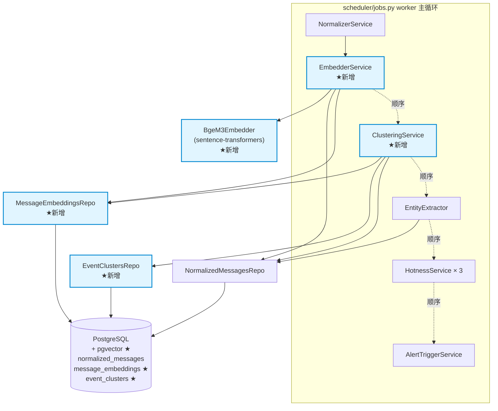
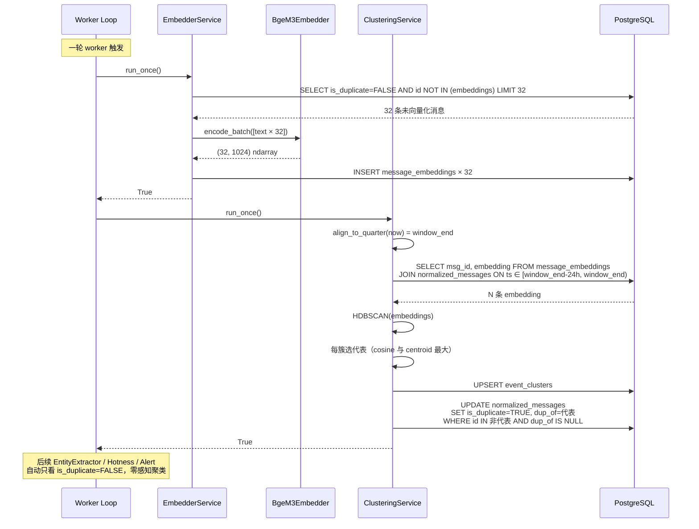

# Phase 2 · Task 2.6 L4 Embedding 聚类 · Design

> 基于 requirements.md v1.0 的架构与接口设计。在 Phase 1 SimHash 去重之上叠加
> 一层语义级降噪，让"同一新闻的不同表述"自动归并成事件簇。

## 1. 概述

### 1.1 目标

把 SimHash 已经判过的"字面不同"的消息，再用 bge-m3 向量化 + HDBSCAN 聚成
事件簇。每簇只保留一条代表消息（`is_duplicate=False`），其它非代表消息标记为
`is_duplicate=True, dup_of=代表 id`。下游 EntityExtractor / HotnessService
**完全不感知**聚类的存在——它们已经在过滤 `is_duplicate=False`，自动只统计
代表消息。

### 1.2 三条核心设计哲学

1. **Embedding 是 SimHash 的语义升级，不是替代**
   - SimHash 抓**字面相同**（汉明距离 ≤ 3）
   - Embedding 抓**语义相同**（cosine ≥ 0.85）
   - 两者协同：聚类**只覆盖** `dup_of IS NULL` 的行，绝不动 SimHash 已标记的

2. **下游服务零感知**
   - 通过复用 `is_duplicate` 字段实现"插入式降噪"
   - EntityExtractor / HotnessService / AlertTriggerService 一行代码不改
   - 这是本任务对 Phase 1/2.x 架构稳定性的最大尊重

3. **配置驱动 + 优雅降级**
   - `embedding_enabled=False` → 整段不构造，零运行时开销
   - 装包失败 / pgvector 不可用 → main.py try/except 兜底，hotness 主流程不受影响
   - 用户可随时回滚（关闭开关 + 重启）

### 1.3 与 Phase 1 / Phase 2.x 的关系

```
Phase 1（不变）              Phase 2.6 本任务                    Phase 2.x（不变）
──────────────────────       ──────────────────────────         ──────────────────
NormalizerService                                                
  └─> normalized_messages   ─┬─> EmbedderService                
                              │     └─> message_embeddings ★新表
                              │            │
                              │            ▼
                              │     ClusteringService ★          
                              │     ├─> event_clusters ★新表    
                              │     └─> UPDATE is_duplicate=TRUE 
                              │             dup_of=代表 id        
                              │             WHERE dup_of IS NULL  
                              │             ★ 不覆盖 SimHash      
                              │                                   
  └────────────────────────► EntityExtractor                    
                                ↑ 自动只看 is_duplicate=FALSE   
                                  → 同一事件只统计代表 1 次
                                                               ──> HotnessService × 3
                                                                   ↑ 自动只统计代表
                                                               ──> AlertTriggerService
```

**改动边界**：

- ✅ 新增 `alembic/versions/003_phase2_embeddings.py` / `llm/embedder_client.py` /
  `services/l4_embedder.py` / `services/l4_clustering.py` /
  `db/repositories/message_embeddings_repo.py` / `db/repositories/event_clusters_repo.py`
- ✅ 改 `db/models.py` 加 ORM、`config/_new.py` 加 8 字段、`main.py` 加构造、
  `requirements.txt` 加 4 个依赖
- ❌ **不改** Phase 1 任何 service（EntityExtractor / Normalizer / HotnessService /
  SlidingCounter）
- ❌ **不改** Phase 2.1/2.2/2.5 service（multi-window-hotness / alert /
  cooccurrence）
- ❌ **不改** `normalized_messages` schema（is_duplicate / dup_of 字段已有）

---

## 2. 总架构图

### 2.1 组件关系



### 2.2 调用时序



**关键时序约束**：

- EmbedderService **必须**在 ClusteringService 之前（vector 喂给聚类）
- ClusteringService **必须**在 EntityExtractor 之前（标记 is_duplicate 后下游才能看到）
- 三者都必须在 NormalizerService 之后（NormalizerService 写 normalized_messages）
- 单 worker 串行调度，无并发竞争（与 Phase 1/2.x 一致）

---

## 3. 详细设计

### 3.1 数据模型

#### 3.1.1 `message_embeddings` 表

```sql
CREATE EXTENSION IF NOT EXISTS vector;

CREATE TABLE message_embeddings (
    msg_id          BIGINT PRIMARY KEY,
    embedding       vector(1024) NOT NULL,
    model_version   VARCHAR(32) NOT NULL,
    created_at      TIMESTAMPTZ NOT NULL DEFAULT NOW()
);

CREATE INDEX idx_msg_embeddings_hnsw
    ON message_embeddings USING hnsw (embedding vector_cosine_ops);
```

**ORM**（`db/models.py` 追加）：

```python
from pgvector.sqlalchemy import Vector

class MessageEmbedding(Base):
    __tablename__ = "message_embeddings"
    msg_id: Mapped[int] = mapped_column(BigInteger, primary_key=True)
    embedding: Mapped[list[float]] = mapped_column(Vector(1024), nullable=False)
    model_version: Mapped[str] = mapped_column(String(32), nullable=False)
    created_at: Mapped[datetime] = mapped_column(
        DateTime(timezone=True), nullable=False, server_default=func.now()
    )
```

**Repo**（`db/repositories/message_embeddings_repo.py`）：

```python
class MessageEmbeddingsRepo:
    def bulk_insert(self, session, records: list[dict]) -> int:
        """ON CONFLICT (msg_id) DO NOTHING；records: [{msg_id, embedding, model_version}]"""

    def fetch_unembedded_msg_ids(
        self, session, *, limit: int
    ) -> list[NormalizedMessage]:
        """返回 is_duplicate=FALSE AND id NOT IN message_embeddings 的消息（含 text 字段）"""

    def fetch_embeddings_in_window(
        self, session, *, since: datetime, until: datetime
    ) -> list[tuple[int, np.ndarray]]:
        """返回 ts ∈ [since, until) 且有 embedding 的 (msg_id, embedding) 元组列表"""
```

#### 3.1.2 `event_clusters` 表

```sql
CREATE TABLE event_clusters (
    id                      BIGSERIAL PRIMARY KEY,
    cluster_id              VARCHAR(64) NOT NULL UNIQUE,
    window_end              TIMESTAMPTZ NOT NULL,
    msg_ids                 BIGINT[] NOT NULL,
    representative_msg_id   BIGINT NOT NULL,
    centroid                vector(1024),
    cluster_size            INTEGER NOT NULL,
    cohesion                FLOAT,
    created_at              TIMESTAMPTZ NOT NULL DEFAULT NOW()
);

CREATE INDEX idx_event_clusters_window ON event_clusters(window_end DESC);
```

`cluster_id` 命名规则：`f"evt_{int(window_end.timestamp())}_{cluster_label}"`，
全局唯一便于跨窗口比较（Phase 3 跟踪事件演化时用）。

**Repo**（`db/repositories/event_clusters_repo.py`）：

```python
class EventClustersRepo:
    def upsert_for_window(
        self, session, *, window_end: datetime, clusters: list[dict]
    ) -> int:
        """clusters: [{cluster_id, msg_ids, representative_msg_id, centroid,
            cluster_size, cohesion}]"""

    def fetch_recent(
        self, session, *, window_end: datetime, limit: int = 20
    ) -> list[EventCluster]: ...
```

### 3.2 BgeM3Embedder（`llm/embedder_client.py`）

#### 3.2.1 接口

```python
@dataclass(frozen=True)
class BgeM3Embedder:
    """
    bge-m3 embedding 客户端。

    懒加载：模块顶部不直接 import sentence_transformers，
    让用户决策方案 C（跳过本任务）时项目仍能启动。
    """
    model_name: str = "BAAI/bge-m3"
    cache_dir: Path = field(
        default_factory=lambda: Path.home() / ".cache" / "huggingface"
    )
    device: str = "cpu"
    model_version: str = "bge-m3-v1"

    # 内部加载的模型实例（field(init=False) 用 _model 在 __post_init__ 写入）
    _model: object = field(init=False, default=None)

    def __post_init__(self) -> None:
        # frozen dataclass 内部赋值的标准方式
        from sentence_transformers import SentenceTransformer  # 懒加载
        model = SentenceTransformer(
            self.model_name,
            cache_folder=str(self.cache_dir),
            device=self.device,
        )
        object.__setattr__(self, "_model", model)
        logger.info(
            "BgeM3Embedder 加载完成：dim=1024, model_version={}", self.model_version
        )

    def encode_batch(self, texts: list[str]) -> np.ndarray:
        """
        输入 N 条文本，输出 (N, 1024) 的 float32 数组（已 L2 normalize）。
        normalize_embeddings=True 让 cosine 相似度 = 点积，下游计算加速。
        """
        embeddings = self._model.encode(
            texts,
            batch_size=32,
            normalize_embeddings=True,
            show_progress_bar=False,
        )
        return embeddings.astype("float32")

    def cosine(self, a: np.ndarray, b: np.ndarray) -> float:
        """点积；前提：a, b 都是单位向量（已 normalize）"""
        return float(np.dot(a, b))
```

#### 3.2.2 为什么用 frozen dataclass

- 实例化后 model 只加载一次（`__post_init__` 完成后不应被替换）
- main.py 全局单例，所有 service 引用同一个 BgeM3Embedder
- frozen 保证不可变性，避免 service 误改 model 字段

#### 3.2.3 首次启动模型下载

bge-m3 模型 ~600MB，首次启动会自动从 HuggingFace 下载到 `cache_dir`。
国内服务器需要 VPN 或预先下载好缓存。在 main.py 加日志说明：

```python
logger.info("BgeM3Embedder 加载中：{}（cache={}, device={}）",
            settings.embedding_model, cache_dir, "cpu")
# 如果首次启动，这一步会下载 ~600MB，耗时几分钟
embedder = BgeM3Embedder(
    model_name=settings.embedding_model,
    cache_dir=cache_dir,
    device="cpu",
)
```

### 3.3 EmbedderService（`services/l4_embedder.py`）

```python
@dataclass
class EmbedderService:
    db: Database
    normalized_repo: NormalizedMessagesRepo
    embeddings_repo: MessageEmbeddingsRepo
    embedder: BgeM3Embedder
    batch_size: int = 32

    def run_once(self) -> bool:
        # 阶段 1：拉未向量化消息（独立只读 session）
        try:
            with self.db.get_session() as session:
                msgs = self.embeddings_repo.fetch_unembedded_msg_ids(
                    session, limit=self.batch_size
                )
        except Exception as e:
            logger.error("embedder fetch failed: {}", e)
            return False

        if not msgs:
            return False

        # 阶段 2：内存向量化（纯 CPU 计算，不访问 DB）
        texts = [m.text[:512] for m in msgs]  # 截断长文本避免 OOM
        try:
            embeddings = self.embedder.encode_batch(texts)
        except Exception as e:
            logger.error("embedder encode failed: {}", e)
            return False

        # 阶段 3：写库（独立写 session）
        records = [
            {
                "msg_id": int(m.id),
                "embedding": embeddings[i].tolist(),
                "model_version": self.embedder.model_version,
            }
            for i, m in enumerate(msgs)
        ]
        try:
            with self.db.get_session() as session:
                try:
                    self.embeddings_repo.bulk_insert(session, records)
                    session.commit()
                except Exception:
                    session.rollback()
                    raise
        except Exception as e:
            logger.error("embedder write failed: {}", e)
            return False

        logger.info(
            "embedder 本轮：处理 {} 条消息 → 写入 {} 条 embedding",
            len(msgs), len(records)
        )
        return True
```

**关键设计点**：

- 三阶段事务隔离（与 EntityExtractor 同款）
- 文本截断到 512 字符避免 bge-m3 OOM
- 失败回滚 + 下一轮重试（与 Phase 1 同款）

### 3.4 ClusteringService（`services/l4_clustering.py`）

```python
@dataclass
class ClusteringService:
    db: Database
    embeddings_repo: MessageEmbeddingsRepo
    clusters_repo: EventClustersRepo
    normalized_repo: NormalizedMessagesRepo
    min_cluster_size: int = 3
    min_samples: int = 2
    window_hours: int = 24
    timezone: ZoneInfo = field(default_factory=lambda: ZoneInfo("UTC"))

    _last_window_end: Optional[datetime] = None

    def run_once(self) -> bool:
        # 阶段 1：对齐 + 跳过判断
        now = datetime.now(self.timezone)
        window_end = align_to_quarter(now)  # 复用 Phase 1 已有函数
        if self._last_window_end == window_end:
            return False

        since = window_end - timedelta(hours=self.window_hours)

        # 阶段 2：拉 embedding
        try:
            with self.db.get_session() as session:
                rows = self.embeddings_repo.fetch_embeddings_in_window(
                    session, since=since, until=window_end
                )
        except Exception as e:
            logger.error("clustering fetch failed: {}", e)
            return False

        if len(rows) < self.min_cluster_size * 5:
            logger.info(
                "clustering skipped: too few embeddings (count={} < {})",
                len(rows), self.min_cluster_size * 5
            )
            return False

        msg_ids = np.array([r[0] for r in rows], dtype=np.int64)
        embeddings = np.stack([r[1] for r in rows])  # (N, 1024)

        # 阶段 3：HDBSCAN 聚类
        clusters = self._cluster_window(embeddings)

        # 阶段 4：每簇选代表 + 计算 cohesion
        cluster_records = []
        non_rep_to_rep: dict[int, int] = {}  # 非代表 msg_id → 代表 msg_id
        for label, indices in clusters.items():
            if label == -1:  # HDBSCAN 噪声点跳过
                continue
            cluster_msg_ids = msg_ids[indices].tolist()
            cluster_embeddings = embeddings[indices]
            rep_idx = self._select_representative(cluster_embeddings)
            rep_msg_id = cluster_msg_ids[rep_idx]
            centroid = cluster_embeddings.mean(axis=0)
            cohesion = self._compute_cohesion(cluster_embeddings)

            cluster_records.append({
                "cluster_id": f"evt_{int(window_end.timestamp())}_{label}",
                "window_end": window_end,
                "msg_ids": cluster_msg_ids,
                "representative_msg_id": rep_msg_id,
                "centroid": centroid.tolist(),
                "cluster_size": len(cluster_msg_ids),
                "cohesion": float(cohesion),
            })
            for mid in cluster_msg_ids:
                if mid != rep_msg_id:
                    non_rep_to_rep[mid] = rep_msg_id

        # 阶段 5：写库
        try:
            with self.db.get_session() as session:
                try:
                    self.clusters_repo.upsert_for_window(
                        session, window_end=window_end, clusters=cluster_records
                    )
                    if non_rep_to_rep:
                        self.normalized_repo.mark_duplicates_by_clustering(
                            session, non_rep_to_rep
                        )
                    session.commit()
                except Exception:
                    session.rollback()
                    raise
        except Exception as e:
            logger.error("clustering write failed: {}", e)
            return False

        avg_cohesion = (
            sum(c["cohesion"] for c in cluster_records) / len(cluster_records)
            if cluster_records else 0
        )
        logger.info(
            "clustering window_end={} clusters={} representatives={} cohesion_avg={:.2f}",
            window_end, len(cluster_records), len(cluster_records), avg_cohesion,
        )

        self._last_window_end = window_end
        return True

    def _cluster_window(
        self, embeddings: np.ndarray
    ) -> dict[int, list[int]]:
        """HDBSCAN(min_cluster_size, min_samples, metric='cosine')，返回 label → 索引列表"""
        import hdbscan
        clusterer = hdbscan.HDBSCAN(
            min_cluster_size=self.min_cluster_size,
            min_samples=self.min_samples,
            metric="cosine",
        )
        labels = clusterer.fit_predict(embeddings)
        result: dict[int, list[int]] = defaultdict(list)
        for i, label in enumerate(labels):
            result[int(label)].append(i)
        return dict(result)

    def _select_representative(self, embeddings: np.ndarray) -> int:
        """返回与 centroid cosine 最大的索引（embeddings 已 L2 normalize）"""
        centroid = embeddings.mean(axis=0)
        centroid = centroid / np.linalg.norm(centroid)
        sims = embeddings @ centroid
        return int(np.argmax(sims))

    def _compute_cohesion(self, embeddings: np.ndarray) -> float:
        """簇内所有消息对的平均 cosine 相似度"""
        if len(embeddings) < 2:
            return 1.0
        sims = embeddings @ embeddings.T  # (N, N) cosine 矩阵
        n = len(embeddings)
        # 取上三角去对角（避免重复计算）
        triu_mask = np.triu(np.ones_like(sims, dtype=bool), k=1)
        return float(sims[triu_mask].mean())
```

### 3.5 与 SimHash 协同（关键）

#### 3.5.1 NormalizedMessagesRepo 扩展一个方法

```python
class NormalizedMessagesRepo:
    # 已有方法...

    def mark_duplicates_by_clustering(
        self, session, non_rep_to_rep: dict[int, int]
    ) -> int:
        """
        ★ 关键：只覆盖 dup_of IS NULL 的行，绝不动 SimHash 已标记的。

        non_rep_to_rep: {非代表 msg_id: 代表 msg_id}
        """
        # 一次性批量 UPDATE，性能优于逐行
        cases = " ".join(
            f"WHEN id={mid} THEN {rep}" for mid, rep in non_rep_to_rep.items()
        )
        ids_list = ",".join(str(mid) for mid in non_rep_to_rep.keys())
        stmt = text(f"""
            UPDATE normalized_messages
            SET is_duplicate = TRUE,
                dup_of       = CASE {cases} END
            WHERE id IN ({ids_list})
              AND dup_of IS NULL
        """)
        result = session.execute(stmt)
        return int(result.rowcount or 0)
```

**为什么必须 `AND dup_of IS NULL`**：

| 场景 | dup_of 当前值 | clustering 想做 | 实际行为 |
|---|---|---|---|
| SimHash 已判重 | `dup_of=42`（SimHash 代表）| 标记成另一个簇代表 | **不动**（保持 SimHash 标记） |
| SimHash 未判重 | `dup_of=NULL` | 标记 `dup_of=代表` | **覆盖** |
| Embedding 之前已聚过 | `dup_of=88`（之前簇代表）| 重新聚成另一簇 | **不动**（避免抖动）|

第三种情况的处理理由：聚类窗口是 24h 滑动的，相邻两次 run_once 可能因
HDBSCAN 随机性产生不同代表。"先标记的优先"避免抖动让下游统计不稳定。

#### 3.5.2 下游服务的零感知

EntityExtractor 现有 SQL（Phase 1 已存在，本任务**不改**）：

```sql
SELECT * FROM normalized_messages
WHERE is_duplicate = FALSE
  AND l1_processed_at IS NULL
LIMIT 500;
```

聚类标记 `is_duplicate=TRUE` 后，EntityExtractor 自然只看代表消息。
**这是本任务最重要的不变量**：聚类完全旁挂，不改任何 Phase 1/2.x service。

### 3.6 与 HotnessService 衔接

HotnessService 调 `mentions_repo.count_for_entity(start, end)` 计算
short_count / baseline。`entity_mentions` 是 EntityExtractor 写的，
EntityExtractor 已经只看 `is_duplicate=False` → `entity_mentions` 里只有
代表消息的 mention → HotnessService 自动只统计代表。

**链路**：

```
聚类标记 is_duplicate=TRUE
   ↓ EntityExtractor 下一轮跳过非代表消息
非代表消息不进 entity_mentions
   ↓ HotnessService 公式 count_for_entity 不算它们
hotness 公式自动降噪
   ↓ AlertTriggerService 收到的是降噪后的 growth_rate
告警更准确
```

整条链路上 **没有任何代码读 `event_clusters` 表**——这是设计的优雅之处。

### 3.7 配置（NewPipelineSettings 扩展 8 字段）

```python
# config/_new.py 末尾追加

# Phase 2.6 Embedding 聚类
embedding_enabled: bool = True
embedding_model: str = "BAAI/bge-m3"
embedding_batch_size: int = 32
clustering_enabled: bool = True
clustering_window_hours: int = 24
clustering_min_cluster_size: int = 3
clustering_min_samples: int = 2
clustering_dim_reduction: bool = False  # Phase 3 用 UMAP 降维加速预留
```

### 3.8 main.py 注入

```python
# Step 4.5：BgeM3Embedder + EmbedderService + ClusteringService
embedder_service = None
clustering_service = None
if settings.embedding_enabled:
    try:
        from llm.embedder_client import BgeM3Embedder
        from services.l4_embedder import EmbedderService
        from services.l4_clustering import ClusteringService
        from db.repositories.message_embeddings_repo import MessageEmbeddingsRepo
        from db.repositories.event_clusters_repo import EventClustersRepo

        embedder = BgeM3Embedder(
            model_name=settings.embedding_model,
            device="cpu",
        )
        embeddings_repo = MessageEmbeddingsRepo()
        clusters_repo = EventClustersRepo()

        embedder_service = EmbedderService(
            db=db,
            normalized_repo=normalized_repo,
            embeddings_repo=embeddings_repo,
            embedder=embedder,
            batch_size=settings.embedding_batch_size,
        )
        logger.info("EmbedderService 启动：batch_size={}", settings.embedding_batch_size)

        if settings.clustering_enabled:
            clustering_service = ClusteringService(
                db=db,
                embeddings_repo=embeddings_repo,
                clusters_repo=clusters_repo,
                normalized_repo=normalized_repo,
                min_cluster_size=settings.clustering_min_cluster_size,
                min_samples=settings.clustering_min_samples,
                window_hours=settings.clustering_window_hours,
                timezone=settings.timezone,
            )
            logger.info(
                "ClusteringService 启动：window_hours={} min_cluster_size={} min_samples={}",
                settings.clustering_window_hours,
                settings.clustering_min_cluster_size,
                settings.clustering_min_samples,
            )
    except ImportError as e:
        logger.error(
            "Embedding 模块装包失败已跳过：{}（先 pip install sentence-transformers hdbscan pgvector）", e
        )
    except Exception as e:
        logger.error("Embedding 模块加载失败已跳过：{}", e)
else:
    logger.info("EmbedderService / ClusteringService 未启用（embedding_enabled=False）")

# new_services 顺序：Normalizer → Embedder → Clustering → EntityExtractor → Hotness × 3 → Alert
new_services = [normalizer_service]
if embedder_service is not None:
    new_services.append(embedder_service)
if clustering_service is not None:
    new_services.append(clustering_service)
new_services.append(entity_extractor)
new_services.extend(hotness_services)
if alert_service is not None:
    new_services.append(alert_service)
```

### 3.9 性能与资源

#### 3.9.1 向量化耗时（CPU 模式）

| 规模 | 单批耗时（batch=32）| 全量耗时 |
|---|---|---|
| 32 条 | 1.5~2 秒 | 1.5~2 秒 |
| 500 条 | 同上 | 25~30 秒（15 批）|
| 4943 条（首次）| 同上 | **3~5 分钟**（155 批）|
| 1 万条/天稳态 | 每轮 1~2 秒 | 持续 |

#### 3.9.2 聚类耗时

| 窗口规模 | HDBSCAN 耗时 | 总轮耗时 |
|---|---|---|
| 100 条 | < 100ms | < 1 秒 |
| 1000 条 | < 1 秒 | 1~2 秒 |
| 10000 条 | 5~10 秒 | 10~20 秒 |

10000 条以上建议加 UMAP 降维到 64 维（Phase 3）。

#### 3.9.3 磁盘占用

```
1024 维 × 4 字节（float32）≈ 4 KB/条 embedding
4943 条历史 ≈ 20 MB
1 万条/天稳态 ≈ 40 MB/天 → 1 年 14 GB（远超合理范围）
```

⚠️ Phase 3 需要加定期清理（保留最近 30 天）。

#### 3.9.4 venv 包磁盘增量

```
torch-cpu                  ~250 MB
sentence-transformers       ~50 MB
transformers (传递依赖)    ~150 MB
hdbscan                    ~20 MB
pgvector                   ~5 MB
其它 (numpy/scipy/...)     ~100 MB
合计 venv 增量             ~575 MB
+ bge-m3 模型缓存          ~600 MB
合计磁盘增量               ~1.2 GB
```

---

## 4. 文件清单

```
新增：
  alembic/versions/003_phase2_embeddings.py     [建表 + hnsw 索引]
  llm/embedder_client.py                         [BgeM3Embedder]
  db/repositories/message_embeddings_repo.py     [MessageEmbeddingsRepo]
  db/repositories/event_clusters_repo.py         [EventClustersRepo]
  services/l4_embedder.py                        [EmbedderService]
  services/l4_clustering.py                      [ClusteringService]
  tests/test_embedder_client.py                  [4 cases]
  tests/test_l4_embedder.py                      [5 cases]
  tests/test_l4_clustering.py                    [10 cases]

修改：
  db/models.py                                   +MessageEmbedding +EventCluster
  db/repositories/normalized_messages_repo.py    +mark_duplicates_by_clustering
  config/_new.py                                 +8 字段
  main.py                                        +Embedder/Clustering 构造
  requirements.txt                               ★ +sentence-transformers
                                                    +hdbscan +pgvector
                                                    （torch 是传递依赖）

不动：
  services/l0_*.py / l1_*.py / l2_*.py
  notifications/telegram_client.py / config/_alerts.py
  其它所有 Phase 1 / 2.1~2.5 文件
```

---

## 5. 测试矩阵

测试基线：**135 → 154 passed**（+19，0 回归）。

### 5.1 `tests/test_embedder_client.py`（4 用例，→ 139）

| # | 用例 | 关键断言 |
|---|---|---|
| 1 | `test_encode_returns_1024_dim` | `embedder.encode_batch(["hello"]).shape == (1, 1024)` |
| 2 | `test_encode_batch_consistency` | 同输入两次输出向量相等 |
| 3 | `test_cosine_similarity_for_known_pairs` | "BTC 大涨" / "比特币飙升" cosine > 0.7 |
| 4 | `test_handles_chinese_and_english` | "BTC up" / "BTC 涨" cosine > 0.6 |

⚠️ 这 4 个用例如果在 CI 真跑会下载 600MB 模型，建议本地跑 + CI mock。
mock 方案：替换 `SentenceTransformer.encode` 返回固定 ndarray。

### 5.2 `tests/test_l4_embedder.py`（5 用例，→ 144）

| # | 用例 | 关键断言 |
|---|---|---|
| 5 | `test_embeds_only_unembedded_messages` | 已有 embedding 的不重复算 |
| 6 | `test_skips_when_no_pending_messages` | 无未向量化消息时返回 False |
| 7 | `test_batch_size_respected` | 一次拉 batch_size 条 |
| 8 | `test_write_failure_rolls_back` | DB 写失败 rollback，下一轮重试 |
| 9 | `test_idempotent_on_duplicate_msg_id` | ON CONFLICT DO NOTHING |

### 5.3 `tests/test_l4_clustering.py`（10 用例，→ 154）

| # | 用例 | 关键断言 |
|---|---|---|
| 10 | `test_cluster_basic_correctness` | 构造已知向量验证聚类 label |
| 11 | `test_outliers_not_clustered` | HDBSCAN 噪声点 label=-1 跳过 |
| 12 | `test_representative_is_centroid_nearest` | 代表选择正确 |
| 13 | `test_marks_non_representative_as_duplicate` | is_duplicate=TRUE 标记 |
| 14 | `test_does_not_overwrite_simhash_dup` | **关键回归保护**：已有 dup_of 不覆盖 |
| 15 | `test_skips_when_window_unchanged` | 同 window_end 第二次跳过 |
| 16 | `test_skips_when_too_few_embeddings` | 数据稀疏跳过 |
| 17 | `test_cohesion_calculation` | 簇内平均 cosine 公式 |
| 18 | `test_handles_empty_window` | 0 条 embedding 时优雅返回 |
| 19 | `test_upsert_overwrites_same_window` | 同窗口跑两次 event_clusters 行数一致 |

### 5.4 测试约束

- **不允许真连 PG**（用 SQLite 内存库 + monkeypatch datetime）
- **不允许真调外部服务**
- 用例 14 是**最关键的回归保护**：聚类绝不能覆盖 SimHash 已标记的 dup_of

---

## 6. 风险与缓解

### 6.1 高风险（用户决策点）

#### 风险 1：新依赖 1.5GB 让仓库变重

**症状**：`requirements.txt` 加 4 行，`pip install` 后 venv 多 575MB，
首次启动 + bge-m3 模型 600MB ≈ 1.2GB 总磁盘增量。

**缓解**：
- 用户在 Task 0 必须做方案 A/B/C 决策
- 方案 B（走 Ollama embedding API）完全不装本地包
- 方案 C（跳过本任务）让 spec 停在文档阶段
- 详细论证见 §8

#### 风险 2：pgvector 不可用

**症状**：`CREATE EXTENSION vector` 失败（DBA 没启用 / PG 版本不支持）。

**缓解**：
- 第一时间在 Task 0.2 验证：`psql -c "CREATE EXTENSION IF NOT EXISTS vector;"`
- 失败时联系 DBA 协助安装
- 极端情况方案 B 退化到 numpy 文件存向量（性能差但能跑）

#### 风险 3：bge-m3 下载需要 VPN

**症状**：国内服务器无法访问 huggingface.co，首次启动卡在模型下载。

**缓解**：
- 在国外网络下手动下载到 `~/.cache/huggingface/hub` 再传到服务器
- 或走 HuggingFace 镜像（hf-mirror.com 等）
- 启动失败时 main.py 的 try/except 兜底，跳过 EmbedderService

### 6.2 中风险（实施期注意）

| 风险 | 缓解 |
|---|---|
| CPU 模式向量化慢（每条 ~50ms）| batch_size=32 + 增量异步处理；4943 条全量首次启动约 3~5 分钟可接受 |
| HDBSCAN 在 10000 条以上变慢 | window_hours=24 限制候选；Phase 3 加 UMAP 降维到 64 维 |
| 聚类把语义相似但**不同事件**的消息合并 | min_cluster_size=3 + 部署后人工抽查 cohesion；偏低时调严 min_samples |
| 装包失败让 main.py 起不来 | main.py 整段用 try/except 包，跳过 Embedding 模块继续启动 |
| 模型下载失败 | 同上，BgeM3Embedder 构造失败时 try/except 跳过 |

### 6.3 低风险（可接受）

| 风险 | 缓解 |
|---|---|
| message_embeddings 表磁盘占用增长 | Phase 3 加定期清理（保留 30 天）|
| 首次启动 4 分钟向量化历史数据 | 启动日志清楚标注，可接受 |
| frozen dataclass 字段被误改 | `object.__setattr__` 在 `__post_init__` 内是合规用法 |

---

## 7. 部署步骤

### 7.1 用户决策（Task 0）

实施前必须由用户在三个方案里拍板：

| 方案 | 工程量 | 磁盘开销 | 是否突破"零新依赖" | 实施建议 |
|---|---|---|---|---|
| **A. 接受新依赖**（本设计默认）| 5~7 天 | venv +575MB + 模型缓存 600MB ≈ 1.2GB | ❌ 突破 | 推荐：能力最完整 |
| **B. 走 Ollama embedding API** | 3~4 天 | 几乎无（只多 ~50KB pgvector）| ✅ 不突破 | 中庸：先验证 Ollama 端 `/api/embeddings` 可用 |
| **C. 跳过本任务** | 0 天 | 0 | ✅ 不突破 | 最省：只做 Phase 2.4/2.5，观察 1~2 周再决策 |

决策依据见 §8（详细论证）。design.md **不替用户做决策**——Task 0.3 由用户拍板。

下面 7.2~7.4 假设走方案 A。走方案 B 时把 §3.2 的 `BgeM3Embedder` 替换成 HTTP
调 Ollama 的 thin wrapper，其它代码一字不改；走方案 C 时本 spec 停在文档阶段。

### 7.2 Pre-flight 检查

```bash
# 1. 测试基线确认
.venv/bin/python -m pytest tests/ --ignore=tests/test_ollama_client.py -q
# 预期：135 passed, 1 skipped

# 2. PostgreSQL pgvector 扩展可用性（关键依赖）
psql -d <db> -c "CREATE EXTENSION IF NOT EXISTS vector;"
psql -d <db> -c "SELECT extname, extversion FROM pg_extension WHERE extname='vector';"
# 预期：看到 vector 扩展已启用，version >= 0.5.0

# 3. 磁盘空间
df -h "$(.venv/bin/python -c 'import sysconfig; print(sysconfig.get_paths()[\"purelib\"])')"
# 预期：available >= 2GB

# 4. HuggingFace 可达性（决定是否需要预下载模型）
curl -I https://huggingface.co/BAAI/bge-m3 2>&1 | head -1
# 预期：HTTP 200；如果 timeout/403 → 需要 VPN 或预下载模型到本地
```

任一失败 → 推迟实施，先解决依赖问题。

### 7.3 实施顺序（按 tasks.md）

```
Task 0（决策 + Pre-flight）
   └─> Task 1（依赖 + 迁移：requirements.txt + alembic 003）
        └─> Task 2（BgeM3Embedder + tests → 139 passed）
              └─> Task 3（EmbedderService + tests → 144 passed）
                    └─> Task 4（ClusteringService + tests → 154 passed）
                          └─> Task 5（main.py 注入）
                                └─> Task 6（端到端验收）
                                      └─> Task 7（文档）
```

每完成一个 Task 跑 `pytest -q` 确认 pass 数只增不减。

### 7.4 重启与验证

```bash
# 1. 装新依赖
.venv/bin/pip install sentence-transformers hdbscan pgvector

# 2. 跑迁移
.venv/bin/alembic upgrade head

# 3. 重启服务（首次启动会下载 bge-m3 模型 ~600MB，等 3~5 分钟）
./scripts/restart.sh

# 4. 启动日志检查
tail -f logs/service.log | grep -E "BgeM3Embedder|EmbedderService|ClusteringService"
# 预期顺序：
#   BgeM3Embedder 加载中：BAAI/bge-m3 (cache=..., device=cpu)
#   BgeM3Embedder 加载完成：dim=1024, model_version=bge-m3-v1
#   EmbedderService 启动：batch_size=32
#   ClusteringService 启动：window_hours=24 min_cluster_size=3 min_samples=2

# 5. 等历史向量化完成（约 4 分钟，4943 条 / batch=32 ≈ 155 批）
psql -c "SELECT count(*) FROM message_embeddings;"
# 预期：≥ 4943

# 6. 等下一个 quarter，看首份事件簇
psql -c "SELECT cluster_id, cluster_size, cohesion FROM event_clusters
         ORDER BY created_at DESC LIMIT 5;"

# 7. 抽样人工评估代表消息
psql -c "SELECT ec.cluster_id, ec.cohesion,
         (SELECT text FROM normalized_messages WHERE id = ec.representative_msg_id) AS rep_text
         FROM event_clusters ec ORDER BY RANDOM() LIMIT 5;"
```

### 7.5 回滚

```bash
# 软回滚（保留表 + 数据）
echo "embedding_enabled = False" 改 config/_new.py
echo "clustering_enabled = False" 改 config/_new.py
./scripts/restart.sh
# main.py 跳过整个 Embedding 模块构造 → 回到 Phase 2.5 等价状态

# 硬回滚（删表 + 卸装）
.venv/bin/alembic downgrade -1   # 撤销 003_phase2_embeddings 迁移
.venv/bin/pip uninstall sentence-transformers hdbscan pgvector torch
rm -rf ~/.cache/huggingface/hub/models--BAAI--bge-m3
```

`is_duplicate=TRUE, dup_of=非 SimHash 代表` 的行（聚类标记的）回滚后会被
保留——理论上下游 EntityExtractor 不会再去看它们（已经 `is_duplicate=TRUE`），
不会造成数据错误。如要彻底清除，可以补一条修复 SQL：

```sql
-- 把聚类标记过的非代表消息恢复为 is_duplicate=FALSE（仅在硬回滚后执行）
UPDATE normalized_messages nm
SET is_duplicate = FALSE, dup_of = NULL
WHERE nm.is_duplicate = TRUE
  AND nm.dup_of IS NOT NULL
  AND EXISTS (
      SELECT 1 FROM event_clusters ec
      WHERE nm.id = ANY(ec.msg_ids) AND nm.id <> ec.representative_msg_id
  );
```

⚠️ 该 SQL 仅在确认 SimHash 没有同时标记过这些行的前提下才安全。生产回滚时
建议先备份 normalized_messages 表。

---

## 8. "零新依赖"硬约束的明确突破论证

> 本章是 Phase 2.6 设计文档的关键决策章。读者请配合 requirements §"关于
> 零新依赖硬约束被突破" 一起读。

### 8.1 老硬约束的原文与本意

Phase 1 / Phase 2.1~2.5 的硬约束#3 原文：

> **零新依赖**：`requirements.txt` 全程不动，所有功能用 Python 标准库 +
> Phase 1 已有的 SQLAlchemy / loguru / requests 等基础栈实现。

**本意**：

1. **部署可控**：单人开发的小项目，每加一个依赖都意味着多一个潜在的
   "升级破坏" / "包冲突" / "供应链风险"
2. **资源开销可控**：本机 Mac mini 24/7 跑，磁盘 / 内存 / CPU 都不富裕
3. **回滚简单**：删一个 service 就能回滚，不用额外清理 venv

### 8.2 三条本意的对照

| 本意 | 方案 A（新依赖）破坏程度 | 方案 B（Ollama embed）破坏程度 | 方案 C（跳过）破坏程度 |
|---|---|---|---|
| 1. 部署可控 | ❌ 高（4 个新依赖，torch 版本敏感）| ✅ 几乎不破坏（只多 pgvector ~50KB）| ✅ 0 破坏 |
| 2. 资源开销可控 | ❌ 高（venv +575MB / 模型 600MB / CPU 推理 ~50ms 每条）| ⚠️ 中（远端 Ollama 已有，本机零开销，但每次 HTTP 调用 ~10ms 网络延迟）| ✅ 0 破坏 |
| 3. 回滚简单 | ⚠️ 中（pip uninstall + 删模型缓存 + drop 表，可控但繁琐）| ✅ 简单（drop 表 + 改开关）| ✅ 0 操作 |

### 8.3 为何方案 A 仍然值得考虑

- **CPU 推理 + bge-m3 多语言效果是当前最佳组合**：bge-m3 在中英文混合场景
  下的检索 / 聚类质量显著优于 m3e / e5 / OpenAI 等旧模型，单人开发场景
  不太可能找到更便宜的替代
- **HDBSCAN 在 Python 生态里没有一等替代**：sklearn DBSCAN 不能自动调
  min_cluster_size，FAISS 索引只解决检索不解决聚类。坚持纯标准库就要自
  己实现层次化密度聚类，比直接装包风险更大
- **本任务的不可替代性**：Phase 2.5 共现网络部分降噪，但只能识别"几个
  token 同时被提"；语义相同但 token 不同的消息（"BTC 大涨" vs "比特币
  飙升"）只能靠 Embedding。如果用户明确要这个能力，方案 A 是最直接的

### 8.4 方案 B 的取舍

如果用户拒绝方案 A，方案 B 是次优：

- ✅ 零本地新依赖（除 pgvector ORM 适配 ~50KB）
- ✅ 零模型下载（远端 Ollama 已经 pull 过）
- ⚠️ 每条向量化 +HTTP 调用 ~10ms（vs 本地 ~50ms，反而更快）
- ⚠️ 但所有 Embedding 调用都打到 192.168.1.219:11434，与 Level1Service /
  Level2Service / Phase 2.7 BriefingService 共享同一个 Ollama 实例，可能
  会因为模型切换 swap 拖慢
- ❌ Ollama 端的 embedding 接口需要先验证：
  ```bash
  curl http://192.168.1.219:11434/api/embeddings \
       -d '{"model":"bge-m3","prompt":"hello"}'
  ```

实施时把 §3.2 `BgeM3Embedder` 改成 thin HTTP wrapper：

```python
@dataclass(frozen=True)
class BgeM3Embedder:
    base_url: str
    model: str = "bge-m3"
    timeout_seconds: int = 60
    model_version: str = "bge-m3-ollama"

    def encode_batch(self, texts: list[str]) -> np.ndarray:
        # 串行调 /api/embeddings 一条一条算（Ollama 接口当前不支持 batch）
        out = []
        for t in texts:
            resp = requests.post(
                f"{self.base_url}/api/embeddings",
                json={"model": self.model, "prompt": t},
                timeout=self.timeout_seconds,
            )
            resp.raise_for_status()
            out.append(np.array(resp.json()["embedding"], dtype="float32"))
        return np.stack(out)
```

§3.3 EmbedderService / §3.4 ClusteringService / §3.5 SimHash 协同 / §3.6
HotnessService 衔接全部不动。

### 8.5 防止滑坡

未来如果有人想再装新依赖：

1. **本设计文档 §8 + docs/faq Q12（计划）** 记录"零新依赖"硬约束被突破的
   先例 + 论证流程；后续任何 PR 想加依赖都要走类似的"决策矩阵 + 对照表 +
   方案 B fallback"流程
2. **Code review 检查项**：每次 `requirements.txt` 改动必须在 PR 描述里
   说明"为什么不能用现有依赖实现"
3. **Success Metrics 反向验证** 已经包含"关闭开关回到 Phase 2.5 等价"，
   保证就算未来想退依赖也能优雅退

### 8.6 用户最终决策权

实施前由用户在 Task 0.3 拍板：

- **A. 接受新依赖**（本设计默认）—— 工程量最大但能力最完整
- **B. Ollama embedding** —— 中庸方案，先验证可用性
- **C. 跳过本任务** —— 让 spec 停在文档阶段，等 Phase 2.4/2.5 上线后看效果

design.md 不替用户做这个决策。

---

## 9. 与 Phase 2.5 / 2.7 协同

### 9.1 与 Phase 2.5（共现网络）

**互补不替代**：

- 共现网络抓 "tokens 在同一消息里被一起提" → 识别"叙事共生关系"
- Embedding 聚类抓 "语义相同但 token 不同" → 合并"同事件多次转发"

两者都开启时 hotness 榜单的降噪效果叠加：

```
原始消息：
  M1 "BTC 突破 70k" → 聚类代表
  M2 "比特币创新高 70000 美元" → is_duplicate=TRUE, dup_of=M1（聚类标记）
  M3 "BTC just hit ATH at 70K" → is_duplicate=TRUE, dup_of=M1（聚类标记）

降噪后：
  EntityExtractor 只处理 M1 → entity_mentions 只记录 1 条 BTC 提及
  HotnessService 看到 BTC 的 count_short = 1（不是 3）
  共现网络看到 BTC 与其它 entity 的共现也只算 1 次

效果：
  - 同一新闻被刷屏不再虚高 hotness
  - 共现 PMI 不被同事件多次转发污染
```

### 9.2 与 Phase 2.7（LLM 简报）

**evidence 选择策略升级**：

Phase 2.7 BriefingService 的 evidence 选择当前是"按 engagement Top-N
或随机抽样"。如果 Phase 2.6 已上线，可以升级到"每个 cluster 取 1 条代表"，
避免 LLM 看到 10 条几乎相同的重复消息浪费上下文。

实施：BriefingService `_select_evidence` 方法增加一个分支调
`event_clusters_repo.fetch_representatives_for_entity()`。Phase 2.7 v1.0
留 TODO 占位，v2.0 升级位。

### 9.3 与 Phase 1 SimHash 的协同（再次强调）

| 字面相同？ | 语义相同？ | SimHash | Embedding 聚类 | 最终 is_duplicate |
|---|---|---|---|---|
| ✅ | ✅ | TRUE，dup_of=A | 不覆盖 | TRUE（SimHash 标记）|
| ❌ | ✅ | FALSE，dup_of=NULL | TRUE，dup_of=A | TRUE（聚类标记）|
| ❌ | ❌ | FALSE，dup_of=NULL | 噪声点 / 单独簇 | FALSE |

这是设计的优雅之处：两层去重协同工作，互不覆盖、互不冲突。

---

*文档版本：v1.0*
*基于：requirements.md v1.0 + tasks.md v1.0*
*核心引用：phase2-telegram-alerts/design.md（版式标杆）+
 phase2-multi-window-hotness/design.md（多窗口构造模式）*
*预估工时：用户决策 1~2 天 + 编码 5~7 天 ≈ 1~2 周（方案 A）*
*测试基线：135 → 154 passed（+19，0 回归）*
*ROI 评级：⭐⭐⭐ 间接价值（让其它信号更清晰，但不直接产生新信号）*
