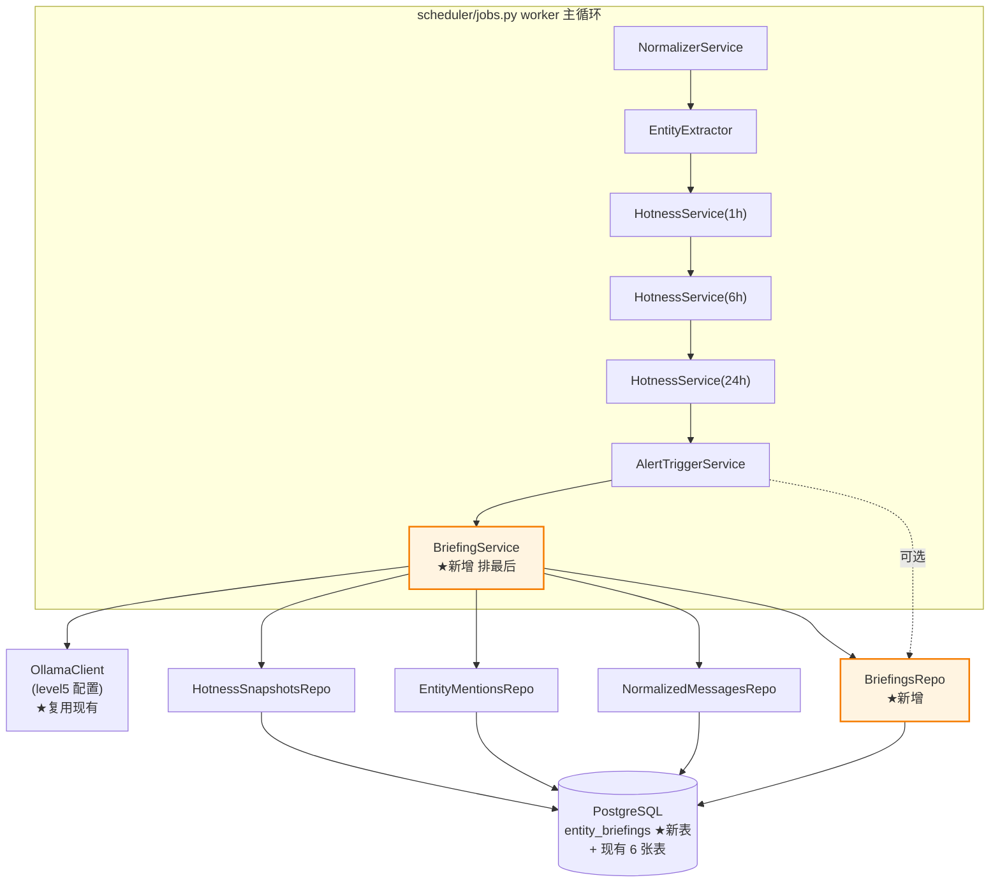
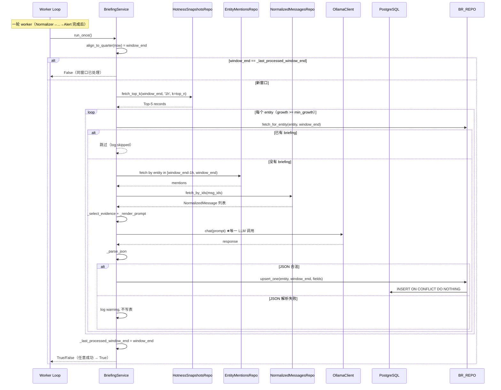

# Phase 2 · Task 2.7 L5 LLM 定向简报 · Design

> 基于 requirements.md v1.0 的架构与接口设计。在已经稳定产出的 hotness 榜单
> 之上叠加一层 LLM 解释，让"什么热"升级为"为什么热"。
>
> ⚠️ **本任务是 Phase 2 路线图里唯一明确突破"零 LLM 硬约束"的子任务**——
> 设计文档第 §9 章用整章篇幅论证这次突破为何合理、与"信号产生链路零 LLM"
> 这条等价物如何共存。读者请优先阅读 §9 再回头看其它章节。

## 1. 概述

### 1.1 目标

在 Phase 1 / Phase 2.1~2.6 已经稳定产出 hotness 榜单的前提下，引入
`BriefingService`：每 15 分钟整点对齐一次，对最新 1h 榜的 Top-N 实体调一次
LLM，输出结构化 JSON 简报（叙事归属 / 催化事件 / 资金逻辑 / 情绪 / 置信度），
落到新表 `entity_briefings`。可选地把这份 briefing 喂给 `AlertTriggerService`，
让 Telegram 推送从「`$EIGEN growth 20×`」升级为「`$EIGEN ↑20× | EigenLayer
v2.0 上线，Restaking 复苏`」。

### 1.2 三条核心设计哲学

1. **"信号产生链路零 LLM"**（重定义）
   - 老的"零 LLM"硬约束本质是"hotness / dedup / cooccur / cluster 这些
     **信号产生**链路绝不被 LLM 幻觉污染"
   - 本任务调 LLM **只在信号产生之后加解释**：hotness 公式不读 briefing、
     SimHash 不读 briefing、共现 PMI 不读 briefing、聚类相似度不读 briefing
   - 老链路 Level1Service / Level2Service 也调 Ollama，但同样只做"摘要"，
     与本任务设计原则一致——LLM 是辅助层，不是核心管道
   - 详细论证见 §9

2. **per-entity 异常隔离 + 优雅降级**
   - 每个 entity 的 LLM 调用独立 try/except，A 失败不影响 B
   - JSON 解析失败 / Ollama 不可达 / 超时 → log warning，**不写表**，
     下一轮 / 下一窗口自然重试
   - `briefing_enabled=False` → main.py 跳过整个 BriefingService 构造，
     零运行时开销

3. **配置驱动 + 可选集成**
   - `briefing_enabled=True` 启用 BriefingService，Top-N + min_growth +
     evidence_count 全可调
   - `AlertTriggerService` 集成是 **Task 6 可选项**：先把 briefings 表跑
     1~2 周观察 LLM 输出质量，确认稳定后再让告警消息读 briefing
   - 任何时候关掉开关 + 重启 = 立刻回到 Phase 2.1~2.6 现状

### 1.3 与 Phase 1 / Phase 2.x 的关系

```
Phase 1（不变）              Phase 2.1~2.6（不变）        Phase 2.7 本任务
───────────────────────       ─────────────────────────   ──────────────────────
NormalizerService                                          
  └─> normalized_messages                                  
      └─> EntityExtractor                                  
          └─> entity_mentions                              
              └─> HotnessService × 3                       
                  └─> hotness_snapshots ─┬─> AlertTriggerService
                                          │     └─> Telegram
                                          │           ↑
                                          │     可选：读 briefings_repo
                                          │     渲染时附加 narrative/catalyst
                                          │
                                          └─> BriefingService ★新增
                                              ├─> 拉 Top-N hotness（1h 榜）
                                              ├─> 选 evidence（mentions）
                                              ├─> 渲染 prompt
                                              ├─> ollama.chat() ★唯一 LLM 调用
                                              ├─> 解析 JSON
                                              └─> entity_briefings ★新表
```

**改动边界**：

- ✅ 新增 `alembic/versions/004_phase2_briefings.py` /
  `db/repositories/briefings_repo.py` / `services/l5_briefing.py` /
  `prompts/level5_briefing.txt`
- ✅ 改 `db/models.py` 加 `EntityBriefing` ORM、新增（或扩展）配置分组、
  `main.py` 加 BriefingService 构造、可选改 `services/l2_alert_trigger.py`
- ❌ **不改** Phase 1 任何 service（NormalizerService / EntityExtractor /
  HotnessService / SlidingCounter / Deduplicator）
- ❌ **不改** Phase 2.1/2.5/2.6 任何 service（multi-window-hotness /
  cooccurrence / clustering）
- ❌ **不改** `hotness_snapshots` / `entity_mentions` / `normalized_messages`
  schema

---

## 2. 总架构图

### 2.1 组件关系



### 2.2 调用时序



**关键时序约束**：

- BriefingService **必须**在 AlertTriggerService 之后（推理慢，不能阻塞实时
  告警；也避免 Alert 读到上一轮的 briefing 然后 Briefing 又写新的造成不一致）
- 多个 HotnessService（1h/6h/24h）**必须全部完成**后才跑 BriefingService
  （它读 1h 榜，1h 榜必须是本轮窗口最新数据）
- 单 worker 串行调度，无并发竞争（与 Phase 1/2.x 一致）
- 每轮总耗时上限：`top_n × ollama_timeout_level5` 即 5 × 600 = 3000s 理论上限，
  但实测每次 ~10s，Top-5 一轮 ~50s，远小于 quarter 间隔（15min = 900s）

---

## 3. 详细设计

### 3.1 数据模型

#### 3.1.1 `entity_briefings` 表 DDL

```sql
CREATE TABLE entity_briefings (
    id              BIGSERIAL PRIMARY KEY,
    entity          VARCHAR(128) NOT NULL,
    window_end      TIMESTAMPTZ  NOT NULL,
    narrative       TEXT,
    catalyst        TEXT,
    fund_logic      TEXT,
    sentiment       VARCHAR(16),
    confidence      DOUBLE PRECISION,
    evidence_msg_ids BIGINT[]    NOT NULL,
    raw_response    JSONB,
    created_at      TIMESTAMPTZ  NOT NULL DEFAULT NOW(),
    CONSTRAINT uq_entity_briefings_entity_window UNIQUE (entity, window_end)
);
CREATE INDEX idx_entity_briefings_window_end
    ON entity_briefings(window_end DESC);
```

字段语义（对齐 Req 1）：

| 字段 | 来源 | 用途 |
|---|---|---|
| `entity` | hotness_snapshots.entity | 索引主体 |
| `window_end` | hotness_snapshots.window_end | 时间快照锚点 |
| `narrative` | LLM 输出 / null | ≤ 20 字 / 当前归属叙事 |
| `catalyst` | LLM 输出 / null | ≤ 50 字 / 具体催化事件 |
| `fund_logic` | LLM 输出 / null | ≤ 50 字 / 资金或基本面逻辑 |
| `sentiment` | LLM 输出 / null | bullish / bearish / neutral |
| `confidence` | LLM 输出 / null | 0.0-1.0 |
| `evidence_msg_ids` | BriefingService 注入 | 本次喂给 LLM 的 normalized_messages.id 列表（幻觉审计关键证据）|
| `raw_response` | LLM 原始字符串 | 便于事后调 prompt 时回放 / 调试（Req 1.4）|

⚠️ Req 1.6：`(entity, window_end)` UNIQUE 约束保证幂等。同窗口同实体重复
调用走 `ON CONFLICT DO NOTHING`——**不覆盖**，避免 LLM 输出抖动让"上次告警
读到的 briefing"和"这次告警读到的 briefing"内容不一致。

#### 3.1.2 ORM 模型（`db/models.py` 追加）

```python
from sqlalchemy import BigInteger, Column, DateTime, Float, String, Text
from sqlalchemy.dialects.postgresql import ARRAY, JSONB

class EntityBriefing(Base):
    __tablename__ = "entity_briefings"

    id: Mapped[int] = mapped_column(BigInteger, primary_key=True)
    entity: Mapped[str] = mapped_column(String(128), nullable=False)
    window_end: Mapped[datetime] = mapped_column(
        DateTime(timezone=True), nullable=False
    )
    narrative: Mapped[Optional[str]] = mapped_column(Text)
    catalyst: Mapped[Optional[str]] = mapped_column(Text)
    fund_logic: Mapped[Optional[str]] = mapped_column(Text)
    sentiment: Mapped[Optional[str]] = mapped_column(String(16))
    confidence: Mapped[Optional[float]] = mapped_column(Float)
    evidence_msg_ids: Mapped[list[int]] = mapped_column(
        ARRAY(BigInteger), nullable=False
    )
    raw_response: Mapped[Optional[dict]] = mapped_column(JSONB)
    created_at: Mapped[datetime] = mapped_column(
        DateTime(timezone=True), nullable=False, server_default=func.now()
    )

    __table_args__ = (
        UniqueConstraint(
            "entity", "window_end", name="uq_entity_briefings_entity_window"
        ),
    )
```

字段类型选择对齐 Phase 1 已有模型风格：`DateTime(timezone=True)` /
`server_default=func.now()` / `BIGSERIAL`。

#### 3.1.3 `BriefingsRepo`（`db/repositories/briefings_repo.py`）

```python
@dataclass
class BriefingsRepo:
    def upsert_one(
        self,
        session,
        *,
        entity: str,
        window_end: datetime,
        fields: dict,
    ) -> int:
        """
        ON CONFLICT (entity, window_end) DO NOTHING。
        返回受影响的行数：0 表示同窗口已存在（被跳过），1 表示新插入。

        fields: {
            'narrative', 'catalyst', 'fund_logic', 'sentiment',
            'confidence', 'evidence_msg_ids', 'raw_response'
        }
        """
        stmt = pg_insert(EntityBriefing).values(
            entity=entity,
            window_end=window_end,
            **fields,
        ).on_conflict_do_nothing(
            constraint="uq_entity_briefings_entity_window"
        )
        result = session.execute(stmt)
        return int(result.rowcount or 0)

    def fetch_for_entity(
        self, session, *, entity: str, window_end: datetime
    ) -> Optional[EntityBriefing]:
        """返回 (entity, window_end) 对应的 briefing，找不到返回 None"""
        stmt = select(EntityBriefing).where(
            EntityBriefing.entity == entity,
            EntityBriefing.window_end == window_end,
        )
        return session.execute(stmt).scalar_one_or_none()

    def fetch_recent(
        self, session, *, window_end: datetime, limit: int = 20
    ) -> list[EntityBriefing]:
        """给 Phase 3 面板用；按 window_end DESC 排序"""
        stmt = (
            select(EntityBriefing)
            .where(EntityBriefing.window_end <= window_end)
            .order_by(EntityBriefing.window_end.desc())
            .limit(limit)
        )
        return list(session.execute(stmt).scalars())
```

### 3.2 BriefingService 接口（`services/l5_briefing.py`）

```python
@dataclass
class BriefingService:
    """
    L5 LLM 定向简报服务。每 15 分钟整点对齐一次，对最新 1h 榜的 Top-N
    实体生成结构化 JSON 简报，写入 entity_briefings。

    ★ 与 AlertTriggerService 同款幂等模式：用 _last_processed_window_end
    避免同一 quarter 反复扫描；用 entity_briefings 的 UNIQUE 约束避免
    同 entity 重复调 LLM。
    """

    db: Database
    hotness_repo: HotnessSnapshotsRepo
    mentions_repo: EntityMentionsRepo
    normalized_repo: NormalizedMessagesRepo
    briefing_repo: BriefingsRepo
    ollama: OllamaClient
    prompt_path: Path

    # 业务参数（main.py 从 settings 读）
    top_n: int = 5
    min_growth: float = 30.0
    evidence_count: int = 10
    timezone: ZoneInfo = field(default_factory=lambda: ZoneInfo("UTC"))

    # 运行时状态（不持久化）
    _last_processed_window_end: Optional[datetime] = None

    # =========================================================================
    # 公共 API
    # =========================================================================

    def run_once(self) -> bool:
        """
        执行一轮 briefing 生成。

        返回值：
        - True：本轮至少成功生成 1 条 briefing
        - False：没新窗口 / 无合格 entity / 全失败 / 同窗口已处理过
        """
        # Step 1：取最新 1h 榜的 window_end
        with self.db.get_session() as session:
            latest = self.hotness_repo.fetch_latest_window_end(session, "1h")

        if latest is None:
            return False

        if (
            self._last_processed_window_end is not None
            and latest <= self._last_processed_window_end
        ):
            logger.info("briefing skipped: latest window already processed")
            return False

        # Step 2：拉 Top-N 实体（窗口、类型、k）
        with self.db.get_session() as session:
            top_records = self.hotness_repo.fetch_top_k(
                session, window_end=latest, window_type="1h", k=self.top_n
            )

        # Step 3：过滤 growth 不足的
        eligible = [r for r in top_records if r.growth_rate >= self.min_growth]
        if not eligible:
            self._last_processed_window_end = latest
            logger.info(
                "briefing skipped: 0 entity 满足 growth>={} 阈值",
                self.min_growth,
            )
            return False

        # Step 4：对每个合格 entity 生成 briefing（per-entity 异常隔离）
        success = 0
        for rec in eligible:
            try:
                if self._process_entity(rec, latest):
                    success += 1
            except Exception as e:
                # 兜底：理论上 _process_entity 内部已 try/except，这里是双保险
                logger.warning(
                    "briefing LLM call failed: entity={} err={}",
                    rec.entity, e,
                )

        # Step 5：标记本窗口已处理（不论成功失败，避免反复扫描）
        self._last_processed_window_end = latest
        return success > 0

    # =========================================================================
    # 内部：单 entity 处理流程
    # =========================================================================

    def _process_entity(self, rec, window_end: datetime) -> bool:
        """对单个 entity 走一遍 select_evidence → render → ollama → parse → upsert"""
        entity = rec.entity

        # 已有 briefing 直接跳过（不再调 LLM）
        with self.db.get_session() as session:
            existing = self.briefing_repo.fetch_for_entity(
                session, entity=entity, window_end=window_end
            )
        if existing is not None:
            logger.info(
                "briefing skipped: entity={} 同窗口已生成",
                entity,
            )
            return False

        # 选 evidence
        with self.db.get_session() as session:
            evidence = self._select_evidence(session, entity, window_end)
        if not evidence:
            logger.info(
                "briefing skipped: entity={} 无 evidence", entity
            )
            return False

        # 渲染 prompt + 调 LLM（独立 try/except 隔离）
        prompt = self._render_prompt(entity, evidence)
        try:
            response = self.ollama.chat(prompt)
        except Exception as e:
            logger.warning(
                "briefing LLM call failed: entity={} err={}", entity, e
            )
            return False

        # 解析 JSON
        try:
            parsed = self._parse_json(response)
        except ValueError as e:
            logger.warning(
                "briefing JSON parse failed: entity={} 原始响应前 200 字: {}",
                entity, response[:200],
            )
            return False

        # 写库
        evidence_ids = [int(m.id) for m in evidence]
        with self.db.get_session() as session:
            try:
                inserted = self.briefing_repo.upsert_one(
                    session,
                    entity=entity,
                    window_end=window_end,
                    fields={
                        "narrative": parsed.get("narrative"),
                        "catalyst": parsed.get("catalyst"),
                        "fund_logic": parsed.get("fund_logic"),
                        "sentiment": parsed.get("sentiment"),
                        "confidence": parsed.get("confidence"),
                        "evidence_msg_ids": evidence_ids,
                        "raw_response": parsed,
                    },
                )
                session.commit()
            except Exception:
                session.rollback()
                raise

        if inserted:
            logger.info(
                "briefing generated: entity={} narrative='{}' "
                "catalyst='{}' confidence={}",
                entity, parsed.get("narrative"),
                parsed.get("catalyst"), parsed.get("confidence"),
            )
        return inserted > 0

    # =========================================================================
    # 内部：evidence 选择 / prompt 渲染 / JSON 解析
    # =========================================================================

    def _select_evidence(
        self, session, entity: str, window_end: datetime
    ) -> list[NormalizedMessage]:
        """
        选 evidence_count 条代表性 mention。

        策略优先级（Req 4.2）：
        1. 如果 mentions 全表存在非零 engagement → 按 engagement DESC 取 Top-N
        2. Phase 2 当前真实情况（engagement 全为 0）→ 随机抽样 N 条
        3. 未来与 Phase 2.6 协同（已上线 ClusteringService）→ 每 cluster 取 1 条

        当前实现先做 1+2，3 留 TODO 占位（Phase 2.6 上线后补）。
        """
        since = window_end - timedelta(hours=1)
        # 拉 entity 在过去 1h 的 mentions
        rows = self.mentions_repo.fetch_for_entity_in_window(
            session, entity=entity, since=since, until=window_end
        )
        if not rows:
            return []

        # Phase 2 现状：engagement 全为 0，直接随机抽样
        # （未来抓取层升级支持 engagement 后切到分支 1）
        if any((m.engagement or 0) > 0 for m in rows):
            rows.sort(key=lambda m: -(m.engagement or 0))
            picked_ids = [m.msg_id for m in rows[: self.evidence_count]]
        else:
            random.seed(hash((entity, window_end)))  # 同窗口同实体可复现
            picked_ids = [
                m.msg_id
                for m in random.sample(rows, k=min(self.evidence_count, len(rows)))
            ]

        # 拉对应的 normalized_messages
        return self.normalized_repo.fetch_by_ids(session, picked_ids)

    def _render_prompt(
        self, entity: str, evidence: list[NormalizedMessage]
    ) -> str:
        """
        加载 prompts/level5_briefing.txt 模板并替换三个占位符。
        evidence 单条剪裁到 (author, posted_at, text[:300])。
        """
        template = self.prompt_path.read_text(encoding="utf-8")
        lines: list[str] = []
        for i, m in enumerate(evidence, 1):
            author = m.author or "<unknown>"
            ts = m.posted_at.strftime("%Y-%m-%d %H:%M") if m.posted_at else ""
            text = (m.text or "")[:300]
            lines.append(f"{i}. [{ts}] @{author}: {text}")
        return template.format(
            entity=entity,
            n_msgs=len(evidence),
            messages="\n".join(lines),
        )

    def _parse_json(self, response: str) -> dict:
        """
        JSON 解析降级策略（Req 3.2 + 风险表）：
        1. 直接 json.loads
        2. 如果失败，尝试剥掉 ```json...``` 包裹再 loads
        3. 仍失败 raise ValueError
        4. 解析成功后做字段校验：sentiment ∈ {bullish, bearish, neutral, null}
        """
        text = response.strip()

        # 降级 1：剥 markdown 代码块包裹
        if text.startswith("```"):
            # 去掉首尾 ``` 行
            lines = text.split("\n")
            if lines[0].startswith("```"):
                lines = lines[1:]
            if lines and lines[-1].startswith("```"):
                lines = lines[:-1]
            text = "\n".join(lines).strip()

        try:
            data = json.loads(text)
        except json.JSONDecodeError as e:
            raise ValueError(f"JSON 解析失败: {e}; 原始: {response[:200]}")

        if not isinstance(data, dict):
            raise ValueError(f"JSON 顶层不是 object: {type(data)}")

        # 字段校验：sentiment 必须在白名单内
        sentiment = data.get("sentiment")
        if sentiment is not None and sentiment not in {
            "bullish", "bearish", "neutral"
        }:
            # 不抛错，置为 None（容忍 LLM 输出小偏差）
            data["sentiment"] = None
            logger.warning(
                "briefing sentiment 字段不在白名单，已置为 null: {}", sentiment
            )

        # confidence 范围校验
        conf = data.get("confidence")
        if conf is not None:
            try:
                conf = float(conf)
                if conf < 0 or conf > 1:
                    data["confidence"] = None
                else:
                    data["confidence"] = conf
            except (TypeError, ValueError):
                data["confidence"] = None

        return data
```

### 3.3 Prompt 模板（`prompts/level5_briefing.txt`）

风格对齐现有 `level1_*.txt` / `level2_*.txt`：纯文本 + Python `.format()`
占位符。模板内容：

```
你是加密市场分析助手。下面是过去 1 小时社交媒体上关于实体 {entity} 的 {n_msgs} 条
代表性消息。

请只输出一个 JSON 对象，**不要任何 markdown 代码块包裹**（不要 ```json），不要
解释 / 不要思考过程 / 不要前后说明文字。只能基于下面的消息内容做归纳，**不要
编造没出现的事件**。

JSON 格式：
{{
  "narrative":  "（这个实体当前归属的叙事，例如 \"Restaking\" / \"AI Agent\"，不超过 20 字。无法判断填 null）",
  "catalyst":   "（具体催化事件，例如 \"EigenLayer 主网升级 v2.0 上线\"，不超过 50 字。无法判断填 null）",
  "fund_logic": "（资金面或基本面逻辑，例如 \"Restaking 赛道 TVL 反弹至 200 亿美元\"，不超过 50 字。无法判断填 null）",
  "sentiment":  "bullish | bearish | neutral",
  "confidence": 0.0~1.0
}}

任一字段无法从消息中判断时，填 null 而不是猜。

消息：
{messages}
```

⚠️ Python `.format()` 里的字面 `{` `}` 必须双写为 `{{` `}}`。模板加载后通过
`template.format(entity=..., n_msgs=..., messages=...)` 替换三个占位符。

### 3.4 Evidence 选择策略

**当前实现**（Phase 2.7 v1.0）：

```
SELECT msg_id, author, posted_at, engagement, text
FROM entity_mentions em
JOIN normalized_messages nm ON em.msg_id = nm.id
WHERE em.entity = :entity
  AND em.ts >= :since
  AND em.ts <  :until
  AND nm.is_duplicate = FALSE
```

排序：

| 数据情况 | 实际策略 | 备注 |
|---|---|---|
| engagement 全表都为 0（Phase 2 现状）| 随机抽样 evidence_count 条 | `random.seed(hash((entity, window_end)))` 让同窗口结果可复现 |
| 部分 mention 有 engagement | 按 engagement DESC 取 Top-N | Phase 2.x 抓取层升级后自动切到这个分支 |
| Phase 2.6 已上线（聚类）| 每 cluster 取 1 条代表 | 留 TODO 占位，Phase 2.6 完工后补一个 _select_by_cluster 分支 |

**剪裁**：每条 evidence 在 prompt 里只保留 `(author, posted_at, text[:300])`
三段。300 字符 cap 是因为 Twitter 单条 280 上限、Discord / 币安偶有更长，
统一截断避免 prompt 超 qwen3:8b 的 16384 num_ctx：

```
10 条 × 平均 200 字 ≈ 2000 token
+ prompt 模板 ~400 token
+ 输出留白（JSON ~200 token）
合计 ~2600 token，远小于 16384。
```

### 3.5 JSON 解析降级策略

**实测 qwen3:8b 输出 JSON 的常见偏差**：

1. **包 markdown 代码块**（最常见）：模型在 JSON 前后各加一行 ` ```json ` 与
   ` ``` ` 包裹，例如返回 ` ```json\n{"narrative": "Restaking", ...}\n``` `

2. **加前后说明文字**（次常见）：在 JSON 前后追加自然语言说明，例如
   "根据消息内容，输出如下：" 然后接 JSON，再追加 "说明：..."

3. **`<think>...</think>` 包裹**（已通过 OllamaClient 的 `enable_thinking=False`
   关闭，但 prompt 里还是再强调一遍）

4. **字段值越界**：sentiment 输出 "positive" / "neg" / 中文 "看涨"，
   confidence 输出 "高" 而不是 0.85

**降级处理**（`_parse_json` 实现）：

| 偏差 | 处理 |
|---|---|
| ```` ```json``` ```` 包裹 | 剥首尾 ` ``` ` 行后再 loads |
| 前后说明文字 | 当前不处理（依赖 prompt 工程把这种压住）。失败 → log warning + 不写表 + 下轮重试 |
| sentiment 不在白名单 | 置为 null（容忍 LLM 输出小偏差，不当 fatal）|
| confidence 不是 float / 越界 | 置为 null |
| 顶层不是 object | raise ValueError |

**失败处理**：JSON 解析失败的 entity，本轮不写表（`raw_response` 也不存）。
下一轮 worker 触发时如果仍是同 window_end，因为 `_last_processed_window_end`
机制会跳过；但下一个 quarter 的新 window_end 会重新调一次 LLM 重试。

### 3.6 配置位置决策

#### 3.6.1 决策矩阵

| 选项 | 工作量 | 语义清晰度 | 未来扩展 |
|---|---|---|---|
| A. 新建 `config/_llm.py` 把 level1/2/5 全迁过去 | 中（改 settings.py 多继承）| ✅ 高 | ✅ Phase 3 加 level6 / 切模型方便 |
| B. 放进现有 `config/_legacy.py`（只加 2 字段）| 低 | ❌ 语义错位（_legacy 是"老链路"，level5 是新链路 LLM）| ⚠️ 后续真要扩 LLM 配置时还得迁 |
| C. 放进 `config/_new.py` | 低 | ❌ 与"新链路零 LLM"语义冲突 | ❌ 同上 |

**推荐方案 A：新建 `config/_llm.py`**

```python
# config/_llm.py（新建）
from dataclasses import dataclass

@dataclass(frozen=True)
class LLMSettings:
    """所有 LLM 相关配置集中管理。覆盖老链路 level1/2 与本任务 level5。"""

    # Ollama 服务端点（与老链路共享同一 Ollama 实例）
    ollama_base_url: str = "http://192.168.1.219:11434"

    # ----- level1 / level2（从 _legacy.py 迁过来）-----
    ollama_model_level1: str = "qwen3:8b"
    ollama_timeout_level1: int = 600
    ollama_model_level2: str = "qwen3:8b"
    ollama_timeout_level2: int = 600

    # ----- level5（本任务新增）-----
    ollama_model_level5: str = "qwen3:8b"
    ollama_timeout_level5: int = 600
```

迁移步骤（实施 Task 4 时）：

1. 新建 `config/_llm.py`（如上）
2. 改 `config/_legacy.py` 把 ollama_* 字段全部删掉，只保留 `batch_size`
   + `level2_threshold` 这种纯老链路业务参数
3. 改 `config/settings.py` 的 `Settings` 多继承列表追加 `LLMSettings`
4. 改老链路 `services/level1_service.py` / `level2_service.py` 的引用
   （从 `settings.LegacySettings` 改成 `settings.LLMSettings`，但因为
   多继承下 settings 实例字段都展平，**实际不用改**，只需保证字段名不变）

**备选方案 B**：如果用户希望"先快后好"先把 task 跑起来，可以暂时放进
`_legacy.py`（只加 `ollama_model_level5` / `ollama_timeout_level5` 两个字段，
不动其它）。等 Phase 3 真有需求扩 LLM 配置时再做迁移。

实施时在 design 评审 / Task 4 启动前由用户拍板。

#### 3.6.2 业务配置（无歧义放 `config/_new.py`）

```python
# config/_new.py 末尾追加（与 hotness_24h_* 等并列）

# Phase 2.7 LLM 简报
briefing_enabled: bool = True
briefing_top_n: int = 5
briefing_min_growth: float = 30.0
briefing_evidence_count: int = 10
```

理由：这 4 个字段是**业务参数**（top_n / 阈值 / evidence 上限），不是 LLM
配置——逻辑上属于"新链路业务行为"分组，与 hotness_top_k 等同源。

### 3.7 main.py 注入

```python
# main.py（在 Step 5d AlertTriggerService 构造之后追加 Step 5e）

# Step 5e：BriefingService（Phase 2.7）
briefing_service = None
if settings.briefing_enabled:
    try:
        from llm.ollama_client import OllamaClient
        from services.l5_briefing import BriefingService
        from db.repositories.briefings_repo import BriefingsRepo

        ollama_l5 = OllamaClient(
            base_url=settings.ollama_base_url,
            model=settings.ollama_model_level5,
            timeout_seconds=settings.ollama_timeout_level5,
        )
        briefing_repo = BriefingsRepo()

        briefing_service = BriefingService(
            db=db,
            hotness_repo=hotness_repo,
            mentions_repo=mentions_repo,
            normalized_repo=normalized_repo,
            briefing_repo=briefing_repo,
            ollama=ollama_l5,
            prompt_path=Path("prompts/level5_briefing.txt"),
            top_n=settings.briefing_top_n,
            min_growth=settings.briefing_min_growth,
            evidence_count=settings.briefing_evidence_count,
            timezone=settings.timezone,
        )
        logger.info(
            "BriefingService 启动：top_n={} min_growth={} evidence_count={} model={}",
            settings.briefing_top_n,
            settings.briefing_min_growth,
            settings.briefing_evidence_count,
            settings.ollama_model_level5,
        )
    except Exception as e:
        logger.error(
            "BriefingService 加载失败已跳过：{}（hotness/alert 主流程不受影响）",
            e,
        )
        briefing_service = None
else:
    logger.info("BriefingService 未启用（briefing_enabled=False）")

# new_services 列表追加（必须在 alert_service 之后）
# 完整顺序：Normalizer → EntityExtractor → Hotness × 3 → Alert → Briefing
new_services = [normalizer_service, entity_extractor]
new_services.extend(hotness_services)
if alert_service is not None:
    new_services.append(alert_service)
if briefing_service is not None:
    new_services.append(briefing_service)
```

### 3.8 与 AlertTriggerService 协同（可选 Task 6）

> ⚠️ 本节对应 Req 8 与 tasks.md Task 6，标记为**可选项**。先把 briefings
> 表跑 1~2 周观察 LLM 输出质量，确认稳定后再做集成；否则可能反过来拉低
> Telegram 推送的可读性。

#### 3.8.1 改动 `services/l2_alert_trigger.py`

```python
@dataclass
class AlertTriggerService:
    db: Database
    hotness_repo: HotnessSnapshotsRepo
    telegram_client: TelegramClient
    # ★ 新增字段：默认 None 保持 Phase 2.2 向后兼容
    briefing_repo: Optional[BriefingsRepo] = None
    # ... 其它字段不变 ...

    def _render_message(self, rec, alert_type: str) -> str:
        # 先渲染原模板（Phase 2.2 完整逻辑保留）
        base = self._render_base_template(rec, alert_type)

        # 可选追加 briefing 字段
        if self.briefing_repo is not None:
            try:
                with self.db.get_session() as session:
                    bf = self.briefing_repo.fetch_for_entity(
                        session, entity=rec.entity, window_end=rec.window_end
                    )
                if bf is not None and bf.narrative:
                    suffix = f"\n📰 {bf.narrative}"
                    if bf.catalyst:
                        suffix += f" | {bf.catalyst}"
                    base += suffix
            except Exception as e:
                # 优雅降级：briefing 查询失败不影响告警发出
                logger.warning(
                    "alert briefing fetch failed: entity={} err={}",
                    rec.entity, e,
                )

        return base
```

#### 3.8.2 main.py 把 briefing_repo 注入 AlertTriggerService

```python
# Step 5d 改造（启用 Task 6 时）：
alert_service = AlertTriggerService(
    db=db,
    hotness_repo=hotness_repo,
    telegram_client=telegram_client,
    briefing_repo=briefing_repo if briefing_service is not None else None,
    # ... 其它参数不变 ...
)
```

未启用 Task 6 时 briefing_repo 默认 None → AlertTriggerService 行为与
Phase 2.2 100% 等价（Req 8.2 / 硬约束#4 不破坏向后兼容）。

#### 3.8.3 协同设计原则（重要）

- **告警永远不应等待 briefing**：briefing 查询失败 / 不存在 → 走原模板，
  告警照发（硬约束#2 不阻塞主流程的字面意思）
- **不阻塞 Telegram**：briefing 查询是 SQL 单行，~5ms，不会拖延
- **顺序保证**：BriefingService 排在 AlertTriggerService **之后**意味着
  本轮 Alert 看到的是**上一窗口**的 briefing。这是可接受的——上一窗口的
  briefing 内容仍然有效（同 entity 同 quarter 的解释）。如果想让 Alert
  看到"本窗口刚生成的 briefing"，需要把 BriefingService 排到 Alert 之前，
  但代价是 Alert 推送延迟 ~50s（一轮 LLM 推理时间），不划算

---

## 4. 文件清单

```
新增：
  alembic/versions/004_phase2_briefings.py     [建表 + UNIQUE + 索引]
  db/repositories/briefings_repo.py            [BriefingsRepo: upsert_one + fetch_for_entity + fetch_recent]
  services/l5_briefing.py                      [BriefingService 主体]
  prompts/level5_briefing.txt                  [LLM prompt 模板]
  tests/test_l5_briefing.py                    [10 cases]

修改：
  db/models.py                                 +EntityBriefing ORM
  config/_llm.py                               ★方案 A 新建（推荐）
  config/_legacy.py                            ★方案 A 时迁出 ollama_* 字段
  config/_new.py                               +4 briefing 业务字段
  config/settings.py                           ★方案 A 时多继承追加 LLMSettings
  main.py                                      +Step 5e BriefingService 构造
  services/l2_alert_trigger.py                 +briefing_repo 字段（Task 6 启用时）
  tests/test_l2_alert_trigger.py               +2 cases（Task 6 启用时）

不动：
  notifications/telegram_client.py
  services/l0_*.py / l1_*.py / l2_hotness.py / l2_sliding_counter.py
  其它所有 Phase 1 / 2.1~2.6 文件
```

---

## 5. 测试矩阵

测试基线：**135 → 147 passed**（+12，0 回归）。

### 5.1 `tests/test_l5_briefing.py`（10 用例 → 145 passed）

| # | 用例 | 关键断言 | mock 重点 |
|---|---|---|---|
| 1 | `test_select_evidence_top_engagement` | engagement 非零时按 engagement DESC 取 Top-N | mentions 表插入带 engagement 数据 |
| 2 | `test_select_evidence_falls_back_to_random` | engagement 全 0 时随机抽样 N 条 | 同窗口同 entity 多次调用结果一致（seed） |
| 3 | `test_render_prompt_replaces_placeholders` | `{entity}` / `{n_msgs}` / `{messages}` 全部替换 | 写临时 prompt 文件 |
| 4 | `test_parse_json_valid` | 合法 JSON 字符串解析成 dict + 字段全在 | - |
| 5 | `test_parse_json_strips_markdown_fence` | ` ```json ... ``` ` 包裹的能解析 | - |
| 6 | `test_parse_json_invalid_raises` | 非法 JSON raise ValueError | - |
| 7 | `test_skips_when_no_top_entities` | 空榜单时返回 False | hotness_repo.fetch_top_k 返回空 |
| 8 | `test_skips_already_briefed_entity` | 同 (entity, window_end) 已有 briefing 不调 LLM | briefing_repo.fetch_for_entity 返回非 None；ollama.chat 不被调用 |
| 9 | `test_per_entity_failure_isolated` | entity A 的 ollama.chat 抛错不影响 entity B | ollama.chat side_effect 第一次抛 timeout 第二次 OK |
| 10 | `test_low_growth_filtered_out` | growth < min_growth 的实体被过滤掉 | hotness_repo.fetch_top_k 返回不同 growth 的 records |

补充非编号但建议加的：

| # | 用例 | 备注 |
|---|---|---|
| 11 | `test_skips_when_window_unchanged` | _last_processed_window_end 命中跳过 | 同 5.1 #7 模式 |
| 12 | `test_evidence_text_truncated_to_300_chars` | 长文本剪裁 | 边界条件 |

### 5.2 `tests/test_l2_alert_trigger.py` 追加（2 用例 → 147 passed，仅 Task 6 启用时）

| # | 用例 | 关键断言 |
|---|---|---|
| 13 | `test_alert_message_appends_briefing_when_present` | briefing_repo 命中 → 消息含 `📰 narrative \| catalyst` |
| 14 | `test_alert_message_falls_back_when_no_briefing` | briefing_repo 未命中 → 走 Phase 2.2 原模板（向后兼容）|

### 5.3 测试约束

- **LLM 必须 mock**（Req 9.4）：禁止任何测试真的调 Ollama
  - 用 `Mock(spec=OllamaClient)` 注入，`mock.chat.return_value` 返回硬编码
    JSON 字符串
- **DB 用 SQLite 内存库**（与 Phase 1 测试一致）
  - `BIGINT[]` 在 SQLite 不支持，evidence_msg_ids 字段需要在测试中 monkeypatch
    成 JSON 序列化或用 PostgreSQL Docker（前者更轻）
- **datetime 用 freeze_time**（已在 test_l2_alert_trigger.py 用过）

---

## 6. 风险与缓解

### 6.1 高风险

| 风险 | 概率 | 缓解 |
|---|---|---|
| **零 LLM 硬约束突破被误解** | 中 | §9 整章论证；docs/faq Q11 明确原则；code review 时严格审 services/l0_*.py / l1_*.py / l2_hotness.py / l2_sliding_counter.py 不能 import OllamaClient |
| **LLM JSON 输出不稳定**（qwen3:8b 容易加 ` ```json ` 包裹）| 高 | prompt 工程显式禁止 + `_parse_json` 降级剥包裹；解析失败不写表 + 下轮重试；实测合法率 < 90% 就回炉调 prompt |
| **LLM 幻觉**（编造 evidence 之外内容）| 高 | prompt 强调"只能基于消息内容"；`evidence_msg_ids` 字段记录用了哪些消息便于事后审计；`raw_response` 字段保留原始输出便于回放；用户应**人工评估 1~2 周**再决定是否长期开启 |
| **本任务 ROI 本身不高**（用户可手动推特搜）| 中 | requirements §2 明确告知；Task 0.3 让用户在方案 A/B/C 之间决策；可以**完全不做**让 spec 停在文档阶段 |

### 6.2 中风险

| 风险 | 概率 | 缓解 |
|---|---|---|
| **CPU 推理慢拖累 worker**（每次 ~10s，Top-5 一轮 ~50s）| 中 | 调度顺序固定排最后；top_n=5 控制单轮总耗时；HotnessService 是 15min 整点对齐，1 分钟内的 worker 延迟可接受 |
| **Ollama 不可达**（服务挂 / 网络断）| 低 | per-entity try/except；ollama.chat 失败 → log warning + 跳过 + 下轮重试；不影响 hotness / alert |
| **配置位置决策错**（_legacy vs _llm）| 低 | §3.6 决策矩阵；实施前用户拍板；走错也容易迁 |
| **AlertTriggerService 集成时 briefing 内容拉低告警可读性** | 中 | Task 6 标可选项；先观察 1~2 周再启用；JSON 解析失败的不写表 = Telegram 不会拿到垃圾内容 |

### 6.3 低风险

| 风险 | 概率 | 缓解 |
|---|---|---|
| **briefing 内容过期** | 低 | 每 15 分钟刷新；同 (entity, window_end) UNIQUE 保证幂等 |
| **Telegram 消息长度超 4096**（追加 briefing 后）| 低 | TelegramClient 已有 4000 字符截断（Phase 2.2 Req 1.3）|
| **失败的 briefing 占据"已处理"位置** | 低 | 不写表 = ON CONFLICT 不触发 = 下一轮 entity 仍可重试（因为 `_last_processed_window_end` 是 window 级，不是 entity 级）|
| **entity_briefings 表磁盘增长** | 低 | Top-5 × 96 quarter/天 = 480 行/天 → 1 年 ~17 万行，单表 ~50MB，可接受 |

---

## 7. 部署步骤

### 7.1 Pre-flight 检查（Task 0）

```bash
# 1. 测试基线确认
.venv/bin/python -m pytest tests/ --ignore=tests/test_ollama_client.py -q
# 预期：135 passed, 1 skipped

# 2. Ollama 可达性
curl http://192.168.1.219:11434/api/tags | grep qwen3
# 预期：看到 qwen3:8b 已 pull

# 3. 试调一次 LLM 看输出
echo '<level5_briefing.txt 模板替换后的完整 prompt>' | \
  curl -X POST http://192.168.1.219:11434/api/chat \
    -d '{"model":"qwen3:8b","stream":false,"messages":[{"role":"user","content":"<上面 prompt>"}]}'
# 预期：返回的 message.content 是合法 JSON
```

如果 Ollama 不可达 → 推迟本任务（方案 B 或 C）。

### 7.2 用户决策（Task 0.3）

读 requirements.md §2 + tasks.md "用户决策点"小节，从 A / B / C 中选一个：

- **A. 接受**（本设计方案）：跑完 Task 1~5 + 可选 6 + Task 7~8
- **B. 跳过**：spec 文档完工，不实施代码；Phase 3 再决策
- **C. 不调 LLM 改"附原文"**：放弃 BriefingService，改成在
  AlertTriggerService 渲染时直接附 Top-3 mention 原文（工程量减少 80%）

下面 7.3~7.5 假设走方案 A。

### 7.3 实施顺序（按 tasks.md）

```
Task 1（DB schema）
   └─> 跑 alembic upgrade head 验证表创建
        └─> Task 2（prompt 工程）
              └─> 用 5 个真实 entity 跑 ollama.chat 实测合法率 ≥ 90%
                    └─> Task 3（BriefingService）→ 145 passed
                          └─> Task 4（配置）
                                └─> Task 5（main.py 注入）
                                      ├─> Task 6（可选 Telegram 集成 → 147 passed）
                                      └─> Task 7（端到端验收）
                                            └─> Task 8（文档）
```

### 7.4 重启与验证

```bash
# 1. 重启服务
./scripts/restart.sh

# 2. 启动日志检查
tail -f logs/service.log | grep "BriefingService 启动"
# 预期：BriefingService 启动：top_n=5 min_growth=30.0 evidence_count=10 model=qwen3:8b

# 3. 等下一个 quarter（最多 15min），看 briefing 落库
psql -c "SELECT entity, narrative, catalyst, sentiment, confidence
         FROM entity_briefings
         ORDER BY created_at DESC LIMIT 10;"

# 4. 人工评估 LLM 输出质量（随机抽 5 条）
psql -c "SELECT entity, raw_response FROM entity_briefings
         ORDER BY RANDOM() LIMIT 5;"
```

### 7.5 回滚

如果 LLM 输出质量差 / 占用 CPU 过多 / 任何不满意：

```bash
# 改 config/_new.py
briefing_enabled: bool = False

# 重启
./scripts/restart.sh
```

`briefing_enabled=False` → main.py 跳过整个 BriefingService 构造 → 系统
回到 Phase 2.6 等价状态。entity_briefings 表的历史数据保留（不主动 drop），
便于以后重新启用时回看。

---

## 8. 与 Phase 2.5 / 2.6 协同

### 8.1 与 Phase 2.5（共现网络）

**Phase 2.5 上线后**可以让 prompt 更稳定：在 prompt 模板里注入"该 entity
共现 Top-3 的邻居"作为 narrative hint：

```
你是加密市场分析助手。下面是关于实体 {entity} 的 {n_msgs} 条消息。
该实体最近共现最多的实体（仅供参考）：{cooccur_neighbors}
...
```

代价：BriefingService 多依赖一个 `cooccur_repo`，对单纯文本归纳来说锦上添花
不是必需。Phase 2.7 v1.0 不做，留 Phase 2.7 v2.0 升级位。

### 8.2 与 Phase 2.6（Embedding 聚类）

**Phase 2.6 上线后**可以显著提升 evidence 质量：从"随机抽样 10 条"升级到
"每个 cluster 取 1 条代表"，避免 LLM 看到 10 条几乎相同的重复消息浪费上下文。

实现位置：`_select_evidence` 内部加一个分支：

```python
def _select_evidence(self, session, entity, window_end):
    # 现有 engagement / random 分支保留作为 fallback
    # ...

    # 优先分支（Phase 2.6 上线后启用）：每 cluster 取 1 条代表
    if hasattr(self, 'clusters_repo') and self.clusters_repo is not None:
        cluster_reps = self.clusters_repo.fetch_representatives_for_entity(
            session, entity=entity, window_end=window_end, limit=self.evidence_count
        )
        if cluster_reps:
            return cluster_reps
    # 否则走原 engagement / random 分支
    # ...
```

代价：`BriefingService` 增加 `clusters_repo: Optional[EventClustersRepo] = None`
字段，main.py 在 Phase 2.6 启用时注入。Phase 2.7 v1.0 不做，留 v2.0 升级位。

### 8.3 与 Phase 2.2（Telegram 告警）

见 §3.8。**强协同**——本任务的产出主要消费者就是 Telegram 推送。但 Task 6
标可选项的原因：先把 LLM 输出质量观察 1~2 周，避免反过来拉低告警可读性。

---

## 9. 零 LLM 硬约束的明确突破论证

> 本章是设计文档**最关键**的一章。读者请优先阅读本章。

### 9.1 老硬约束的原文与本意

Phase 1 / Phase 2.1~2.6 的硬约束#1 原文（出自历次 spec）：

> **零 LLM**：新链路严格不 import `llm/ollama_client.py`，hotness 公式 / SimHash
> / 共现 PMI / 聚类相似度全部用确定性算法。

这条约束的**本意**：

1. **可重放性**：所有信号产生过程都是确定性的，给定同样的输入 + 配置，
   输出 100% 一致。便于事后回放、回归测试、单元测试断言。
2. **可调试性**：Hotness 突变时能精确定位到 SQL 查询 + 公式系数；如果是
   LLM 产出，定位"为什么这次 growth 是 20.3 不是 19.7"几乎不可能。
3. **不被幻觉污染**：LLM 偶尔会编造没出现的 entity，如果让 LLM 参与信号
   产生（比如"LLM 判断 entity X 比 Y 更热"），系统会被幻觉污染。
4. **CPU/GPU 资源解耦**：信号产生跑在普通 worker 上，不依赖 GPU/Ollama；
   LLM 推理慢，让它阻塞实时管道是设计错误。

### 9.2 本任务的位置

```
信号产生链路（不变 / 仍然零 LLM）          解释层（本任务，调 LLM）
──────────────────────────────────         ────────────────────
Normalizer                                  
EntityExtractor                             
HotnessService × 3                          
   └─> hotness_snapshots ─────────┬────────> AlertTriggerService
                                   │            └─> Telegram
                                   │
                                   └────────> BriefingService ★本任务
                                              └─> entity_briefings
                                              └─> 可选反喂 Alert
```

**信号已经产生了**——榜单 / growth_rate / cross_source / count_short 全部
来自 Phase 1 的确定性算法。BriefingService 干的事是**对已产生的信号加文字
解释**，不参与"哪些 entity 进 Top-5"的决策。

### 9.3 与老硬约束 4 条本意的对照

| 本意 | BriefingService 是否破坏 |
|---|---|
| 1. **可重放性** | ❌ 破坏（LLM 输出对同输入不一致）<br>**但**：信号产生链路的可重放性 100% 保留——hotness 公式不读 briefing，下次重跑 hotness 输出仍然完全一致 |
| 2. **可调试性** | ❌ 略微破坏（LLM 输出难调试）<br>**但**：缓解措施是 `evidence_msg_ids` + `raw_response` 字段——能精确知道每次 briefing 用了哪些 evidence、LLM 原始返回是什么 |
| 3. **不被幻觉污染** | ✅ 不破坏——LLM 输出落到 entity_briefings 表，**没有任何 service 反向读这张表写回信号产生链路**（grep 验证：services/l0_*.py / l1_*.py / l2_hotness.py 不 import briefings_repo） |
| 4. **CPU/GPU 资源解耦** | ❌ 破坏（worker 现在依赖 Ollama）<br>**但**：缓解措施是 `briefing_enabled=False` 一键关掉 + per-entity 异常隔离，Ollama 挂掉不阻塞 hotness/alert |

### 9.4 重定义后的硬约束

把硬约束#1 重写为：

> **"信号产生链路零 LLM"**：normalizer / dedup / entity_extractor / hotness /
> sliding_counter / cooccurrence / clustering / alert_trigger 这些**信号产生
> 链路**严格不 import `llm/ollama_client.py`。LLM 只允许出现在**解释层**
> （BriefingService 及未来同类服务），且解释层的输出**不允许反向影响信号
> 产生链路**。

这个重定义保留了老约束 4 条本意的核心（信号产生链路可重放、可调试、不被
幻觉污染、与 Ollama 资源解耦），同时给 LLM 留了一个明确的、可控的、有边界
的活动空间。

### 9.5 与老链路 Level1Service / Level2Service 的设计原则一致

老链路也调 Ollama，但同样只做"摘要"——**对已抓取的原始消息做归纳，不参与
信号产生**。这与本任务的 BriefingService 设计原则完全一致。Phase 2.7 不是
开了一个全新的口子，而是把"信号产生链路零 LLM、解释层允许 LLM"这个老链路
就在用的原则**显式写进新链路硬约束**。

### 9.6 防止滑坡（防止未来其他 service 借口本任务也开始随便引 LLM）

**护栏措施**：

1. **本设计文档 §9 + docs/faq Q11**：明确记录"信号产生链路零 LLM"
   重定义，未来任何新 service 想 import OllamaClient 必须先回答："你是
   信号产生还是解释层？" 信号产生 → 拒绝；解释层 → 走类似 BriefingService
   的方案 A/B/C 决策流程
2. **Code review 检查项**：每次 PR 必跑 `grep -r 'OllamaClient\|ollama' \
   services/l0_*.py services/l1_*.py services/l2_hotness.py \
   services/l2_sliding_counter.py services/l2_alert_trigger.py`，预期 0 命中
3. **Success Metrics 反向验证**（Req §Success Metrics 已包含）：
   `grep -r 'OllamaClient\|ollama' services/l0_*.py services/l1_*.py
   services/l2_hotness.py` 应仍然 0 命中

### 9.7 用户最终决策权

用户可以选择：

- **A. 接受重定义**（本设计方案）—— 接受信号产生链路零 LLM、解释层允许 LLM
- **B. 拒绝重定义**（保持老硬约束严格版）—— 跳过本任务，Phase 3 再考虑
- **C. 部分接受**（不调 LLM，改成附原文）—— 在 AlertTriggerService 渲染
  时直接附 Top-3 mention 原文，让用户自己读 5 条原文判断。**完全不引入 LLM**，
  老硬约束零变化

三个方案对"早期热点发现"产品定位的契合度排序：**A ≈ C > B**。A 和 C 都
能让 Telegram 推送回答"为什么热"；B 完全跳过。A 比 C 多了"自动归纳叙事"
的能力，但代价是引入 LLM 不稳定性 + CPU 资源。

实施前由用户在 Task 0.3 拍板，design.md 不替用户做这个决策。

---

*文档版本：v1.0*
*基于：requirements.md v1.0 / tasks.md v1.0*
*核心引用：Phase 2.2 telegram-alerts/design.md（版式标杆）+ Phase 2.6
 embedding-clustering/design.md（章节结构对照）*
*预估工时：实施前补 prompt 工程 1~2 天 + 编码 3~5 天 ≈ 1 周*
*本任务在 Phase 2 路线图里 ROI 最低，建议放在最后或完全跳过*
