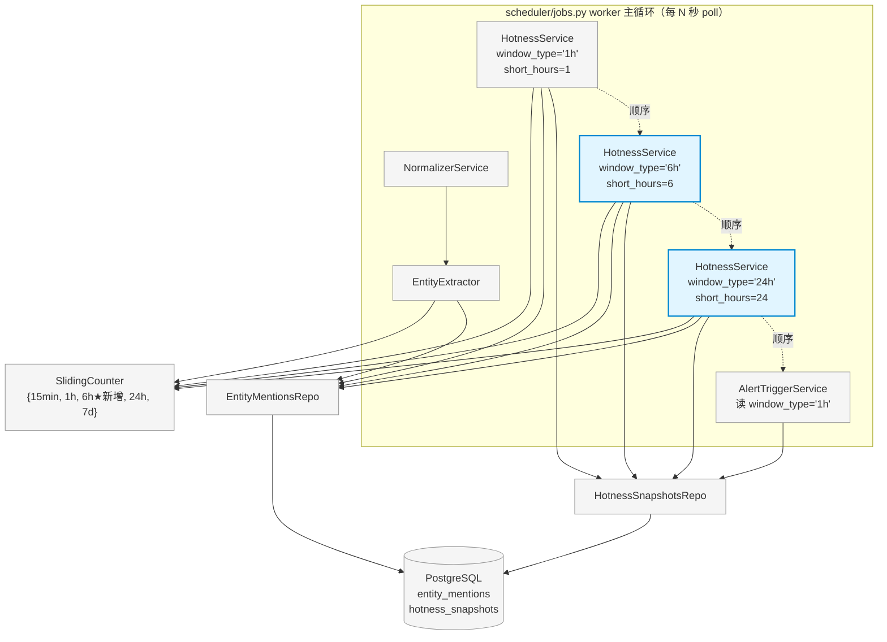
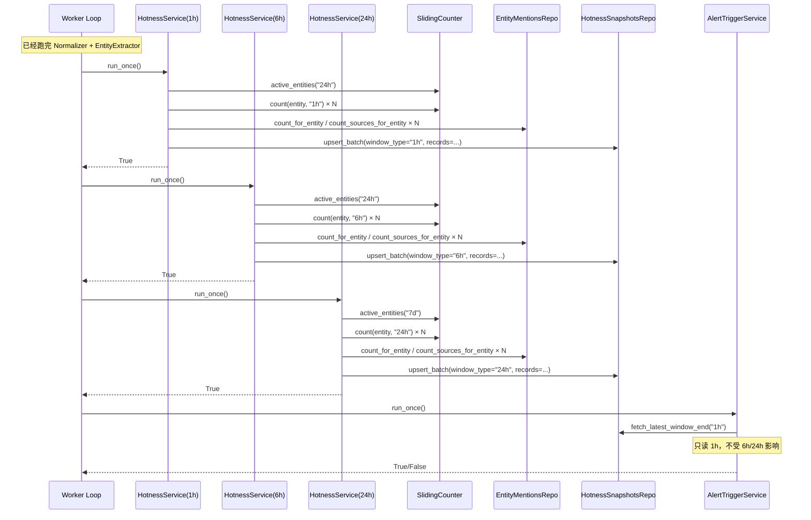

# Phase 2 · Task 2.1 多窗口热度排行榜 · Design

> 在 Phase 1 已经稳定产出的 `1h` 热度排行榜基础上扩展支持 `6h` / `24h`，
> 让 `hotness_snapshots` 同时输出三种 `window_type`，为下游 AlertTriggerService
> 等消费者提供"短中长"三档信号。

## 1. 概述

### 1.1 目标

把现有的 **单窗口** HotnessService（硬编码 `short_hours=1` / `window_type='1h'`）
扩展成 **多窗口**：在每轮 worker 循环中并行写入三份排行榜
（`window_type ∈ {'1h', '6h', '24h'}`），全部落到同一张 `hotness_snapshots` 表。

下游消费者（当前仅 `AlertTriggerService`，Phase 2.2 已上线）保持读 `'1h'`，**完全不动**；
未来 Phase 2.2.1 想增加"中期 / 长期"告警通道时，只需要给 `AlertTriggerService` 配
不同的 `window_type` 参数即可，本任务为它铺好接口。

### 1.2 三条核心设计哲学

1. **零 schema 变更，零新依赖**：`hotness_snapshots` 的 UNIQUE 约束已经是
   `(window_end, window_type, entity)`，天然支持多 `window_type` 共存；
   `SlidingCounter` 已经支持 4 种窗口（差一个 `'6h'`），加个键即可。
2. **每窗口独立可禁用 + 独立可调参**：`6h` / `24h` 的噪音特性、基线长度、
   smoothing 阈值都跟 `1h` 不一样，都通过 `settings` 独立暴露；任一窗口
   构造失败或被关闭都不影响其它窗口。
3. **进程内多实例 + 共享底层资源**：构造 N 个 `HotnessService` 实例
   （每个绑定一种 `window_type`），共享同一个 `SlidingCounter`、
   `EntityMentionsRepo`、`HotnessSnapshotsRepo` 实例；状态字段
   （`_last_window_end` / `_counter_ready`）每实例独立。

### 1.3 与 Phase 1 / Phase 2.2 的关系

```
Phase 1（不变）              Phase 2.1 本任务            Phase 2.2（不动）
─────────────────────       ──────────────────────       ──────────────────────
EntityExtractor                                          
  └─> sliding_counter ◄───── ★ 新增 '6h' 桶 ─────►       
        + entity_mentions                                
                                                         
HotnessService (1h)  ──┐                                 
                       ├─► hotness_snapshots             AlertTriggerService
HotnessService (6h)  ──┤    ─ window_type='1h' ────────► fetch_latest_window_end("1h")
                       │    ─ window_type='6h'           （Phase 2.2 上线，不改）
HotnessService (24h) ──┘    ─ window_type='24h'          
                                                         ★ 未来：可起 3 实例分别读
                                                            '1h' / '6h' / '24h'
```

**改动边界（用户硬约束）**：

- ✅ 改 `services/l2_sliding_counter.py`：加 `'6h'` 窗口键
- ✅ 改 `services/l2_hotness.py`：参数化 `window_type` / 添加构造期校验
- ✅ 改 `config/_new.py`：加各窗口的独立配置字段
- ✅ 改 `main.py`：Step 5c 单实例 → 多实例
- ✅ 加测试：多窗口 SlidingCounter、24h 边界、多实例集成、`'1h'` 行为不变
- ❌ **不改** `db/models.py` / `alembic/versions/`（schema 已就绪）
- ❌ **不改** `services/l2_alert_trigger.py`（Phase 2.2 接口冻结，向前兼容）
- ❌ **不动** `requirements.txt`（用现有库）
- ❌ **不破坏** 当前 128 passed 基线（1h 窗口语义/字段/排序 100% 等价）

---

## 2. 总架构图

### 2.1 组件关系



### 2.2 调用时序（一轮 worker 触发）



**关键点**：

- 三个 HotnessService 在 worker 里**串行**调度（与 Phase 1 单线程模型一致），
  共享 SlidingCounter 不存在并发竞争。
- AlertTriggerService 仍按 `window_type='1h'` 取最新窗口，**完全不感知** 6h/24h 的存在。
- 任意一个 HotnessService 抛异常被 `Jobs._worker_loop` 的异常隔离机制兜底
  （已有逻辑，见 `scheduler/jobs.py`），不影响其它实例。

---

## 3. 详细设计

### 3.1 SlidingCounter：加一个 `'6h'` 窗口键

**改动文件**：`services/l2_sliding_counter.py`

唯一改动是 `WINDOWS_SECONDS` 字典加一行：

```python
WINDOWS_SECONDS: dict[str, int] = {
    "15min": 900,
    "1h": 3600,
    "6h": 21600,   # ★ 新增
    "24h": 86400,
    "7d": 604800,
}
```

**为什么够用**：

- `add(entity, ts)` 的实现是 `for w in WINDOWS_SECONDS:` 遍历，自动覆盖新键。
- `count(entity, window)` / `active_entities(window)` 都对 `WINDOWS_SECONDS` 做合法性
  校验（不在表里就 `raise ValueError`），加键即可放行 `'6h'`。
- `backfill_from_db(db)` 一次回填 7 天数据，对四（→五）个窗口的 deque 同步追加，
  无需修改逻辑。

**内存代价**：

- 现有四桶（15min / 1h / 24h / 7d）每个 entity 一份 deque；新加 `6h` 让每个 entity 多一份。
- Phase 1 实测活跃 entity 数 ~1000，每个 deque 平均 ~50 条 ts（24h 内提及数）。
  新增 `6h` 桶平均 deque 长度比 24h 短约 75%，估算多消耗 < 5MB 内存。可接受。
- 长期累积：deque 是惰性清理（`count` 调用时 popleft 过期），不会无限膨胀。

**向后兼容性**：现有 9 个 SlidingCounter 单测覆盖 `'15min' / '1h' / '24h' / '7d'`，
加键后逐一过；新增 1 个 `'6h'` 用例（详见 §5 测试矩阵）。

### 3.2 HotnessService：参数化 `window_type` + 构造期校验

**改动文件**：`services/l2_hotness.py`

#### 3.2.1 新字段

```python
@dataclass
class HotnessService:
    # ...原有字段...
    
    # ★ 新增：本实例对应的 hotness_snapshots.window_type 值
    # 同时也是 sliding_counter.count() 的 window 入参
    # 三个合法值：'1h' / '6h' / '24h'
    window_type: str = "1h"
    
    # short_hours 默认值由 1 改为"由 window_type 推导"也行，
    # 但为兼容现有构造方式（main.py 显式传 short_hours=settings.hotness_short_hours），
    # 保留 short_hours 字段不动；新增 __post_init__ 校验两者一致性
```

**关键设计选择**：让 `window_type` 与 `SlidingCounter` 的 window 名 **同名**
（`'1h'` / `'6h'` / `'24h'`）。这样 `_compute_records` 内部直接：

```python
short_count = self.sliding_counter.count(entity, self.window_type)
```

不需要额外的"window_type → counter_window_label"映射。`window_type='1h'` 时
完全等价于现行行为（`sliding_counter.count(entity, "1h")`），向后兼容性最好。

#### 3.2.2 构造期校验（`__post_init__`）

数学约束：`baseline_per_hour = baseline_total / (baseline_days*24 - short_hours)`，
分母必须 > 0。

```python
def __post_init__(self) -> None:
    # 防御 1：window_type 必须是 SlidingCounter 支持的窗口名
    if self.window_type not in WINDOWS_SECONDS:
        raise ValueError(
            f"HotnessService window_type={self.window_type!r} 不支持，"
            f"合法值：{sorted(WINDOWS_SECONDS.keys())}"
        )
    
    # 防御 2：short_hours 必须与 window_type 隐含的小时数一致
    expected_hours = WINDOWS_SECONDS[self.window_type] // 3600
    if self.short_hours != expected_hours:
        raise ValueError(
            f"HotnessService window_type={self.window_type} 隐含 short_hours="
            f"{expected_hours}，与传入的 short_hours={self.short_hours} 不一致"
        )
    
    # 防御 3：baseline_hours = baseline_days*24 - short_hours 必须 > 0
    # 否则 baseline_per_hour 会除 0（24h 窗口 + baseline_days=1 就触发）
    if self.baseline_days * 24 - self.short_hours <= 0:
        raise ValueError(
            f"HotnessService(window_type={self.window_type}): baseline_days="
            f"{self.baseline_days} × 24 ({self.baseline_days * 24}) 必须 > "
            f"short_hours={self.short_hours}，否则 baseline 期长度为 0"
        )
```

**为什么必须做防御 3**：

| window_type | short_hours | 最小合法 baseline_days |
|---|---|---|
| `1h`  | 1  | 1（1\*24-1=23）|
| `6h`  | 6  | 1（1\*24-6=18）|
| `24h` | 24 | **8**（8\*24-24=168，等同于"前 7 天作为基线"）|

`24h` 窗口配 `baseline_days=7` 会让分母为 `7*24-24=144` —— 数学上合法但语义错乱
（基线期变成 6 天而不是 7 天，且与 1h 窗口语义不一致）；配 `baseline_days=1` 直接除零。
所以 24h 窗口默认 `baseline_days=8`（详见 §3.4）。

#### 3.2.3 `_compute_records` 改动（极小）

仅有一行改动：

```python
# 原：
short_count = self.sliding_counter.count(entity, "1h")

# 新：
short_count = self.sliding_counter.count(entity, self.window_type)
```

`active_entities` 的窗口选择保持 `"24h"`（覆盖 1h/6h），但 24h 实例需要 `"7d"`：

```python
# active_entities 选择策略：
#   - window_type='1h' 或 '6h': active_entities("24h")（保持现状）
#   - window_type='24h': active_entities("7d")（覆盖 24h 短窗 + 8 天基线候选）
candidate_window = "7d" if self.window_type == "24h" else "24h"
candidates = self.sliding_counter.active_entities(candidate_window)
```

**为什么 24h 窗口必须用 `"7d"` 拿候选**：`active_entities("24h")` 只返回过去 24 小时
有提及的 entity，但 24h 窗口需要扫前 24 小时的提及次数（这一步 OK），同时对每个候选
计算前 8 天基线（要查 DB）。如果某个 entity 在过去 24h 里 0 提及但前 7 天有提及，它
对 24h 排行榜本来就不该上榜（`short_count=0` 会在 `_compute_records` 里被过滤）。所以
理论上用 `"24h"` 也对。但为了**跨实例语义清晰**（24h 窗口 = "前 24 小时活跃" + "8 天基线"），
显式用 `"7d"` 的 active_entities 让 candidates 集合涵盖更多边缘案例（比如一个 entity
正好在 24 小时前刚刚活跃过，但因 `_last[-1] >= cutoff` 卡边界被踢掉），更稳健。

#### 3.2.4 `align_to_quarter` 不变

所有三个实例都用同一个 `align_to_quarter(now)` 算 `window_end`，对齐到
`:00 / :15 / :30 / :45`。这是 §3.3 选择的调度策略的实现基石。

#### 3.2.5 状态字段隔离

`_last_window_end` 与 `_counter_ready` 都是 `dataclass` 字段，**每实例独立**。

特别地，`_counter_ready` 由 main.py 注入：三个实例都依赖**同一个** SlidingCounter 的
backfill 结果，所以三个实例的 `_counter_ready` 应该被**同步**赋值（要么都 True，要么都 False）：

```python
# main.py（详见 §3.6）
hotness_1h._counter_ready = sc_ok
hotness_6h._counter_ready = sc_ok
hotness_24h._counter_ready = sc_ok
```

### 3.3 调度对齐策略：每 15 分钟刷新所有窗口

#### 3.3.1 三个候选方案

| 方案 | 各窗口刷新频率 | 每天写入条数（N=Top-K） | DB 体积 | 实现复杂度 | 上游延迟 |
|---|---|---|---|---|---|
| **A. 全部每 15 分钟** | 1h/6h/24h 都 96 次/天 | 96 × 3 × N = 5760×N | ~7 MB/天（K=20） | 最低（复用 align_to_quarter）| 最低（≤15 分钟）|
| B. 1h 每 15 分钟，6h/24h 每整点 | 1h 96, 6h/24h 24 次/天 | (96+24+24) × N = 144×N | ~3 MB/天 | 中等（新增 align_to_hour）| 6h 最大 1 小时延迟 |
| C. 自然分界对齐 | 1h 96, 6h 4, 24h 1 | (96+4+1) × N = 101×N | ~2 MB/天 | 高（每窗口一套对齐函数）| 6h 最大 6 小时延迟 |

#### 3.3.2 选择：**方案 A（每 15 分钟刷新所有窗口）**

**理由**：

1. **DB 廉价**：每行 hotness_snapshots ≈ 100B，K=20，三窗口每天写 5760×20×100B ≈ 11 MB，
   一年 < 4 GB。Phase 1 当前 PG 实例容量 > 100 GB，可以忽略。
2. **实现复杂度最低**：复用现有 `align_to_quarter`，三个 HotnessService 实例共用
   一套对齐逻辑、一套 `_last_window_end` 跳过判断；任意一个实例的子 bug 都更容易复现
   （时间维度统一）。
3. **下游消费即时性最好**：未来 Phase 2.2.1 给 6h 窗口加告警时，告警延迟从"最大 6 小时"
   降到"最大 15 分钟"，对捕捉中期热点意义很大。
4. **三窗口对齐一致**便于联合分析：同一个 `window_end` 时刻同时有 `'1h'` / `'6h'` /
   `'24h'` 三份榜，可以做跨窗口共振检测（"某 entity 在三个窗口都进 Top-10"），
   后续 alert/dashboard 实现 SQL 简单。

**反方观点 + 反驳**：

- ❓ "6h 窗口每 15 分钟刷新，相邻两次榜单几乎完全相同，浪费"
  → 是有重复，但写入是 UPSERT（同一 `(window_end, window_type, entity)` 覆盖），
  实际占空间只与"独立 window_end 数量 × Top-K"成正比。重复写入的 IO 也非常便宜
  （PG 单连接每秒能跑几千次 UPSERT）。
- ❓ "DB 体积长期累积"
  → 真有压力时加 `cron` 删 30 天前的 snapshot 即可；Phase 3 任务，本任务不必处理。

#### 3.3.3 实现要点

三个实例都用 `align_to_quarter(now)`：

```python
# 1h 实例：window_end=10:15 → 短窗 [09:15, 10:15)
# 6h 实例：window_end=10:15 → 短窗 [04:15, 10:15)
# 24h 实例：window_end=10:15 → 短窗 [前一天 10:15, 当日 10:15)
```

**滚动窗口语义**：window_end 是滑动的，不是"6 小时一次的固定时段"。
这与"按自然时段分块"（00:00-06:00 / 06:00-12:00）的语义不同——本设计是
**滚动 N 小时窗口，每 15 分钟前进一格**。这种语义对告警更有用（不会因
"刚跨过整 6 小时分界但实际信号还没冷却"而错过）。

### 3.4 多窗口配置参数（NewPipelineSettings 扩展）

**改动文件**：`config/_new.py`

#### 3.4.1 字段命名约定

保持向后兼容：现有 `hotness_top_k` / `hotness_smoothing` / `hotness_short_hours` /
`hotness_baseline_days` / `hotness_min_baseline_count` / `hotness_exclude_entities`
**全部不动**，作为 `1h` 窗口的配置。

新增 `6h` / `24h` 各自的配置字段，前缀分别为 `hotness_6h_` / `hotness_24h_`：

```python
# config/_new.py（在 hotness_exclude_entities 之后追加）

# ==========================================================================
# L2 Hotness · 6h 中期窗口（Phase 2.1 新增）
# ==========================================================================

# 是否启用 6h 窗口实例。False → main.py 不构造该实例，零运行时开销
hotness_6h_enabled: bool = True

# Top-K 大小（与 1h 独立，6h 信号更稳定可以放更多）
hotness_6h_top_k: int = 20

# growth_rate 分母平滑值
# 6h 窗口噪音比 1h 小（短窗时长 ×6），可以更激进，分母平滑值放大
hotness_6h_smoothing: float = 5.0

# 基线窗长度（天）。6h 默认沿用 7 天
hotness_6h_baseline_days: int = 7

# 基线样本充足性门槛
# 6h 窗口在 7 天 baseline 中需要的样本量约为 1h 的 6 倍
hotness_6h_min_baseline_count: int = 200

# 黑名单（默认与 1h 相同；可独立调整）
hotness_6h_exclude_entities: tuple[str, ...] = (
    "BTC", "ETH", "SOL", "BNB",
    "USDT", "USDC", "DAI",
)

# ==========================================================================
# L2 Hotness · 24h 长期窗口（Phase 2.1 新增）
# ==========================================================================

# 是否启用 24h 窗口实例
hotness_24h_enabled: bool = True

# Top-K 大小
hotness_24h_top_k: int = 20

# 24h 窗口的 smoothing：信号最稳定，分母平滑值最大
hotness_24h_smoothing: float = 10.0

# ★ 重要边界：必须 ≥ 8（baseline_days*24 - short_hours > 0）
# baseline_days=8 时基线小时数 = 8*24-24 = 168 = 7 天纯基线
# 与 1h 窗口的"7 天基线"语义对齐
hotness_24h_baseline_days: int = 8

# 基线样本充足性门槛（更长窗口需要更多样本）
hotness_24h_min_baseline_count: int = 500

# 黑名单：24h 维度下 BTC/ETH 的"涨跌讨论激增"反而是有意义的信号，
# 默认放回 BTC/ETH，仅屏蔽稳定币
hotness_24h_exclude_entities: tuple[str, ...] = (
    "USDT", "USDC", "DAI",
)
```

#### 3.4.2 为什么不重构成 dict-based config

考虑过 `hotness_windows: dict[str, HotnessWindowConfig]` 这种纯结构化方案，但拒绝：

1. **破坏向后兼容**：`hotness_top_k` 等字段被现有 main.py / 测试 / 文档大量引用。
2. **dataclass(frozen=True) 嵌套配置不优雅**：嵌套 dataclass 跟现有 5 个分组类
   （DatabaseSettings / RuntimeSettings / LegacySettings / NewPipelineSettings /
   AlertSettings）的扁平字段风格不一致。
3. **3 窗口够用**：除非未来加第 4 第 5 个窗口（不太可能——更短的话 < 1h 噪音爆炸，
   更长的话 > 24h 信号稀疏），扁平字段已经够清晰。

#### 3.4.3 字段命名跨分组唯一性检查

`AlertSettings` 已经有 `alert_*` / `telegram_*` 前缀；`NewPipelineSettings` 用
`hotness_*` / `normalizer_*` / `dedup_*` / `entity_extractor_*` / `sliding_counter_*`
前缀。新增 `hotness_6h_*` / `hotness_24h_*` 与现有字段无重名（`hotness_*` 前缀已被
NewPipelineSettings 独占），多继承不会冲突。

### 3.5 HotnessService 多实例化（main.py Step 5c 扩展）

**改动文件**：`main.py`

把现行的"构造单个 hotness_service"改成"构造一个 list[HotnessService]"：

```python
# main.py Step 5c（替换原有逻辑）

# Step 5c.1：构造 1h 实例（保持原行为）
hotness_1h = HotnessService(
    db=db,
    mentions_repo=mentions_repo,
    hotness_repo=hotness_repo,
    sliding_counter=sliding_counter,
    window_type="1h",  # ★ 新增显式传参
    top_k=settings.hotness_top_k,
    smoothing=settings.hotness_smoothing,
    short_hours=settings.hotness_short_hours,
    baseline_days=settings.hotness_baseline_days,
    min_baseline_count=settings.hotness_min_baseline_count,
    timezone=settings.timezone,
    exclude_entities=settings.hotness_exclude_entities,
)
hotness_services: list[HotnessService] = [hotness_1h]

# Step 5c.2：6h 实例（如启用）
if settings.hotness_6h_enabled:
    try:
        hotness_6h = HotnessService(
            db=db,
            mentions_repo=mentions_repo,
            hotness_repo=hotness_repo,
            sliding_counter=sliding_counter,
            window_type="6h",
            top_k=settings.hotness_6h_top_k,
            smoothing=settings.hotness_6h_smoothing,
            short_hours=6,
            baseline_days=settings.hotness_6h_baseline_days,
            min_baseline_count=settings.hotness_6h_min_baseline_count,
            timezone=settings.timezone,
            exclude_entities=settings.hotness_6h_exclude_entities,
        )
        hotness_services.append(hotness_6h)
        logger.info(
            "HotnessService(6h) 启动：top_k={} smoothing={} baseline_days={} "
            "min_baseline_count={}",
            settings.hotness_6h_top_k,
            settings.hotness_6h_smoothing,
            settings.hotness_6h_baseline_days,
            settings.hotness_6h_min_baseline_count,
        )
    except ValueError as e:
        # 构造期校验失败（baseline 数学约束 / window_type 拼错）
        # 不阻塞启动，只 log error，1h 实例继续工作
        logger.error("HotnessService(6h) 构造失败已跳过：{}", e)
else:
    logger.info("HotnessService(6h) 未启用（hotness_6h_enabled=False）")

# Step 5c.3：24h 实例（如启用）
if settings.hotness_24h_enabled:
    try:
        hotness_24h = HotnessService(
            db=db,
            mentions_repo=mentions_repo,
            hotness_repo=hotness_repo,
            sliding_counter=sliding_counter,
            window_type="24h",
            top_k=settings.hotness_24h_top_k,
            smoothing=settings.hotness_24h_smoothing,
            short_hours=24,
            baseline_days=settings.hotness_24h_baseline_days,
            min_baseline_count=settings.hotness_24h_min_baseline_count,
            timezone=settings.timezone,
            exclude_entities=settings.hotness_24h_exclude_entities,
        )
        hotness_services.append(hotness_24h)
        logger.info(
            "HotnessService(24h) 启动：top_k={} smoothing={} baseline_days={} "
            "min_baseline_count={}",
            settings.hotness_24h_top_k,
            settings.hotness_24h_smoothing,
            settings.hotness_24h_baseline_days,
            settings.hotness_24h_min_baseline_count,
        )
    except ValueError as e:
        logger.error("HotnessService(24h) 构造失败已跳过：{}", e)
else:
    logger.info("HotnessService(24h) 未启用（hotness_24h_enabled=False）")

# Step 6：counter_ready 注入到所有实例
for svc in hotness_services:
    svc._counter_ready = sc_ok
if not sc_ok:
    logger.warning(
        "SlidingCounter backfill 失败，{} 个 HotnessService 实例首轮都会跳过",
        len(hotness_services),
    )

# new_services：normalizer + extractor + 全部 hotness 实例
new_services = [normalizer_service, entity_extractor, *hotness_services]
```

**关键设计点**：

1. **任一窗口实例构造失败不阻塞启动**：`try / except ValueError` 兜住
   `__post_init__` 校验失败（比如用户在 settings 里把 `hotness_24h_baseline_days`
   设成 5 触发分母 ≤ 0）。1h 实例不在 try 内，因为 1h 是"必须工作"的核心窗口。
2. **调度顺序**：`hotness_services` 按 `[1h, 6h, 24h]` 顺序入 list；worker 按 list
   顺序串行调度。AlertTriggerService 加在最后，**保证最新 1h 榜已写入**才扫。
3. **共享 SlidingCounter / mentions_repo / hotness_repo**：三个 HotnessService
   实例显式接收**同一对象引用**，与 EntityExtractor 共用同一个 SlidingCounter
   实例（关键不变量，否则短窗计数对不上）。

### 3.6 hotness_snapshots Repo 接口（无改动）

`HotnessSnapshotsRepo` 当前的 `upsert_batch` / `fetch_top_k` / `fetch_latest_window_end`
**全部已经接收 `window_type` 参数**，多窗口直接复用：

```python
# 已有签名，本任务不改：
def upsert_batch(
    self, session, *, window_end, window_type, records
) -> int: ...

def fetch_top_k(
    self, session, *, window_end, window_type, k=20
) -> list[HotnessSnapshot]: ...

def fetch_latest_window_end(
    self, session, window_type: str = "1h"
) -> datetime | None: ...
```

注意 `fetch_latest_window_end` 默认值 `"1h"`，这是给 AlertTriggerService 现行调用方式
准备的（它就是按 `fetch_latest_window_end(session, "1h")` 调）。本任务不改默认值。

### 3.7 与 AlertTriggerService 的向前兼容

**当前接口（不动）**：

```python
# services/l2_alert_trigger.py（Phase 2.2 已上线，本任务不改）
class AlertTriggerService:
    def run_once(self) -> bool:
        with self.db.get_session() as session:
            latest = self.hotness_repo.fetch_latest_window_end(session, "1h")
        # ...只读 1h 窗口...
```

新窗口（6h / 24h）的 hotness_snapshots 写入完全不会影响 AlertTriggerService 的
行为，因为它显式传 `"1h"` 参数。验证方式（详见 §5.1 测试矩阵）：

- `test_alert_trigger_ignores_6h_24h_records`：先种 1h + 6h + 24h 三份榜，
  跑 AlertTriggerService.run_once，断言只对 1h 榜里的 entity 触发告警。

**未来 Phase 2.2.1 扩展点（不实现，仅标注）**：

```python
# 未来可能的接口（不在本任务范围）
alert_1h = AlertTriggerService(window_type="1h", growth_threshold=20.0, ...)
alert_6h = AlertTriggerService(window_type="6h", growth_threshold=10.0, ...)
alert_24h = AlertTriggerService(window_type="24h", growth_threshold=5.0, ...)
```

要做到这一点，本任务需要让 AlertTriggerService 的 `window_type` 字段可参数化
（当前硬编码 "1h"）。但**用户明确说本任务不动 alert 代码**，所以这一步留给 Phase 2.2.1。

### 3.8 公式在多窗口下的行为示例

#### 3.8.1 场景：某 entity "NEWMEME" 三窗口同时上榜

假设当前时刻 `now=2026-05-13 10:23`，对齐后 `window_end=10:15`。

```
NEWMEME 提及历史（前 8 天）：
  - 前 8 天累计 100 次提及（baseline_total=100）
  - 过去 24h 提及 80 次
  - 过去 6h 提及 60 次
  - 过去 1h 提及 40 次
  - 提及来源：twitter + binance_square 两源

cross_source 计算（独立查询每个窗口）：
  - 1h 窗口：cross_source = 2
  - 6h 窗口：cross_source = 2
  - 24h 窗口：cross_source = 2
```

**1h 实例计算**：

```
short_count = 40
baseline_total = 100（短窗外 8 天数据，但实际查询是 [10:15-7d, 10:15-1h)）
baseline_per_hour = 100 / (7*24 - 1) = 100 / 167 ≈ 0.60
growth_rate = 40 / max(0.60, 2.0) = 40 / 2.0 = 20.0
final_score = 20.0 * (1 + 0.3 * (2 - 1)) = 20.0 * 1.3 = 26.0
```

**6h 实例计算**：

```
short_count = 60
baseline_total = 100（这里基线区间是 [10:15-7d, 10:15-6h)）
baseline_per_hour = 100 / (7*24 - 6) = 100 / 162 ≈ 0.62
growth_rate = 60 / max(0.62, 5.0) = 60 / 5.0 = 12.0
final_score = 12.0 * (1 + 0.3 * (2 - 1)) = 12.0 * 1.3 = 15.6
```

**24h 实例计算**：

```
short_count = 80
baseline_total = 100（基线区间 [10:15-8d, 10:15-24h)）
baseline_per_hour = 100 / (8*24 - 24) = 100 / 168 ≈ 0.595
growth_rate = 80 / max(0.595, 10.0) = 80 / 10.0 = 8.0
final_score = 8.0 * (1 + 0.3 * (2 - 1)) = 8.0 * 1.3 = 10.4
```

**观察**：

- 三窗口的 growth_rate 自然衰减（20 → 12 → 8），符合"短窗信号最强烈、长窗最稳健"的预期。
- 因为 smoothing 跟着窗口长度等比放大（2 / 5 / 10），所以**冷启动期（baseline_total 很小）
  时**三窗口的 growth_rate 都会被 smoothing 锚定，不会出现"24h 窗口 growth_rate
  虚高 ×100"的问题。
- 三窗口的 final_score 量纲一致（同一个 cross_source 加权公式），可以直接比较
  "同一个 entity 在哪个窗口最热"。

#### 3.8.2 场景：常驻巨头 BTC

按当前默认黑名单：
- 1h: 屏蔽 BTC ✅
- 6h: 屏蔽 BTC ✅
- 24h: **不屏蔽 BTC**（默认黑名单只含稳定币）

**为什么 24h 放回 BTC**：

- 1h 维度的 BTC growth ≈ 1（提及频率稳定），确实是噪音。
- 6h 维度依然以稳定为主。
- 24h 维度的 BTC growth 有意义：BTC 突破历史新高 / 跌破关键支撑等大事件会让
  24h 提及量激增 5~10 倍（例如 baseline_per_hour=50, short=2000 → growth_rate=2000/50=40），
  这是真正"宏观叙事"信号，应该上榜。

用户可以按需在 `hotness_24h_exclude_entities` 里加回 BTC（如果觉得吵），配置驱动。

---

## 4. 文件清单

### 4.1 改动汇总

```
修改：
  services/l2_sliding_counter.py        [+1 行：WINDOWS_SECONDS 加 '6h']
  services/l2_hotness.py                [+1 字段 window_type / +__post_init__ 校验
                                          / +1 行 _compute_records 用 self.window_type
                                          / +1 行 candidate_window 选择]
  config/_new.py                        [+12 字段：hotness_6h_* × 6 + hotness_24h_* × 6]
  main.py                               [Step 5c 单实例 → 多实例 list；加 try/except；
                                          counter_ready 循环注入]
  tests/test_l2_sliding_counter.py      [+1 case：'6h' 窗口 add/count]
  tests/test_l2_hotness.py              [+5 cases：见 §5]
  tests/test_l2_alert_trigger.py        [+1 case：6h/24h records 不触发 1h alert]

新增：
  无（不引入新文件）

不动：
  db/models.py
  alembic/versions/
  services/l2_alert_trigger.py
  notifications/telegram_client.py
  config/_alerts.py
  其它所有 Phase 1 / Phase 2.2 文件
```

### 4.2 测试基线变化

```
起点：128 passed（Phase 2.2 完工状态）
新增：
  - test_l2_sliding_counter +1 case        → 129
  - test_l2_hotness        +5 cases        → 134
  - test_l2_alert_trigger  +1 case         → 135
落点：135 passed（在用户预估 134~138 范围内）
回归：0
```

---

## 5. 测试矩阵

### 5.1 详细测试用例

| # | 用例 | 文件 | 类型 | 关键 mock / 断言 |
|---|---|---|---|---|
| 1 | `test_count_6h_window` | test_l2_sliding_counter | 单元 | `add(ts=now-3h)` 后 `count('6h')==1`、`count('1h')==0` |
| 2 | `test_align_to_quarter` 仍只覆盖现有 | （不变）| — | — |
| 3 | `test_hotness_window_type_field_default_is_1h` | test_l2_hotness | 单元 | `HotnessService(...)` 默认 `window_type='1h'`（向后兼容）|
| 4 | `test_hotness_24h_baseline_days_lt_8_raises` | test_l2_hotness | 单元 | `HotnessService(window_type='24h', short_hours=24, baseline_days=7)` 构造时 `raise ValueError`，错误消息含 `baseline_days` 与 `short_hours` |
| 5 | `test_hotness_window_type_unknown_raises` | test_l2_hotness | 单元 | `HotnessService(window_type='2h', short_hours=2)` `raise ValueError` |
| 6 | `test_hotness_window_type_short_hours_mismatch_raises` | test_l2_hotness | 单元 | `HotnessService(window_type='6h', short_hours=1)` `raise ValueError` |
| 7 | `test_hotness_6h_writes_window_type_6h` | test_l2_hotness | 集成 | mock SlidingCounter + repos，跑 6h 实例 run_once，断言 `upsert_batch.call_args.kwargs['window_type']=='6h'` 且 `sliding_counter.count` 被以 `(_, '6h')` 调用 |
| 8 | `test_hotness_24h_uses_7d_active_entities` | test_l2_hotness | 集成 | 24h 实例的 candidates 应来自 `active_entities("7d")` 而不是 `"24h"` |
| 9 | `test_alert_trigger_ignores_6h_24h_records` | test_l2_alert_trigger | 集成 | SQLite 种 3 份榜（1h/6h/24h），跑 AlertTriggerService.run_once，断言只对 1h 榜里的 entity 调 send_text |

### 5.2 已有测试的回归保证

```
test_l2_hotness 现有 13 个 cases（含黑名单 3 个）：
  - 全部传 window_type 默认值（'1h'）走，行为应 100% 等价
  - 不需改测试代码

test_l2_sliding_counter 现有 9 个 cases：
  - 全部用 '15min' / '1h' / '24h' / '7d'，加 '6h' 不影响
  - 不需改测试代码

test_l2_alert_trigger 现有 11 个 cases：
  - 全部种 1h 榜数据，不种 6h/24h，行为不变
  - 不需改测试代码

合计回归保护：13 + 9 + 11 = 33 个直接相关 case 全过 → 1h 窗口语义不变
```

### 5.3 集成测试要点（用例 7-9）

**用例 7（`test_hotness_6h_writes_window_type_6h`）的关键代码骨架**：

```python
def test_hotness_6h_writes_window_type_6h(monkeypatch):
    # 复用 _make_mock_sliding_counter，但 counts 用 '6h' window 名走 .count() 路径
    sc = MagicMock()
    sc.active_entities.return_value = ["NEWMEME"]
    sc.count.side_effect = lambda entity, window: 60 if window == "6h" else 0
    
    repo = _make_mock_mentions_repo(
        baseline_totals={"NEWMEME": 100},
        cross_sources={"NEWMEME": 2},
        count_since_value=300,  # > min_baseline_count=200
    )
    hotness_repo = MagicMock()
    
    svc = HotnessService(
        db=_FakeDatabase(),
        mentions_repo=repo,
        hotness_repo=hotness_repo,
        sliding_counter=sc,
        window_type="6h",        # ★
        short_hours=6,           # ★
        top_k=20,
        smoothing=5.0,
        baseline_days=7,
        min_baseline_count=200,
        timezone=ZoneInfo("UTC"),
    )
    # 走 monkeypatch datetime 的标准 fixture
    _freeze_now(monkeypatch, datetime(2026, 5, 13, 10, 0, 5, tzinfo=ZoneInfo("UTC")))
    
    assert svc.run_once() is True
    
    # 验证 1：写入时 window_type='6h'
    call = hotness_repo.upsert_batch.call_args
    assert call.kwargs["window_type"] == "6h"
    
    # 验证 2：sliding_counter.count 用 '6h' 调用
    sc.count.assert_any_call("NEWMEME", "6h")
    
    # 验证 3：growth_rate = 60 / max(100/162, 5.0) = 60 / 5.0 = 12.0
    rec = call.kwargs["records"][0]
    assert abs(rec["growth_rate"] - 12.0) < 0.01
    assert rec["entity"] == "NEWMEME"
```

**用例 9（`test_alert_trigger_ignores_6h_24h_records`）的关键代码骨架**：

```python
def test_alert_trigger_ignores_6h_24h_records(sqlite_db, ...):
    repo = _SqliteHotnessSnapshotsRepo()
    window_end = datetime(2026, 5, 13, 10, 15)
    
    # 种三份榜：1h 榜里 BTC growth=25（应触发），
    #          6h 榜里 ETH growth=999（高得离谱但 window_type='6h' 应被忽略），
    #          24h 榜里 SOL growth=999（同样应被忽略）
    with sqlite_db.get_session() as s:
        repo.upsert_batch(s, window_end=window_end, window_type="1h",
                          records=[{"entity": "BTC", "growth_rate": 25.0,
                                    "count_short": 10, "cross_source": 2,
                                    "is_new_entity": False, "final_score": 32.5,
                                    "rank": 1, "count_baseline": 0.5,
                                    "engagement_sum": 0}])
        repo.upsert_batch(s, window_end=window_end, window_type="6h",
                          records=[{"entity": "ETH", "growth_rate": 999.0, ...}])
        repo.upsert_batch(s, window_end=window_end, window_type="24h",
                          records=[{"entity": "SOL", "growth_rate": 999.0, ...}])
        s.commit()
    
    telegram = MagicMock()
    telegram.send_text.return_value = True
    
    svc = AlertTriggerService(db=sqlite_db, hotness_repo=repo,
                              telegram_client=telegram, growth_threshold=20.0, ...)
    
    assert svc.run_once() is True
    
    # 关键断言：只对 BTC 调一次（不应对 ETH/SOL 触发）
    assert telegram.send_text.call_count == 1
    call_text = telegram.send_text.call_args.args[0]
    assert "BTC" in call_text
    assert "ETH" not in call_text and "SOL" not in call_text
```

---

## 6. 关键算法（Low-Level Design）

### 6.1 `HotnessService.__post_init__` 校验函数（伪代码 + Python 签名）

```python
def __post_init__(self) -> None:
    """
    构造期校验三道：window_type 合法 / short_hours 一致 / baseline 数学约束。

    Preconditions（构造时所有字段已 dataclass 默认 / 显式赋值）:
      - self.window_type: str
      - self.short_hours: int >= 1
      - self.baseline_days: int >= 1
      - WINDOWS_SECONDS 字典已经定义且包含合法 key

    Postconditions（满足才返回 None）:
      - self.window_type ∈ keys(WINDOWS_SECONDS)
      - WINDOWS_SECONDS[self.window_type] / 3600 == self.short_hours
      - self.baseline_days * 24 - self.short_hours > 0

    Raises:
      ValueError，错误消息含违规字段名 + 实际值，便于 main.py 兜底日志定位
    """
```

```pascal
ALGORITHM hotness_post_init_validate(self)
INPUT: self with fields {window_type, short_hours, baseline_days}
OUTPUT: None | raise ValueError

BEGIN
  // 检查 1：window_type 必须是 SlidingCounter 已知窗口
  IF self.window_type NOT IN keys(WINDOWS_SECONDS) THEN
    RAISE ValueError(
      "window_type=" + self.window_type + " unsupported, " +
      "valid: " + sorted(keys(WINDOWS_SECONDS))
    )
  END IF
  
  // 检查 2：short_hours 必须与 window_type 自洽
  expected_hours ← WINDOWS_SECONDS[self.window_type] / 3600
  IF self.short_hours ≠ expected_hours THEN
    RAISE ValueError(
      "window_type=" + self.window_type + " implies short_hours=" + 
      expected_hours + ", but got " + self.short_hours
    )
  END IF
  
  // 检查 3：baseline 区间长度必须 > 0
  baseline_hours ← self.baseline_days * 24 - self.short_hours
  IF baseline_hours ≤ 0 THEN
    RAISE ValueError(
      "baseline_days=" + self.baseline_days + " * 24 = " + 
      self.baseline_days * 24 + 
      " must be > short_hours=" + self.short_hours
    )
  END IF
  
  RETURN None
END
```

**Loop Invariants**: N/A（无循环）

### 6.2 `HotnessService._compute_records` 改动后伪代码

```python
def _compute_records(self, window_end: datetime) -> list[dict]:
    """
    对当前 window_type 的活跃 entity 计算 hotness 记录。

    Preconditions:
      - self.window_type ∈ {'1h', '6h', '24h'}（由 __post_init__ 保证）
      - self.sliding_counter 已 backfill（_counter_ready=True 时调用）
      - window_end 是 align_to_quarter 输出（对齐到 :00/:15/:30/:45）

    Postconditions:
      - 返回 list[dict]，每个 dict 含 entity / count_short / count_baseline /
        growth_rate / cross_source / is_new_entity / final_score
      - 短窗 count == 0 的 entity 不出现在返回值中
      - 单个 entity 查 DB 失败时跳过该 entity，不影响其它 entity

    Loop Invariants:
      - 循环过程中 records 列表只追加不删除
      - 每次迭代结束 records 中所有元素都是有效的（含全部必填字段）
    """
```

```pascal
ALGORITHM compute_records(self, window_end)
INPUT: self with {window_type, short_hours, baseline_days, smoothing, sliding_counter, mentions_repo, db}
       window_end ∈ DateTime（已对齐 quarter）
OUTPUT: records ∈ list[dict]

BEGIN
  // 步骤 1：确定 candidates 窗口（24h 实例需要更宽的候选窗）
  IF self.window_type = "24h" THEN
    candidate_window ← "7d"
  ELSE
    candidate_window ← "24h"
  END IF
  
  candidates ← self.sliding_counter.active_entities(candidate_window)
  
  // 步骤 2：常量预计算
  baseline_hours ← self.baseline_days * 24 - self.short_hours
  short_start ← window_end - timedelta(hours=self.short_hours)
  baseline_start ← window_end - timedelta(days=self.baseline_days)
  
  records ← []
  
  // 步骤 3：逐 entity 计算
  FOR each entity IN candidates DO
    ASSERT records 中所有元素均有效  // loop invariant
    
    short_count ← self.sliding_counter.count(entity, self.window_type)
    
    IF short_count = 0 THEN
      CONTINUE  // 跳过没活动的 entity，不浪费 DB 查询
    END IF
    
    TRY
      WITH self.db.get_session() AS session DO
        baseline_total ← self.mentions_repo.count_for_entity(
          session, entity, start=baseline_start, end=short_start
        )
        cross_source ← self.mentions_repo.count_sources_for_entity(
          session, entity, start=short_start, end=window_end
        )
      END WITH
    CATCH Exception AS e
      // 单实体查询失败：log warn 后跳过，不拖整批
      log.warning("hotness entity={} count failed: {}", entity, e)
      CONTINUE
    END TRY
    
    baseline_per_hour ← baseline_total / baseline_hours
    growth_rate ← short_count / max(baseline_per_hour, self.smoothing)
    final_score ← growth_rate * (1 + 0.3 * (cross_source - 1))
    is_new ← (baseline_total = 0 AND short_count ≥ 5)
    
    records.append({
      "entity": entity,
      "count_short": short_count,
      "count_baseline": baseline_per_hour,
      "growth_rate": growth_rate,
      "cross_source": cross_source,
      "is_new_entity": is_new,
      "final_score": final_score
    })
  END FOR
  
  RETURN records
END
```

### 6.3 `main.py` 多实例构造算法

```pascal
ALGORITHM build_hotness_services(settings, db, mentions_repo, hotness_repo, sliding_counter)
INPUT: settings 含 hotness_* / hotness_6h_* / hotness_24h_* 字段
OUTPUT: hotness_services ∈ list[HotnessService]，至少含 1 个实例（1h）

BEGIN
  hotness_services ← []
  
  // 必需实例：1h（不在 try/except 内，构造失败应阻塞启动）
  hotness_1h ← HotnessService(
    db=db, mentions_repo=mentions_repo, hotness_repo=hotness_repo,
    sliding_counter=sliding_counter,
    window_type="1h", short_hours=settings.hotness_short_hours,
    top_k=settings.hotness_top_k,
    smoothing=settings.hotness_smoothing,
    baseline_days=settings.hotness_baseline_days,
    min_baseline_count=settings.hotness_min_baseline_count,
    exclude_entities=settings.hotness_exclude_entities,
    timezone=settings.timezone
  )
  hotness_services.append(hotness_1h)
  log.info("HotnessService(1h) 启动")
  
  // 可选实例：6h
  IF settings.hotness_6h_enabled THEN
    TRY
      svc_6h ← HotnessService(
        ...,  // 共享 db/repos/sliding_counter
        window_type="6h", short_hours=6,
        top_k=settings.hotness_6h_top_k,
        smoothing=settings.hotness_6h_smoothing,
        baseline_days=settings.hotness_6h_baseline_days,
        min_baseline_count=settings.hotness_6h_min_baseline_count,
        exclude_entities=settings.hotness_6h_exclude_entities,
        timezone=settings.timezone
      )
      hotness_services.append(svc_6h)
      log.info("HotnessService(6h) 启动：smoothing={}, baseline_days={}, ...",
               settings.hotness_6h_smoothing,
               settings.hotness_6h_baseline_days)
    CATCH ValueError AS e
      // 构造期校验失败 → 不阻塞启动，1h 继续工作
      log.error("HotnessService(6h) 构造失败已跳过：{}", e)
    END TRY
  ELSE
    log.info("HotnessService(6h) 未启用")
  END IF
  
  // 可选实例：24h（同 6h 模式）
  IF settings.hotness_24h_enabled THEN
    TRY
      svc_24h ← HotnessService(
        ...,
        window_type="24h", short_hours=24,
        top_k=settings.hotness_24h_top_k,
        smoothing=settings.hotness_24h_smoothing,
        baseline_days=settings.hotness_24h_baseline_days,
        min_baseline_count=settings.hotness_24h_min_baseline_count,
        exclude_entities=settings.hotness_24h_exclude_entities,
        timezone=settings.timezone
      )
      hotness_services.append(svc_24h)
      log.info("HotnessService(24h) 启动：...")
    CATCH ValueError AS e
      log.error("HotnessService(24h) 构造失败已跳过：{}", e)
    END TRY
  ELSE
    log.info("HotnessService(24h) 未启用")
  END IF
  
  // SlidingCounter ready 状态注入到所有实例
  FOR each svc IN hotness_services DO
    svc._counter_ready ← sc_ok
  END FOR
  
  RETURN hotness_services
END
```

**Postconditions**:
- 返回 list 长度 ∈ [1, 3]（1h 必有；6h/24h 视配置 + 构造结果）
- 所有元素共享同一个 `sliding_counter` / `mentions_repo` / `hotness_repo` 引用
- 所有元素的 `_counter_ready` 与 `sc_ok` 一致

---

## 7. 风险与缓解

| 风险 | 概率 | 影响 | 缓解 |
|---|---|---|---|
| 24h 窗口 baseline 数据不足导致首日全部跳过 | 高 | 中：24h 榜首日为空 | `min_baseline_count=500` 保护，跳过分支已有 INFO 日志；运行 24~48h 后自然达标 |
| 三实例共用 SlidingCounter 在 worker 重启后 backfill 慢 | 低 | 低：首轮三实例都跳过 | `_counter_ready=False` 自愈逻辑保证下一轮重试（已有） |
| 用户在 settings 把 `hotness_24h_baseline_days=5` 设错 | 中 | 低：24h 实例构造失败 | `__post_init__` raise ValueError + main.py try/except 兜底 + log error；1h/6h 不受影响 |
| `hotness_snapshots` 表体积长期累积 | 低 | 低：占空间，无功能影响 | Phase 3 加 cron 清理 30 天前数据；本任务不处理 |
| AlertTriggerService 未来读到 6h/24h 记录 | 低 | 中：可能误告警 | 显式传 `window_type="1h"` 已在 Phase 2.2 锁定；新增测试 9 回归保护 |
| 多实例并行扫 SlidingCounter 内存竞争 | 极低 | 高：数据错乱 | 单 worker 线程串行调度（与 Phase 1 一致），不存在并发；将来若拆多线程，需要给 SlidingCounter 加锁 |
| 6h/24h 窗口写入频率高带来 PG IO 抖动 | 低 | 低 | 每 15 分钟 3 次 UPSERT × 20 行 = 60 行/15min，远低于 PG 单连接吞吐量 |

---

## 8. 部署与验证

### 8.1 本地开发完成

```bash
# 1. 跑测试
.venv/bin/python -m pytest tests/ --ignore=tests/test_ollama_client.py -q
# 预期：135 passed, 1 skipped

# 2. 验证 settings 加载
.venv/bin/python -c "from config.settings import get_settings; s=get_settings(); \
print(s.hotness_6h_enabled, s.hotness_24h_baseline_days, s.hotness_6h_smoothing)"
# 预期：True 8 5.0

# 3. 验证 main.py 仍能 import
.venv/bin/python -c "import main; print('ok')"
```

### 8.2 重启服务

```bash
./scripts/restart.sh
```

**预期日志（按顺序）**：

```
SlidingCounter backfill 完成：耗时 X.Xs，回填 N 条
HotnessService(1h) 启动：top_k=20 smoothing=2.0 baseline_days=7 ...
HotnessService(6h) 启动：top_k=20 smoothing=5.0 baseline_days=7 ...
HotnessService(24h) 启动：top_k=20 smoothing=10.0 baseline_days=8 ...
AlertTriggerService 启动：growth_threshold=20.0 cooldown=60min ...
summary worker 启动：level1=0 level2=0 new=5 空闲 sleep Xs
```

### 8.3 数据库验证

等下一个 quarter（最多 15 分钟）后：

```sql
-- 确认三种 window_type 都已写入
SELECT window_type, COUNT(*) AS rows, MAX(window_end) AS latest
FROM hotness_snapshots
GROUP BY window_type
ORDER BY window_type;

-- 预期输出：
--  window_type | rows | latest
-- -------------+------+---------------------
--  1h          | N    | 2026-XX-XX HH:MM:00
--  6h          | M    | 2026-XX-XX HH:MM:00（同时刻）
--  24h         | K    | 2026-XX-XX HH:MM:00（同时刻；如未达 min_baseline_count 可能为 0）
```

```sql
-- 看同一 entity 在三窗口的 growth_rate 对比
SELECT window_type, entity, growth_rate, count_short, rank
FROM hotness_snapshots
WHERE window_end = (SELECT MAX(window_end) FROM hotness_snapshots WHERE window_type='1h')
  AND entity = 'NEWMEME'  -- 替换成实际热点
ORDER BY window_type;
```

### 8.4 反向验证

```bash
# 关掉 6h/24h，验证 1h 行为完全不变（向后兼容）
# 临时改 config/_new.py:
#   hotness_6h_enabled: bool = False
#   hotness_24h_enabled: bool = False
./scripts/restart.sh

# 等下一个 quarter，DB 应只有 window_type='1h' 的新数据
# AlertTriggerService 行为应与 Phase 2.2 完全一致
```

---

## 9. 未来扩展（不在本任务范围）

### Phase 2.2.1：多通道 AlertTriggerService

把当前单实例 AlertTriggerService 扩展成 N 实例：

```python
# 设想接口（不实现）
alert_1h  = AlertTriggerService(window_type="1h",  growth_threshold=20.0,
                                 telegram_client=client_main)
alert_6h  = AlertTriggerService(window_type="6h",  growth_threshold=10.0,
                                 telegram_client=client_main)
alert_24h = AlertTriggerService(window_type="24h", growth_threshold=5.0,
                                 telegram_client=client_main)
```

**前置改动**（本任务不做，但本设计已经为它准备好）：

- AlertTriggerService 加 `window_type: str = "1h"` 字段
- `fetch_latest_window_end(session, self.window_type)` 替换硬编码
- `_alert_records` 的 key 从 `entity` 改为 `(window_type, entity)` 避免跨窗口污染冷却

### Phase 2.2.2：三窗口共振信号

某 entity 在 1h / 6h / 24h **同时**进 Top-K → 强信号。SQL 即可实现：

```sql
SELECT entity, ARRAY_AGG(window_type ORDER BY window_type) AS hits
FROM hotness_snapshots
WHERE window_end = (SELECT MAX(window_end) FROM hotness_snapshots WHERE window_type='1h')
  AND rank ≤ 10
GROUP BY entity
HAVING COUNT(DISTINCT window_type) = 3;
```

### Phase 3：snapshots 表生命周期管理

加 cron 清理 30 天前数据 + 添加分区表（按 window_end 月分区）。

---

*文档版本：v1.0*
*基于：Phase 1 design.md / Phase 2.2 design.md（标杆版式）*
*预估工时：3~4 小时净 coding（不含 spec 写作）*
*测试基线：128 → 135 passed（+7，0 回归）*
