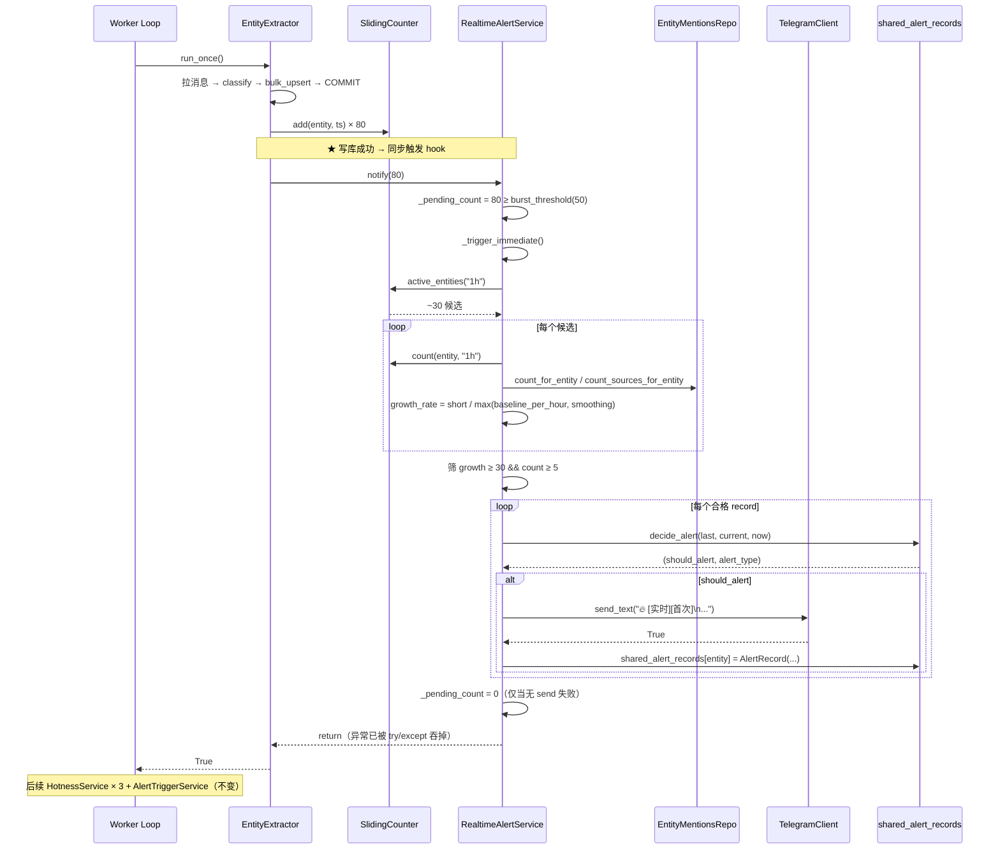

# Phase 2 · Task 2.4 实时告警触发 · Design

> 基于 requirements.md v1.0 的架构与接口设计。把端到端告警延迟从 14~15 分钟
> 压到 1~2 分钟。

## 1. 概述

### 1.1 目标

EntityExtractor 写完一批新提及后立刻"通知"下游做一次轻量榜计算，满足阈值
的 entity 直接推 Telegram，不等下一个 :00/:15/:30/:45 整点。

延迟拆解：worker poll 间隔（默认 5s）+ EntityExtractor 写库（< 1s）+
`_trigger_immediate` 内存计算（< 2s 预算）+ Telegram 网络往返（< 2s）≈
**最坏 1~2 分钟**，对比 Phase 2.2 整点最坏 14~15 分钟。

### 1.2 三条核心设计哲学

1. **进程内同步 hook，不引入异步基础设施**
   `notify()` 直接在 EntityExtractor 的 worker 线程里同步执行。预算 < 2s
   完成；超出阈值才考虑切异步（详见 §6 风险 1）。单人 + 单 worker 项目，
   引入 Redis / Celery 是过度工程。

2. **共享 AlertRecord 冷却 dict，跨服务不重复推送**
   实时和整点共用**同一个** `dict[str, AlertRecord]` 对象引用。单 worker
   串行调度天然无并发，dict 读写无需加锁。重启清零的代价是每实体最多多
   发 1 条告警，可接受。

3. **不写 hotness_snapshots 表，不污染主表对齐**
   实时榜只在内存算 Top-K 直接推送。落库会让 `window_end` 出现非
   `:00/:15/:30/:45` 的脏数据，破坏整点对齐的查询语义。

### 1.3 与 Phase 1 / Phase 2.x 的关系

```
Phase 2.1（不变）            Phase 2.2（不变）             Phase 2.4（本任务）
─────────────────────       ──────────────────────       ──────────────────────
EntityExtractor                                          
  └─> entity_mentions                                    
  └─> sliding_counter ─►   HotnessService × 3            
                              └─> hotness_snapshots ───► AlertTriggerService
                                                            └─> Telegram
                                                            └─> _alert_records ◄─┐
                                                                                 │ ★ 共享引用
EntityExtractor.run_once()                                                       │
  └─> realtime_trigger.notify(N) ──► RealtimeAlertService                        │
                                       _pending_count += N                       │
                                       达 burst_threshold → _trigger_immediate() │
                                         ├─ sliding_counter.count("1h")          │
                                         ├─ mentions_repo.count_for_entity       │
                                         ├─ 公式 = 整点榜公式                    │
                                         ├─ decide_alert（共用 4 路径决策树）    │
                                         ├─ alert_type 前缀 "[实时]"             │
                                         ├─ telegram_client.send_text            │
                                         └─ 推送成功 → 写入 ◄────────────────────┘
                                            ★ 不写 hotness_snapshots
```

## 2. 总架构图



## 3. 详细设计

### 3.1 RealtimeAlertService（services/l2_realtime_trigger.py）

#### 3.1.1 dataclass 字段

```python
@dataclass
class RealtimeAlertService:
    # 依赖（共享单实例）
    db: Database
    mentions_repo: EntityMentionsRepo
    sliding_counter: SlidingCounter        # 与 EntityExtractor / Hotness 共享
    telegram_client: TelegramClient        # 与 AlertTriggerService 共享

    # 触发参数
    burst_threshold: int = 50              # 累积多少新提及触发
    realtime_threshold: float = 30.0       # 比整点 20 严
    min_count_short: int = 5               # 比整点 3 严

    # 公式参数（与 HotnessService(1h) 一致）
    short_hours: int = 1
    baseline_days: int = 7
    smoothing: float = 2.0

    # ★ 共享冷却 dict（main.py 传 alert_service._alert_records 同一引用）
    shared_alert_records: dict[str, AlertRecord] = field(default_factory=dict)

    # 冷却参数（与 AlertTriggerService 一致）
    cooldown_minutes: int = 60
    escalation_growth_multiplier: float = 1.5
    heartbeat_hours: int = 6

    # 消息模板（默认与整点共用，渲染时 alert_type 自带 "[实时]" 前缀）
    message_template: str = (
        "🔥 {alert_type}\n实体: {entity} ({entity_type})\n"
        "增长: {growth_rate}x（实时短窗）\n"
        "提及: {count_short} 次 / 1h\n跨源: {cross_source}\n"
        "{is_new_entity_mark}@ {window_end}"
    )

    # 运行时状态
    _pending_count: int = 0
```

#### 3.1.2 `notify` + `_trigger_immediate` 方法骨架

```python
def notify(self, n_added: int) -> None:
    """EntityExtractor 写库成功后调用。异常一律吞掉，绝不向上抛。"""
    try:
        self._pending_count += n_added
        if self._pending_count < self.burst_threshold:
            return
        logger.info("realtime trigger fired: pending={}", self._pending_count)
        self._trigger_immediate()
    except Exception as e:
        logger.error("realtime_trigger.notify 异常（已隔离）：{}", e)


def _trigger_immediate(self) -> None:
    now = datetime.now(timezone.utc)
    candidates = self.sliding_counter.active_entities("1h")
    if not candidates:
        self._pending_count = 0
        return

    short_start = now - timedelta(hours=self.short_hours)
    baseline_start = now - timedelta(days=self.baseline_days)
    baseline_hours = self.baseline_days * 24 - self.short_hours

    # 阶段 1：筛候选（公式与 HotnessService(1h) 完全一致）
    eligible: list[dict] = []
    for entity in candidates:
        short_count = self.sliding_counter.count(entity, "1h")
        if short_count < self.min_count_short:
            continue
        try:
            with self.db.get_session() as session:
                baseline_total = self.mentions_repo.count_for_entity(
                    session, entity, start=baseline_start, end=short_start)
                cross_source = self.mentions_repo.count_sources_for_entity(
                    session, entity, start=short_start, end=now)
        except Exception as e:
            logger.warning("realtime entity={} count failed: {}", entity, e)
            continue
        growth_rate = short_count / max(baseline_total / baseline_hours, self.smoothing)
        if growth_rate < self.realtime_threshold:
            continue
        eligible.append({
            "entity": entity, "entity_type": None,
            "count_short": short_count, "growth_rate": growth_rate,
            "cross_source": cross_source,
            "is_new_entity": (baseline_total == 0 and short_count >= 5),
            "window_end": now, "rank": 0,
        })

    # 阶段 2：决策 + 推送 + 更新共享冷却
    sent, any_failed = 0, False
    for rec in eligible:
        should_alert, alert_type = decide_alert(
            self.shared_alert_records.get(rec["entity"]), rec, now,
            cooldown_minutes=self.cooldown_minutes,
            escalation_growth_multiplier=self.escalation_growth_multiplier,
            heartbeat_hours=self.heartbeat_hours,
        )
        if not should_alert:
            continue
        prefixed = f"[实时]{alert_type}"   # ★ 与整点告警的关键区分
        if self.telegram_client.send_text(self._render_message(rec, prefixed)):
            self.shared_alert_records[rec["entity"]] = AlertRecord(
                last_alerted_at=now,
                last_growth_rate=rec["growth_rate"],
                last_cross_source=rec["cross_source"],
            )
            sent += 1
            logger.info("alert sent: entity={} growth={:.1f} type={}",
                        rec["entity"], rec["growth_rate"], prefixed)
        else:
            any_failed = True
            logger.error("realtime alert send failed: entity={}", rec["entity"])

    logger.info("realtime trigger done: candidates={} alerts={}",
                len(candidates), sent)

    # ★ pending 清零策略：全成功 / 无合格 entity → 清零
    #    任一失败 → 不清零，下一轮 burst 再试（Task 1.4 用例 6）
    if not any_failed:
        self._pending_count = 0
```

#### 3.1.3 `_decide_alert` 决策

复用 AlertTriggerService 已有的 4 路径决策树（首次/心跳/升级/跨源升级/重新触发）。
实现见 §3.3.2 把 `decide_alert` 抽到模块顶层。

### 3.2 EntityExtractor hook（frozen 改造取舍）

**当前状态**：`EntityExtractor` 是 `@dataclass(frozen=True)`，运行时不能给字段
赋值。但 main.py 必须**反向注入** `entity_extractor.realtime_trigger = svc`：
RealtimeAlertService 依赖 `alert_service._alert_records`，而 alert_service
在 EntityExtractor 之后才构造，形成时序循环。

**候选方案对比**：

| 方案 | 优点 | 缺点 |
|---|---|---|
| **A. 去掉 frozen** | 改动最小；与项目其他 Service 风格一致 | 失去不可变性保证 |
| B. 保留 frozen，构造时传入 | 保留不可变性 | 时序循环依赖（trigger 需要 _alert_records，alert_service 必须在 EntityExtractor 之后构造） |
| C. 引入 mutable wrapper | 保留不可变性 | 过度工程，违背"不引入新依赖"精神 |

**选择：方案 A**。理由：
1. 改动最小（`@dataclass(frozen=True)` → `@dataclass`）
2. dataclass 仍是 main.py 全局单例，正常代码路径不会改其他字段
3. `AlertTriggerService` / `HotnessService` / `NormalizerService` 都是非
   frozen 的 dataclass，改后风格更统一
4. 未来真担忧时可加 `__setattr__` 钩子白名单只允许 `realtime_trigger` 赋值

**改造代码**：

```python
@dataclass  # ★ 去掉 frozen=True
class EntityExtractor:
    db: Database
    normalized_repo: NormalizedMessagesRepo
    mentions_repo: EntityMentionsRepo
    sliding_counter: SlidingCounter
    batch_size: int = 500
    realtime_trigger: Optional["RealtimeAlertService"] = None  # ★ 新增

    def run_once(self) -> bool:
        # ...原有代码不变...

        # ★ 新增 hook：放在 logger.info 之前
        if self.realtime_trigger is not None and len(to_insert) > 0:
            try:
                self.realtime_trigger.notify(len(to_insert))
            except Exception as e:
                logger.error("realtime_trigger.notify 异常（已隔离）：{}", e)

        logger.info("entity_extractor 本轮：处理 {} 条消息 → 产出 {} 条实体提及",
                    len(msgs), len(to_insert))
        return True
```

`RealtimeAlertService` 用 `TYPE_CHECKING` 守护 import 避免循环依赖。

### 3.3 共享 AlertRecord 冷却 dict（绝对核心）

#### 3.3.1 为什么必须共享

不共享时的失败场景：

```
14:30  实时触发 → NEWMEME growth=42 → 推送 [实时][首次]
14:30  rt_records[NEWMEME] = (14:30, 42, 2)
15:00  整点榜 → NEWMEME growth=45 → integral_records[NEWMEME] is None
       → 决策路径 1（首次告警）→ 推送 [首次]
       ★ 用户 30 分钟内收 2 条 NEWMEME 告警，刷屏
```

共享后 `:15:00` 整点扫到 `shared_records[NEWMEME]`：elapsed=30min < 60min，
growth 1.07× < 1.5×，cross_source 没变 → 决策路径 5（cooldown 内 + 无质变）
→ 不告警。用户只收 1 条。

#### 3.3.2 实现方式（decide_alert 重构）

把决策抽到 `services/l2_alert_trigger.py` 模块顶层做成纯函数：

```python
# services/l2_alert_trigger.py 新增模块级函数
def decide_alert(
    last: Optional[AlertRecord], current: dict, now: datetime, *,
    cooldown_minutes: int, escalation_growth_multiplier: float,
    heartbeat_hours: int,
) -> tuple[bool, str]:
    """4 路径决策树，与 Phase 2.2 §3.2.1 等价。current 至少含 growth_rate /
    cross_source 两个字段。"""
    if last is None:
        return True, "[首次]"
    elapsed = now - last.last_alerted_at
    if elapsed >= timedelta(hours=heartbeat_hours):
        return True, f"[持续 {int(elapsed.total_seconds() // 3600)}h]"
    if (last.last_growth_rate > 0
            and current["growth_rate"]
            >= last.last_growth_rate * escalation_growth_multiplier):
        ratio = current["growth_rate"] / last.last_growth_rate
        return True, f"[升级 → growth ×{ratio:.1f}]"
    if current["cross_source"] > last.last_cross_source:
        return True, f"[跨源升级 +{current['cross_source'] - last.last_cross_source}]"
    if elapsed < timedelta(minutes=cooldown_minutes):
        return False, ""
    return True, "[重新触发]"


class AlertTriggerService:
    def _decide_alert(self, rec, now: datetime) -> tuple[bool, str]:
        # 改成薄包装，保留方法签名让现有 11 个测试用例零改动
        return decide_alert(
            self._alert_records.get(rec.entity),
            {"entity": rec.entity, "growth_rate": rec.growth_rate,
             "cross_source": rec.cross_source},
            now,
            cooldown_minutes=self.cooldown_minutes,
            escalation_growth_multiplier=self.escalation_growth_multiplier,
            heartbeat_hours=self.heartbeat_hours,
        )
```

main.py Step 5e 用引用语义传入：

```python
realtime_service = RealtimeAlertService(
    ..., shared_alert_records=alert_service._alert_records,  # ★ 引用，不是 deepcopy
)
```

#### 3.3.3 单 worker 串行下为什么安全

worker 线程执行顺序（`scheduler/jobs.py` 已有逻辑）：

```
loop:
    for svc in [Normalizer, EntityExtractor, Hotness × 3, AlertTrigger]:
        svc.run_once()
    sleep(poll_interval)
```

关键时序：
1. EntityExtractor.run_once 内同步触发 `_trigger_immediate`
2. `_trigger_immediate` 完整跑完（含写 dict）后才返回
3. 才轮到 Hotness × 3
4. 才轮到 AlertTriggerService（读同一 dict）

任何时刻只有一个调用者读写 dict，无并发。CPython GIL 保证 dict 单 key
set/get 原子。未来拆多 worker 时再给 dict 加 `threading.Lock`（详见 §8）。

### 3.4 配置（config/_alerts.py 4 字段）

在现有 `AlertSettings` 末尾追加：

```python
# 总开关。False → main.py 跳过构造，行为退化为 Phase 2.2
realtime_enabled: bool = True

# 累积多少新提及触发一次实时计算
# 50 是经验值：低流量期 5~10 轮（25~50 秒）攒满；高流量期单轮就触发
realtime_burst_threshold: int = 50

# growth_rate ≥ 此值。比整点 alert_growth_threshold(20) 严 50%。
# 严的理由：分钟级窗口的 growth 抖动比整点榜大；实时频率高，把噪音放进去会刷屏
realtime_growth_threshold: float = 30.0

# count_short ≥ 此值。比整点 alert_min_count_short(3) 严
# 5 过滤"3 条偶然提及就触发"；分钟级窗口里 3 条可能就是 KOL 转发同话题
realtime_min_count_short: int = 5
```

### 3.5 main.py 注入（Step 5e）

```python
# 在 Step 5d（AlertTriggerService）之后追加
realtime_service = None
if (settings.realtime_enabled
        and settings.telegram_bot_token
        and settings.telegram_chat_id
        and alert_service is not None):
    from services.l2_realtime_trigger import RealtimeAlertService

    realtime_service = RealtimeAlertService(
        db=db, mentions_repo=mentions_repo,
        sliding_counter=sliding_counter,           # 与 EntityExtractor / Hotness 共享
        telegram_client=telegram_client,           # 与 AlertTriggerService 共享
        burst_threshold=settings.realtime_burst_threshold,
        realtime_threshold=settings.realtime_growth_threshold,
        min_count_short=settings.realtime_min_count_short,
        shared_alert_records=alert_service._alert_records,  # ★ 引用
        cooldown_minutes=settings.alert_cooldown_minutes,
        escalation_growth_multiplier=settings.alert_escalation_growth_multiplier,
        heartbeat_hours=settings.alert_heartbeat_hours,
    )
    entity_extractor.realtime_trigger = realtime_service  # ★ 反向注入
    logger.info("RealtimeAlertService 启动：burst={} threshold={} min_count_short={}",
                settings.realtime_burst_threshold,
                settings.realtime_growth_threshold,
                settings.realtime_min_count_short)
else:
    # 三种跳过场景分别打日志（详见 Req 7.2）
    if not settings.realtime_enabled:
        logger.info("RealtimeAlertService 未启用（realtime_enabled=False）")
    elif not (settings.telegram_bot_token and settings.telegram_chat_id):
        logger.info("RealtimeAlertService 跳过：Telegram 未配置")
    else:
        logger.info("RealtimeAlertService 跳过：依赖 AlertTriggerService 未启用")
```

注意 **不**把 `realtime_service` 加到 `new_services`：它由 EntityExtractor
内部触发，不需要 worker 主循环调度。

## 4. 文件清单

```
新增：
  services/l2_realtime_trigger.py         [RealtimeAlertService 整体]
  tests/test_l2_realtime_trigger.py       [Task 1.4，6 用例]
  .kiro/specs/phase2-realtime-trigger/{requirements,design}.md

修改：
  services/l1_entity_extractor.py        [去掉 frozen + realtime_trigger 字段
                                            + run_once 末尾 notify hook]
  services/l2_alert_trigger.py           [抽 decide_alert 模块级函数，
                                            _decide_alert 改薄包装]
  config/_alerts.py                      [+4 字段]
  main.py                                [+Step 5e]
  tests/test_l1_entity_extractor.py      [+3 用例：Task 2.2]
  docs/operations_guide.md               [+§6.1 实时调参]
  docs/faq_design_decisions.md           [+Q8]

不动：
  services/l2_hotness.py / l2_sliding_counter.py
  notifications/telegram_client.py
  db/repositories/*.py / db/models.py / alembic/
  其它所有 Phase 1 / 2.1 / 2.2 文件
```

## 5. 测试矩阵

测试基线：**135 → 144 passed**（+9，0 回归），与 tasks.md 落点一致。

| # | 用例 | 文件 | Task | 关键断言 |
|---|---|---|---|---|
| 1 | `test_notify_below_threshold_does_not_trigger` | test_l2_realtime_trigger | 1.4 | `notify(40)` 后 `send_text.call_count==0`，`_pending_count==40` |
| 2 | `test_notify_at_threshold_triggers_immediate` | test_l2_realtime_trigger | 1.4 | `notify(50)` 触发；send_text 被调；`_pending_count==0` |
| 3 | `test_immediate_uses_realtime_threshold` | test_l2_realtime_trigger | 1.4 | growth=25 不告警；growth=35 告警（threshold=30） |
| 4 | `test_immediate_shares_alert_records_with_integral` | test_l2_realtime_trigger | 1.4 | 外部 dict 作 `shared_alert_records`，触发后外部 dict 含 AlertRecord（验证引用语义） |
| 5 | `test_immediate_does_not_write_hotness_snapshots` | test_l2_realtime_trigger | 1.4 | hotness_repo mock 全程未被调用（RealtimeAlertService 根本没接它） |
| 6 | `test_immediate_send_failure_does_not_consume_pending` | test_l2_realtime_trigger | 1.4 | send_text 返回 False → `_pending_count` 不清零 |
| 7 | `test_realtime_trigger_called_with_inserted_count` | test_l1_entity_extractor | 2.2 | run_once 写 N 条 → `mock_trigger.notify.assert_called_once_with(N)` |
| 8 | `test_realtime_trigger_not_called_when_zero_insertions` | test_l1_entity_extractor | 2.2 | `to_insert==[]` → `notify.call_count==0` |
| 9 | `test_realtime_trigger_none_does_not_break` | test_l1_entity_extractor | 2.2 | `realtime_trigger=None` 默认下 run_once 行为与 Phase 2.1 等价 |

约束：不真调 Telegram API；不真连 PG；mock SlidingCounter / repos / TelegramClient
+ monkeypatch `datetime.now`。

## 6. 风险与缓解

### 风险 1：`_trigger_immediate` 慢拖延 EntityExtractor（最重要）

`notify` 在 worker 线程内同步执行，跑得越慢主链路吞吐越低。

**耗时拆解（预估）**：

| 步骤 | 耗时 |
|---|---|
| `active_entities("1h")` | < 50ms（内存遍历，~100 entity） |
| 候选 × 2 次 DB 查询 | 30 候选 × 60ms = **~1.8s** |
| 公式 + decide_alert | < 10ms |
| `send_text` × 合格条数 | 合格数 × ~500ms（Telegram 200~800ms） |
| **典型场景合计** | **~2 秒**（30 候选 + 2 条告警） |
| **极端场景合计** | **~10 秒**（100 候选 + 5 条告警） |

**阈值与对策**：

| 实测耗时 | 评估 | 对策 |
|---|---|---|
| **< 2 秒** | 可接受 | 当前同步设计落地 |
| 2 ~ 5 秒 | 警告但可接受 | log.warning；调严 `realtime_threshold` 让候选更稀疏 |
| **> 5 秒** | 不可接受，必须异步 | `_trigger_immediate` 改 `threading.Thread(daemon=True).start()` 后台跑；shared dict 加 `threading.Lock` |

**短期保护**：在 `_trigger_immediate` 入口记 `start = time.time()`，结尾打日志：

```python
elapsed = time.time() - start
logger.info("realtime trigger done: candidates={} alerts={} elapsed={:.1f}s", ...)
if elapsed > 2.0:
    logger.warning("realtime trigger 耗时偏高 ({:.1f}s)，考虑调严 realtime_threshold", elapsed)
```

**线下验证**：上线前在本地实测一轮真实数据耗时；< 2s 才上线，否则切异步。

### 风险 2~6（汇总）

| # | 风险 | 缓解 |
|---|---|---|
| 2 | Telegram 限流（30 msg/s） | `growth ≥ 30` + `count ≥ 5` + 共享冷却三重门槛把合格条数压极少；触发限流时 `send_text` 返回 False，下一轮再试 |
| 3 | 阈值过严 7 天 0 告警 | Success Metrics 强制 7 天 ≥ 3 次；不达标即调小 threshold/burst（改设置 + 重启，零代码改动）|
| 4 | 共享 dict 跨服务破坏封装 | 短期可接受（单 worker 串行无并发）；Phase 2.5 多通道时封装成 `AlertCoolDownStore` 类（详见 §8.1）|
| 5 | 去 frozen 后字段被误改 | Code Review + 测试覆盖（用例 9）保证 None 默认值不破坏现有行为 |
| 6 | 进程重启冷却失效，连发 2 条 | 沿用 Phase 2.2 取舍——每实体最多多发 1 条远比"持久化冷却到 DB"的复杂度划算 |

## 7. 部署步骤

### 7.1 本地开发

```bash
# Task 0~6 按顺序完成
.venv/bin/python -m pytest tests/ --ignore=tests/test_ollama_client.py -q
# 预期 144 passed
```

### 7.2 端到端验收（Task 5）

临时调小阈值快速验证：

```python
realtime_burst_threshold: int = 5
realtime_growth_threshold: float = 1.0
realtime_min_count_short: int = 1
```

```bash
./scripts/restart.sh --bg
# 等几分钟，应收到 "🔥 [实时]..." 告警
```

确认收到后改回生产配置（50 / 30.0 / 5）+ 重启。

### 7.3 启动日志检查

```
SlidingCounter backfill 完成：耗时 X.Xs，回填 N 条
HotnessService(1h) / (6h) / (24h) 启动：...
AlertTriggerService 启动：growth_threshold=20.0 ...
RealtimeAlertService 启动：burst=50 threshold=30.0 min_count_short=5
```

### 7.4 7 天观察（Success Metrics 业务验收）

- 抽 3 次实时告警，验证端到端延迟 ≤ 2 分钟
- 抽 1 次实时 + 整点重叠场景，验证只收 1 条
- 假阳性占比 ≤ 40%

不达标时按风险 3 调阈值。

## 8. 与 Phase 2.5 / 2.6 / 2.7 的接口设计

### 8.1 共享 dict 扩展到多通道（Phase 2.5）

未来加邮件 / Discord webhook / 多 chat_id 路由时，每个通道可能想要自己的
冷却策略，但**实体级冷却**仍应跨通道共享。改造方向：把
`shared_alert_records: dict` 改成统一的 `AlertCoolDownStore` 类（含
`threading.Lock` 守护，多 worker 时启用），各通道 Service 都调它的
`get / set` 方法。

**Phase 2.4 → 2.5 迁移成本**：把 `dict.get/[]=` 改成 `store.get / store.set`，
两个 Service 同步改，约 1~2 小时。

### 8.2 实时触发的多窗口（Phase 2.6）

未来加 6h / 24h 实时通道时，给 RealtimeAlertService 加 `window_type` 字段
+ `__post_init__` 自洽校验（复用 HotnessService 的三道校验模式）。本任务
先硬编码 `"1h"`；迁移时 main.py 多构造几个实例（参考 Phase 2.1 多窗口
HotnessService 的方式）。

### 8.3 实时告警历史持久化（Phase 2.7）

需要回看历史告警时，新增 `alert_history` 表（与 hotness_snapshots 分离，
避免分钟级时间戳污染主表的核心约束依然成立）：

```sql
CREATE TABLE alert_history (
  id BIGSERIAL PRIMARY KEY,
  alerted_at TIMESTAMPTZ NOT NULL,
  entity TEXT NOT NULL,
  channel TEXT NOT NULL,           -- 'realtime' / 'integral_1h' / ...
  alert_type TEXT NOT NULL,
  growth_rate FLOAT NOT NULL,
  count_short INT NOT NULL,
  cross_source INT NOT NULL,
  message_text TEXT NOT NULL,
  INDEX (entity, alerted_at DESC)
);
```

迁移成本：在两个 Service 推送成功路径加一次 INSERT；约 1 天工作量。

---

*文档版本：v1.0*
*基于：requirements.md v1.0 + tasks.md v1.0*
*参考：phase2-telegram-alerts/{design,requirements}.md v1.1
       + phase2-multi-window-hotness/{design,requirements}.md v1.0*
*预估工时：编码 4~6 小时*
*测试基线：135 → 144 passed（+9，0 回归）*
*端到端延迟：14~15 分钟 → 1~2 分钟*
